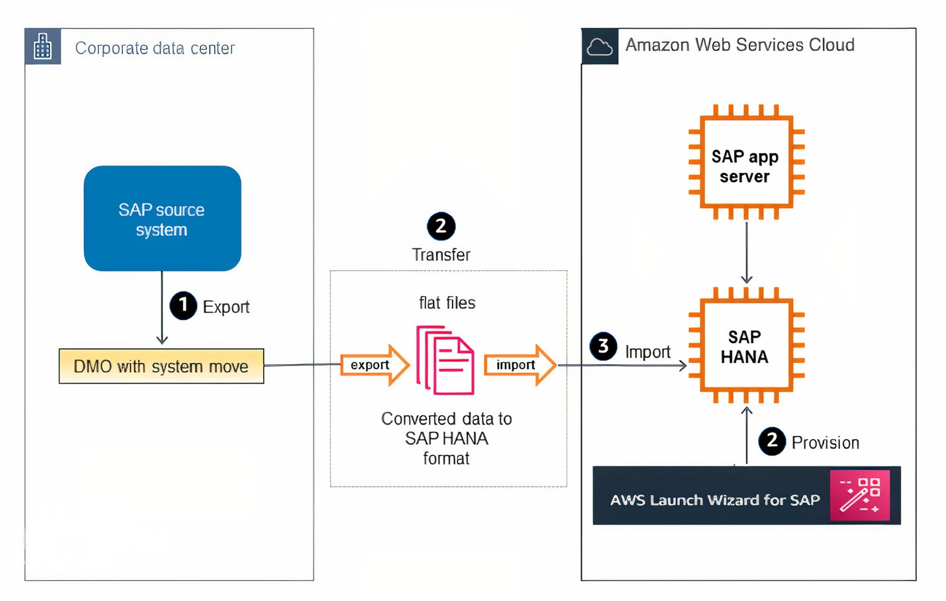
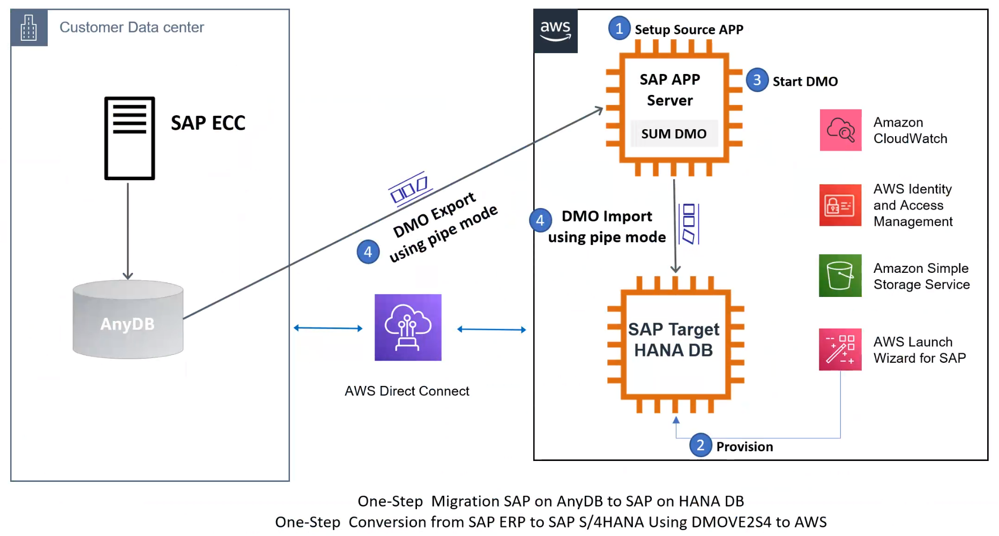
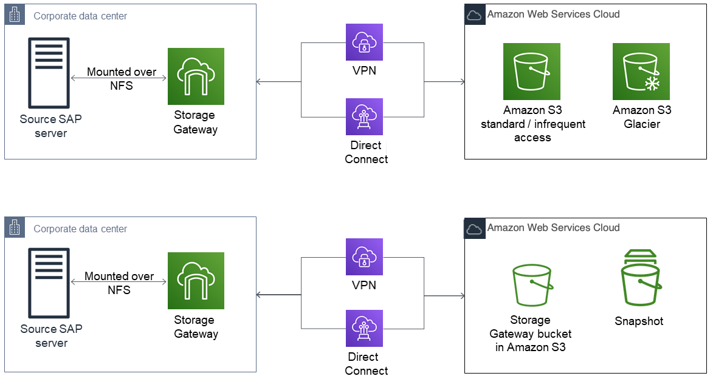
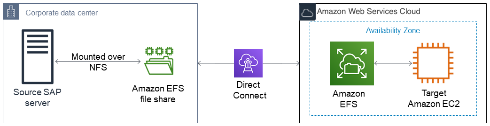

# Migration Tools and Methodologies

This section provides an introduction to the tools and methodologies available to you for your SAP system migration.

###### Topics

- [AWS Launch Wizard for SAP](#migrating-hana-launch-wizard "#migrating-hana-launch-wizard")
- [AWS Migration Hub Orchestrator](#migrating-hana-orchestrator "#migrating-hana-orchestrator")
- [Amazon EC2 Instance Resize](#migrating-hana-instance-resize "#migrating-hana-instance-resize")
- [AMIs](#migrating-hana-amis "#migrating-hana-amis")
- [AWS Snowball Edge](#migrating-hana-snowball "#migrating-hana-snowball")
- [Amazon S3 Transfer Acceleration](#migrating-hana-s3-acceleration "#migrating-hana-s3-acceleration")
- [SAP HANA HSR with Initialization via Backup and Restore](#migrating-hana-hsr-init "#migrating-hana-hsr-init")
- [Migration Using DMO with System Move](#migrating-hana-dmo-sm "#migrating-hana-dmo-sm")
- [SAP HANA Classical Migration](#migrating-hana-classical "#migrating-hana-classical")
- [SAP Software SUM DMO](#migrating-hana-sum-dmo "#migrating-hana-sum-dmo")
- [DMO Move to SAP S/4HANA on AWS (single step) – DMOVE2S4](#migrating-hana-dmove2s4 "#migrating-hana-dmove2s4")
- [Backup/Restore Tools](#migrating-hana-backup-restore "#migrating-hana-backup-restore")

## AWS Launch Wizard for SAP

AWS Launch Wizard for SAP is a service that guides you through the sizing, configuration, and deployment of SAP applications on AWS, and follows [AWS cloud application best practices](../../../wellarchitected/latest/framework/welcome.md "../../../wellarchitected/latest/framework/welcome.md").

AWS Launch Wizard reduces the time it takes to deploy SAP applications on AWS. You input your application requirements, including SAP HANA settings, SAP landscape settings, and deployment details on the service console, and Launch Wizard identifies the appropriate AWS resources to deploy and run your SAP application. Launch Wizard provides an estimated cost of deployment, which allows you to modify your resources and instantly view the updated cost. When you finalize your settings, Launch Wizard provisions and configures the selected resources. It then optionally installs an SAP HANA database and supported SAP applications using customer-provided software.

After you deploy an SAP application, you can access it from the Amazon EC2 console. You can manage your SAP applications with AWS SSM.

For more information, see [AWS Launch Wizard for SAP](../../../launchwizard/latest/userguide/launch-wizard-sap.md "../../../launchwizard/latest/userguide/launch-wizard-sap.md").

## AWS Migration Hub Orchestrator

AWS Migration Hub Orchestrator simplifies and automates the migration of servers and enterprise applications to AWS. It provides a single location to run and track your migrations.

You can migrate SAP HANA scale-up and scale-out systems to AWS cloud with AWS Migration Hub Orchestrator. Migration Hub Orchestrator offers templates to create a migration workflow that can be customized to fit your unique migration requirements. For more information, see [AWS Migration Hub Orchestrator?](../../../migrationhub-orchestrator/latest/userguide/what-is-migrationhub-orchestrator.md "../../../migrationhub-orchestrator/latest/userguide/what-is-migrationhub-orchestrator.md")

You can access AWS Migration Hub Orchestrator from link: [https://console.aws.amazon.com/migrationhub/orchestrator/](https://console.aws.amazon.com/migrationhub/orchestrator/ "https://console.aws.amazon.com/migrationhub/orchestrator/") or from the AWS Command Line Interface.

## Amazon EC2 Instance Resize

Amazon EC2 provides you with the ability to easily change your instance type in minutes, from the Amazon EC2 console, the AWS Command Line Interface (AWS CLI), or the Amazon EC2 API. You can start with an instance type that meets your current needs and size your instance up or down, when your requirements change. When you change your EC2 instance type, all instance metadata, including the IP address, instance ID, and hostname, remains the same. This enables you to migrate your SAP HANA to a new instance type seamlessly, without incurring a longer downtime. For details, see the [Changing the Instance Type](../../../AWSEC2/latest/UserGuide/ec2-instance-resize.md "../../../AWSEC2/latest/UserGuide/ec2-instance-resize.md") in the Amazon EC2 documentation.

## AMIs

You can use an Amazon Machine Image (AMI) to launch any EC2 instance. You can create an AMI of an EC2 instance that hosts SAP HANA, including the attached EBS volumes, through the Amazon EC2 console, the AWS CLI, or the Amazon EC2 API. You can then use the AMI to launch a new EC2 instance with SAP HANA in any Availability Zone within the AWS Region where the AMI was created. You can also copy your AMI to another AWS Region and use it to launch a new instance. You can use this feature to move your SAP HANA instance to another Availability Zone or AWS Region, or to change the tenancy type of your EC2 instance. For example, you can create an AMI of your EC2 instance with default tenancy and use it to launch a new EC2 instance with host or dedicated tenancy and vice versa. For details, see the [Amazon Machine Images (AMIs)](../../../AWSEC2/latest/UserGuide/ec2-instance-resize.md "../../../AWSEC2/latest/UserGuide/ec2-instance-resize.md") in the Amazon EC2 documentation.

## AWS Snowball Edge

With AWS Snowball Edge, you can copy large amounts of data from your on-premises environment to AWS, when it’s not practical or possible to copy the data over the network. AWS Snowball Edge is a storage appliance that is shipped to your data center. You plug it into your local network to copy large volumes of data at high speed. When your data has been copied to the appliance, you can ship it back to AWS, and your data will be copied to Amazon S3 based on the desired target storage destination that you specify. AWS Snowball Edge is very useful when you’re planning very large, multi-TB SAP system migrations. For more information, see _When should I consider using Snowball instead of the Internet_ in the [AWS Snowball Edge FAQ](https://aws.amazon.com/snowball/faqs/ "https://aws.amazon.com/snowball/faqs/").

## Amazon S3 Transfer Acceleration

Amazon S3 Transfer Acceleration provides a faster way to copy data from your on-premises environment to AWS by copying data first to Amazon CloudFront edge locations that are closest to the source, and then using an optimized network path to copy data to Amazon S3. There is a network charge associated with this type of transfer. You can run an AWS-provided [test tool](https://s3-accelerate-speedtest.s3-accelerate.amazonaws.com/en/accelerate-speed-comparsion.html "https://s3-accelerate-speedtest.s3-accelerate.amazonaws.com/en/accelerate-speed-comparsion.html") to compare the speed of Amazon S3 Transfer Acceleration to standard Amazon S3 data transfer. For SAP workloads, you can copy backups or DB logs at regular intervals over Amazon S3 Transfer Acceleration to reduce the transfer time, if your regular network connection is slow—​for example, if your SAP environment is hosted in a location that doesn’t have very strong internet connectivity. For more information, see the [Amazon S3 documentation](../../../AmazonS3/latest/dev/transfer-acceleration.md "../../../AmazonS3/latest/dev/transfer-acceleration.md").

## SAP HANA HSR with Initialization via Backup and Restore

SAP supports the option of initializing the HSR target system with a backup and restore process. Using backup and restore can be useful if the network connection between your source SAP HANA system and the target system does not have enough bandwidth to replicate the data in a timely manner. Additionally, you may not want the data replication to consume part of your network traffic bandwidth. For details, see [SAP Note 1999880 – FAQ: SAP HANA System Replication](https://launchpad.support.sap.com/#/notes/1999880 "https://launchpad.support.sap.com/#/notes/1999880").

## Migration Using DMO with System Move

SAP has enhanced the database migration option (DMO) of their Software Update Manager (SUM) tool to accelerate the testing of SAP application migrations. DMO with System Move enables you to migrate your SAP system from your on-premises environment to AWS by using a DMO tool and a special export and import process. You can use AWS services such as Amazon S3, Amazon EFS (over AWS Direct Connect), Storage Gateway file interface, and AWS Snowball Edge to transfer your SAP export files to AWS.

You can then use the AWS Launch Wizard for SAP to rapidly provision SAP HANA instances and build your SAP application servers on AWS, when you are ready to trigger the import process of the DMO tool.

The SUM DMO tool can convert data from _anyDB_ to SAP HANA or SAP ASE, with OS migrations, release/enhancement pack upgrades, and Unicode conversions occurring at the same time. Results are written to flat files, which are transferred to the target SAP HANA system on AWS. The second phase of DMO with System Move imports the flat files and builds the migrated SAP application with the extracted data, code, and configuration. Here’s a conceptual flow of the major steps involved:

## SAP HANA Classical Migration

SAP offers the SAP HANA classical migration option for migrating from other database systems to SAP HANA. This option uses the SAP heterogeneous system copy process and tools. To copy the exported files, you can use the options described in the [Backup/Restore Tools](#migrating-hana-backup-restore "#migrating-hana-backup-restore") section later in this guide. For details on the classical migration approach, see the [classical migration overview](https://scn.sap.com/docs/DOC-49744 "https://scn.sap.com/docs/DOC-49744") on the SAP website.

## SAP Software SUM DMO

SAP offers the standard SUM DMO approach as a one-step migration option from other database systems to HANA. This option uses the SAP DMO process and tool to automate multiple required migration steps. This is a preferred option if you are already running SAP on _anyDB_ on AWS, as it will improve your migration times to SAP HANA, since there is no need for data export/import at a file system level. For details, see the [DMO of SUM overview](https://scn.sap.com/docs/DOC-49580 "https://scn.sap.com/docs/DOC-49580") on the SAP website.

## DMO Move to SAP S/4HANA on AWS (single step) – DMOVE2S4

Using SAP Database Migration Option (DMO) feature DMOVE2S4, you can migrate SAP ECC on SAP HANA or any other database, such as Oracle, SQL or others hosted on-premises to AWS Cloud. It combines migration with conversion. With this option, you can convert SAP ERP on SAP HANA to SAP S/4HANA while migrating the system to SAP S/4HANA cloud, private edition on AWS Cloud.

The migration is performed over network, using memory pipe option. It eliminates the requirement to import/export data over file system. You can further accelerate the migration by using one or both of the following options.

- Use AWS Direct Connect to enable secure and fast data transfer over the network. For more information, see [What is AWS Direct Connect](../../../directconnect/latest/UserGuide/Welcome.md "../../../directconnect/latest/UserGuide/Welcome.md")?
- Use an Amazon EC2 instance with a high number of vCPUs as the SAP application server running the import. This increases the parallel processing rate of the database load and reduces the time taken for migration and conversion.

One of the biggest advantages of a heterogeneous migration is that you can use DMO features, downtime optimized techniques, such as downtime optimized DMO (doDMO) or downtime optimized conversion (DOC), that are not available when using traditional DMO with system move option.

For more information, see the following SAP resources.

- [SAP Note 3296427 - Database Migration Option (DMO) of SUM 2.0 SP17](https://me.sap.com/notes/3296427https://me.sap.com/notes/3296427 "https://me.sap.com/notes/3296427https://me.sap.com/notes/3296427") (requires SAP portal access)
- [SAP Documentation - DMO Move to SAP S/4HANA (on Hyperscaler)](https://help.sap.com/docs/SLTOOLSET/7d57e56e12104cc68bce7646cd9f4cbf/c17f45ffa4004ca4837913a745b3a081.html "https://help.sap.com/docs/SLTOOLSET/7d57e56e12104cc68bce7646cd9f4cbf/c17f45ffa4004ca4837913a745b3a081.html")

## Backup/Restore Tools

Backup and restore options are tried-and-true mechanisms for saving data on a source system and restoring it to another destination. AWS has various storage options available to help facilitate data transfer to AWS. Some of those are explained in this section. We recommend that you discuss which option would work best for your specific workload with your systems integrator (SI) partner or with an AWS solutions architect.

- Storage Gateway: This is a virtual appliance installed in your on-premises data center that helps you replicate files, block storage, or tape libraries by integrating with AWS storage services such as Amazon S3 and by using standard protocols like Network File system (NFS) or Internet Small Computer System Interface (iSCSI). Storage Gateway offers file-based, volume-based, and tape-based storage solutions. For SAP systems, we will focus on file replication using a file gateway and block storage replication using a volume gateway. For scenarios where multiple backups or logs need to be continuously copied to AWS, you can copy these files to the locally mounted storage and they will be replicated to AWS.

- Amazon EFS file transfer: AWS provides options to copy data from an on-premises environment to AWS by using Amazon Elastic File System (Amazon EFS). Amazon EFS is a fully managed service, and you pay only for the storage that you use. You can mount an Amazon EFS file share on your on-premises server, as long as you have AWS Direct Connect set up between your corporate data center and AWS.

