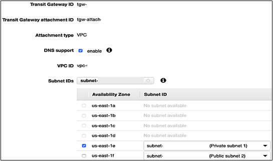
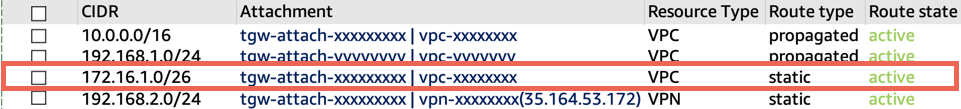
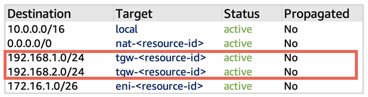
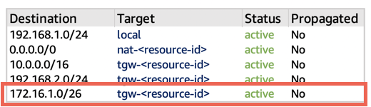

# Configuration Steps for AWS Transit Gateway

This section includes high-level steps necessary to understand overlay IP address configuration for this scenario. See the [AWS Transit Gateway documentation](../../../vpc/latest/tgw/tgw-getting-started.md "../../../vpc/latest/tgw/tgw-getting-started.md") for detailed steps regarding AWS Transit Gateway configuration.

## Step 1. Set up the Transit Gateway architecture

1. Create a Transit Gateway in your AWS account in the AWS Region where the SAP instance is deployed. For detailed steps, see [Getting Started with Transit Gateways](../../../vpc/latest/tgw/tgw-getting-started.md "../../../vpc/latest/tgw/tgw-getting-started.md").
2. Attach VPCs where SAP instances are deployed (and any other VPCs as required) to the Transit Gateway. For detailed steps, see [Transit Gateway Attachments to a VPC](../../../vpc/latest/tgw/tgw-vpc-attachments.md "../../../vpc/latest/tgw/tgw-vpc-attachments.md").

**Note:** For attachment, select only the subnet where the SAP instances are running with cluster and overlay IP configured. In the following figure, the private subnet of the SAP instance is selected for the Transit Gateway attachment.

**Figure 2: Attaching Transit Gateway to private subnet**

 3. Do one of the following, depending on your connection:

    * **VPN connection**. Attach a VPN to this Transit Gateway. For detailed steps, see [Transit Gateway VPN Attachments](../../../vpc/latest/tgw/tgw-vpn-attachments.md "../../../vpc/latest/tgw/tgw-vpn-attachments.md").

    When you create a site-to-site VPN connection, you specify the static routes for the overlay IP address. For detailed steps, see [VPN routing options](../../../vpn/latest/s2svpn/VPNRoutingTypes.md "../../../vpn/latest/s2svpn/VPNRoutingTypes.md").
    * **AWS Direct Connect**. Attach a Direct Connect Gateway to this Transit Gateway. First, associate a Direct Connect Gateway with the Transit Gateway. Then, create a transit virtual interface for your AWS Direct Connect connection to the Direct Connect gateway. Here, you can advertise prefixes from on-premises to AWS and from AWS to on-premises. For detailed steps, see [Transit Gateway Attachments to a Direct Connect Gateway](../../../vpc/latest/tgw/tgw-dcg-attachments.md "../../../vpc/latest/tgw/tgw-dcg-attachments.md").

    When you associate a Transit Gateway with a Direct Connect gateway, you specify the prefix lists to advertise the overlay IP address to the on-premises environment. For detailed steps, see [Allowed prefixes interactions](../../../directconnect/latest/UserGuide/allowed-to-prefixes.md "../../../directconnect/latest/UserGuide/allowed-to-prefixes.md").

    **Note:**
     AWS Direct Connect is recommended for business critical workloads. See [Resilience in AWS Direct Connect](../../../directconnect/latest/UserGuide/disaster-recovery-resiliency.md "../../../directconnect/latest/UserGuide/disaster-recovery-resiliency.md") to learn about resiliency at the network level.

## Step 2. Configure routing for AWS and corporate networks

The following table lists the IP addresses used in the example configuration. Make sure to use your valid private IP addresses for your implementation.

| Description                                                                                                                          | IP Range/IP Address |
| ------------------------------------------------------------------------------------------------------------------------------------ | ------------------- |
| VPC CIDR of production SAP systems (with HA cluster running with Overlay IP)                                                      | 10.0.0.0/16         |
| VPC CIDR of non-production SAP systems (Instances in this VPC access the Production cluster overlay IP using AWS Transit Gateway) | 192.168.1.0/24      |
| Corporate network CIDR (Site-to-Site VPN is configured between corporate networks to AWS Transit Gateway)                         | 192.168.2.0/24      |
| Overlay IP address CIDR                                                                                                              | 172.16.1.0/26       |
| Customer gateway IP address                                                                                                          | 34.216.94.150/32    |

###### Note

If you are using [AWS Client VPN](../../../vpn/latest/clientvpn-admin/what-is.md "../../../vpn/latest/clientvpn-admin/what-is.md"), you do not need to configure Transit Gateway. You can create additional entries in the routing table for overlay IP addresses. Route traffic to the subnets of the VPC of production SAP system where overlay IP addresses are configured.

When you create a Transit Gateway attachment to a VPC, the propagation route is created in the default Transit Gateway route table. In Figure 3, the first and second entry shows the propagated route created automatically for VPCs where SAP production and non-production systems are running through VPC attachment.

1. To route traffic from AWS Transit Gateway to the overlay IP address, create static routes in the **Transit Gateway route tables** to route overlay IP addresses to the VPC of production SAP system where the overlay IP addresses are configured. In Figure 3, the third entry shows that the static route created for the overlay IP range is attached. The target for this route is the SAP Production VPC.

**Figure 3: Transit Gateway route table: Overlay IP static route with VPC of production SAP system target**

 2. To route the outgoing traffic from VPCs where SAP instances are running to private IP addresses of another VPC where SAP instances are running attached to same Transit Gateway, create entries in the **route tables associated with these VPC subnets**. The target of these routes is AWS Transit Gateway. In the following VPC of production SAP system route table example, the non-production SAP VPC (third entry) and corporate network (fourth entry) are routed to the Transit Gateway.

**Figure 4: VPC of production SAP system route table: VPC of production SAP system and corporate network routed to AWS Transit Gateway**

 3. In the VPC of the non-production SAP system, to route the outgoing traffic from the overlay IP address, create entries in the route tables with Transit Gateway as the target. In the following VPC of non-production SAP system route table example, the destination is the overlay IP range and the target is Transit Gateway.

**Figure 5: VPC of non-production SAP system route table: Outgoing traffic from overlay IP address routed to Transit Gateway**

 4. Configure routing from corporate devices to Amazon VPC IP addresses.

## Step 3. Disable the source/destination check

Each Amazon EC2 performs source/destination checks by default. This means that the instance must be the source or destination of any traffic it sends or receives. For cluster instances, source/destination check must be disabled on both Amazon EC2 instances which are supposed to receive traffic from the Overlay IP address. You can use the [AWS CLI](https://aws.amazon.com/cli/ "https://aws.amazon.com/cli/") or the [AWS Management Console](https://aws.amazon.com/console/ "https://aws.amazon.com/console/") to disable source/destination check. For details, see [ec2 modify-instance-attribute](https://awscli.amazonaws.com/v2/documentation/api/latest/reference/ec2/modify-instance-attribute.html "https://awscli.amazonaws.com/v2/documentation/api/latest/reference/ec2/modify-instance-attribute.html").

## Step 4. Test the configuration

Once the setup is complete, perform connectivity testing by making sure you can reach the SAP systems through overlay IP address. With this configuration, you can reach the overlay IP addresses from other VPCs and your corporate network just like any private IP address of the VPC. With the AWS Transit Gateway approach, no additional components are required for communication, such as Amazon Route 53 agent or Network Load Balancer.

## Step 5. Update overlay IP address

Step 4: Once the network connectivity is tested successfully, update the overlay IP address of the production or non-production SAP system in the message server parameter of your SAP Graphical User Interface (GUI) System Entry Properties along with other SAP connectivity properties for connection. You can use the corporate DNS or Amazon Route 53 to create a user friendly CNAME for the Overlay IP.
