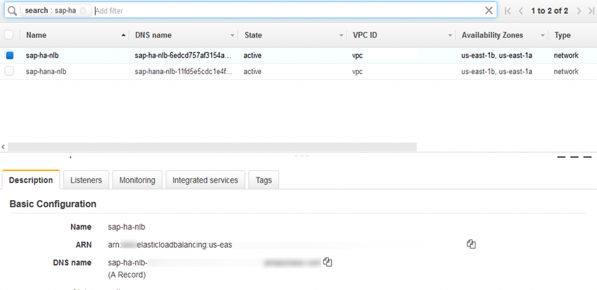
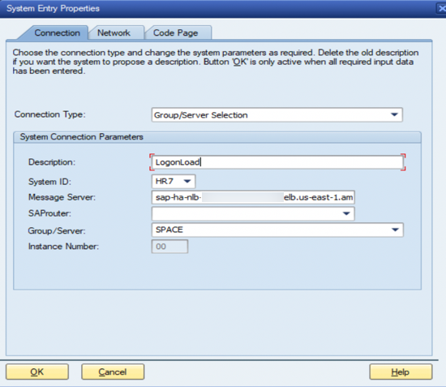
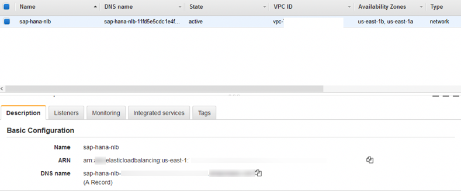
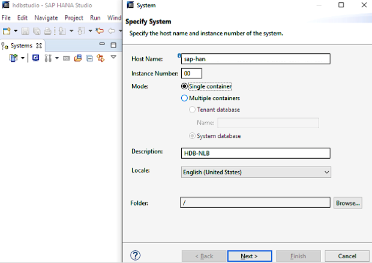

# Configuration Steps for Network Load Balancer

Use the following instructions to set up the Network Load Balancer to access the overlay IP address. The following values are used for the example configuration.

**Table 1: System Settings**

| System Setting                        | Value        |
| ------------------------------------- | ------------ |
| Instance number for ASCS and SAP HANA | 00           |
| OIP for ASCS                          | 192.168.0.20 |
| OIP for HANA                          | 192.168.1.99 |

**Table 2: Listener Port Values**

| Listener Ports           | Value                                                                                                                                                                         |
| ------------------------ | ----------------------------------------------------------------------------------------------------------------------------------------------------------------------------- |
| ASCS Message server port | 36<instance number> (3600)                                                                                                                                                    |
| SAP HANA                 | SAP HANA Studio service connection (login required) [SAP Note 1592925](https://launchpad.support.sap.com/#/notes/1592925 "https://launchpad.support.sap.com/#/notes/1592925") |
| SAPStartSrv/HTTP Port    | 5<instance number>13 (50013)                                                                                                                                                  |
| JDBC/SQL Port            | 3<instance number>15 (30015)                                                                                                                                                  |

## Step 1. Create the target group

1. Open the Amazon EC2 console at [https://console.aws.amazon.com/ec2/](https://console.aws.amazon.com/ec2/ "https://console.aws.amazon.com/ec2/")
2. On the navigation pane, under **LOAD BALANCING**, choose **Target Groups**.
3. Choose Create target group.
4. For **Name**, type an easily identified target group name for the sap-ascs instance. (For example, type sap-ascs for your ASCS overlay IP address).
5. For **Target type**, select **IP**.
6. For **Protocol**, choose **TCP**.
7. For **Port**, type 36<ASCS instance number>. For example: 3600, where 00 is the instance number.
8. For **Health checks**, keep the default health check settings, or change settings based on your requirements.
9. Choose **Create**.
10. Repeat steps 1 to 9 to create target group for JDBC/SQL port 3<instance number>15 and SAP HANA HTTP port 5<instance number>13 to access your SAP HANA instance with the respective overlay IP address.
11. Choose the **Targets** tab, then choose **Edit**.
12. Choose **Add** to register your targets.
13. Choose the **Network** drop-down and select **Other private IP address**. Then, enter the ASCS overlay IP address and choose **Add to list**.
14. Repeat steps 11 to 13 to register JDBC/SQL and HTTP ports with the respective overlay IP address.

## Step 2. Create the Network Load Balancer for ASCS

1. On the EC2 navigation pane, under **LOAD BALANCING**, choose **Load Balancers**.
2. Choose Create Load Balancer.
3. For Network Load Balancer, choose Create.
4. For **Name**, type a name for your load balancer. For example, sap-ha-nlb.
5. For **Scheme**, choose **internal**. An internal load balancer routes requests to targets using private IP addresses.
6. For **Listeners**, under Protocol, choose **TCP**. For **Port**, specify the ASCS port (36< SAP Instance number>. For example, use 3600 if your SAP instance number is 00.
7. For **Availability Zones**, select the VPC and subnets where the SAP instances with HA setup are deployed.
8. For **Tags**, choose **Add Tags** and for Key, type Name. For Value, type the name of the network load balancer, such as sap-ha-nlb.
9. Choose Next: Configure Security Settings.
10. Ignore the warning that appears and choose **Next: Configure Routing**. (In this scenario, the network load balancer is used as pass through without any SSL termination. For end-to-end encryption, use SNC from SAP GUI to SAP Instance.)
11. For **Target group**, choose **Existing target group** and select the **sap-ascs** target group created earlier.
12. Choose **Next: Register Targets**.
13. Choose **Next: Review**.
14. Choose **Create**.
15. Repeat the steps 1 to 14 to create another Network Load Balancer for SAP HANA setup with Network Load Balancer TCP protocol listener to JDBC/SQL port 3<instance number>15. Choose VPC and the subnets where the primary and secondary SAP HANA database is deployed and register the target JDBC/SQL target group.
16. Add an additional listener to the Network Load Balancer created in step 14 with SAP StartSrv/HTTP port 5<instance number>13 listener port and register the target StartSrv/HTTP port target group.

## Step 3. Set up VPC routing table

This step enables the connection to your SAP instance.

1. Open the Amazon VPC console at [https://console.aws.amazon.com/vpc/](https://console.aws.amazon.com/vpc/ "https://console.aws.amazon.com/vpc/")
2. In the navigation pane, choose **Route Tables**, and select the Amazon VPC routing table where your SAP instance is deployed.
3. Choose **Actions**, **Edit routes**.
4. For **Destination**, specify your overlay IP address. For **Target**, specify the SAP instance Elastic Network Interface.
5. Choose Save routes.

This setup allows the static Network Load Balancer DNS to forward the traffic to your SAP instance network interface through the static overlay IP address. During failover scenarios, you can point to the elastic network interface of the active SAP instance using manual steps or automatically using cluster management software.

## Step 4. Connect using SAP GUI

1. In the **Load Balancers** section of the EC2 console, make a note of the Network Load Balancer DNS name for the sap-ha-nlb.

**Figure 7: sap-ha-nlb DNS name**

 2. Start SAP Logon. 3. Choose **New**, then **Next**. 4. In the System Entry Properties box, for Connection Type, choose Group/Server Selection. 5. For **Message Server**, type the Network Load Balancer DNS name, and choose **OK**.

**Figure 8: Configuring System Connection Parameters for SAP GUI**

## Step 5. Connect using SAP HANA Studio

1. In the **Load Balancers** section of the EC2 console, make a note of the Network Load Balancer DNS name for the JBDC/SQL and SAPStartSrv/HTTP ports.

**Figure 9: DNS name of ports**

 2. In the Host Name parameter of SAP HANA Studio, use the Network Load Balancer DNS name and provide additional credentials to connect to the SAP HANA system.

**Figure 10: Updated Host Name in SAP HANA Studio**

