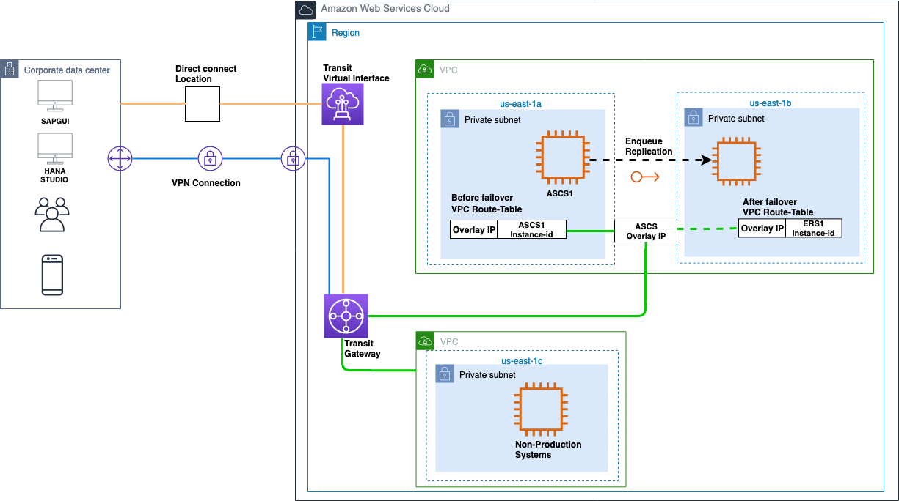

# Overlay IP Routing using AWS Transit Gateway

With Transit Gateway, you use route table rules which allow the overlay IP address to communicate to the SAP instance without having to configure any additional components, like a Network Load Balancer or Amazon Route 53. You can connect to the overlay IP from another VPC, another subnet (not sharing the same route table where overlay IP address is maintained), over a VPN connection, or via an AWS Direct Connect connection from a corporate network.

**Note:** If you do not use Amazon Route 53 or AWS Transit Gateway, see the [Overlay IP Routing with Network Load Balancer](sap-oip-overlay-ip-routing-with-network-load-balancer.md "sap-oip-overlay-ip-routing-with-network-load-balancer.md") section.

## Architecture

AWS Transit Gateway acts as a hub that controls how traffic is routed among all the connected networks which act like spokes. Your Transit Gateway routes packets between source and destination attachments using [Transit Gateway route tables](../../../vpc/latest/tgw/tgw-route-tables.md "../../../vpc/latest/tgw/tgw-route-tables.md"). You can configure these route tables to propagate routes from the route tables for the attached VPCs and VPN connections. You can also add static routes to the Transit Gateway route tables. You can add the overlay IP address or address CIDR range as a static route in the transit gateway route table with a target as the VPC where the EC2 instances of SAP cluster are running. This way, all the network traffic directed towards overlay IP addresses is routed to this VPC. The following figure shows this scenario with connectivity from different VPC and corporate network.

**Figure 1: Overlay IP address setup with AWS Transit Gateway**

_Pricing for the AWS Transit Gateway_:

AWS Transit Gateway [pricing](https://aws.amazon.com/transit-gateway/pricing/ "https://aws.amazon.com/transit-gateway/pricing/") is based on the number of connections made to the Transit Gateway per hour and the amount of traffic that flows through AWS Transit Gateway. For more information, see [AWS Transit Gateway Service Level Agreement](https://aws.amazon.com/transit-gateway/sla/ "https://aws.amazon.com/transit-gateway/sla/").
