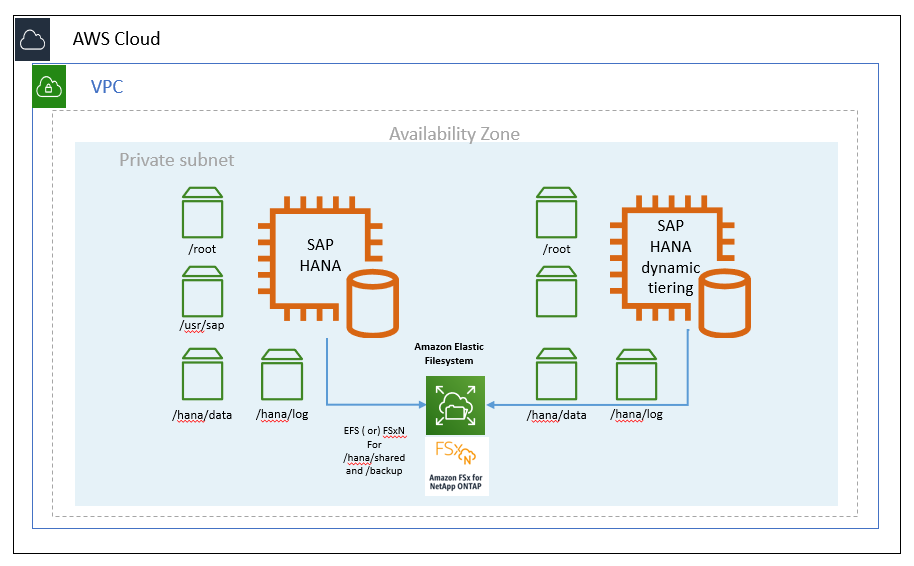
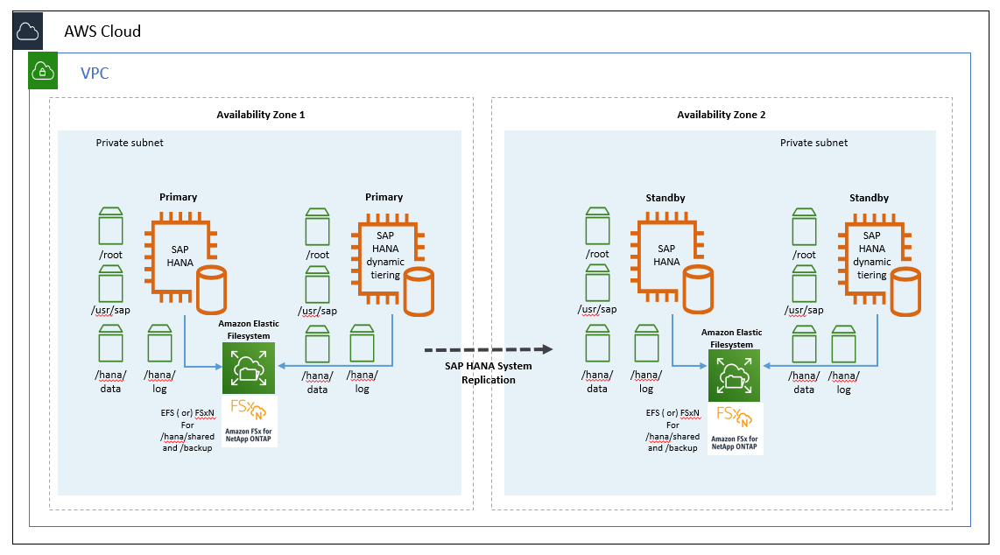
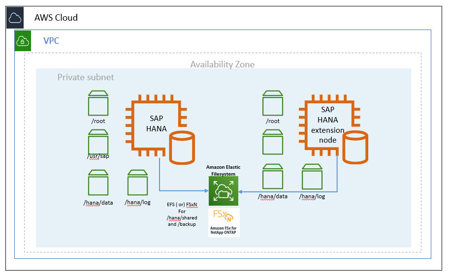

# Warm Data Tiering Options

The following sections discuss the warm data tiering options you have on AWS.

## SAP HANA native storage extension

SAP HANA Native Storage Extension (NSE) is a solution to store your warm data in SAP HANA. NSE manages warm data in a special area of SAP HANA memory (buffer cache) that is separate from the SAP HANA hot and working memory areas. The NSE solution is managed at the SAP HANA layer, making it independent of other warm data solutions (such as Data Aging). Refer to the following SAP Notes for more information about NSE (requires SAP portal access).

- [SAP Note 2799997 - FAQ: SAP HANA Native Storage Extension (NSE)](https://launchpad.support.sap.com/#/notes/2799997 "https://launchpad.support.sap.com/#/notes/2799997")
- [SAP Note 2816823 - Use of SAP HANA Native Storage Extension in SAP S/4HANA and SAP Business Suite powered by SAP HANA](https://launchpad.support.sap.com/#/notes/2816823 "https://launchpad.support.sap.com/#/notes/2816823")
- [SAP Note 2973243 - Guidance for use of SAP HANA Native Storage Extension in SAP S/4HANA and SAP Business Suite powered by SAP HANA](https://launchpad.support.sap.com/#/notes/2973243 "https://launchpad.support.sap.com/#/notes/2973243")

## SAP HANA Dynamic Tiering

SAP HANA dynamic tiering is an optional add-on to the SAP HANA database to manage historical data that can be used for your native SAP HANA use case. The purpose of SAP HANA dynamic tiering is to extend SAP HANA memory with a disk-centric columnar store (as opposed to SAP HANA’s in-memory store) for managing less frequently accessed data. In this disk-centric solution, dynamic tiering service (extended storage service - esserver) runs on a separate dedicated server. The main use case for dynamic tiering is to offload less active data from SAP HANA memory to the dynamic tiering disk-backed store. As noted in the solution table, SAP HANA dynamic tiering:

- can only be used for native SAP HANA use cases.
- provides online data storage in extended store, available for both queries and updates.
- is fully validated and supported on the AWS Cloud beginning with SAP HANA 2 SPS 2.
- is an integrated component of the SAP HANA database and cannot be operated separately from the SAP HANA database.
- allows you to store up to 5 times more data in the warm tier than in your hot tier.

**Figure 1: SAP HANA dynamic tiering on AWS (single-AZ)**

**Figure 2: SAP HANA dynamic tiering on AWS (multi-AZ)**

## SAP HANA Extension Node

SAP HANA extension node is a special purpose SAP HANA worker node that is specifically set up and reserved for storing warm data. An important difference between SAP HANA dynamic tiering and SAP HANA extension node is that the extension node is a separate SAP HANA instance. It is not a separate *esserver*process like dynamic tiering. Because of this, the SAP HANA extension node offers the full feature set of the SAP HANA database. SAP HANA extension node allows you to store warm data for your SAP Business Warehouse (BW) or native SAP HANA use cases.

The total amount of data that can be stored on the SAP HANA extension node ranges from 1 to 2x of the total amount of memory of your extension node. For example, if your extension node had 2 TB of memory, you could potentially store up to 4 TB of warm data on your extension node.

**Figure 3: SAP HANA extension node on AWS**

## Data Aging

[Data aging](https://help.sap.com/viewer/669e1da71e744a34af9b86deec50a57c/7.5.14/en-US/5306a0995655488785175d57bef083da.html "https://help.sap.com/viewer/669e1da71e744a34af9b86deec50a57c/7.5.14/en-US/5306a0995655488785175d57bef083da.html") can be used for SAP products like SAP Business Suite on HANA (SoH) or SAP S/4HANA to move data from SAP HANA memory to the disk area. The disk area is additional disk space that is a part of the SAP HANA database. This helps free up more SAP HANA memory by storing older, less frequently accessed data in the disk area. When the data is read or updated, data aging uses the [paged attribute](https://help.sap.com/viewer/669e1da71e744a34af9b86deec50a57c/7.40.21/en-US/3c802fd776f748d98fa0b990b404de90.html "https://help.sap.com/viewer/669e1da71e744a34af9b86deec50a57c/7.40.21/en-US/3c802fd776f748d98fa0b990b404de90.html") property to selectively load the pages of a table into memory instead of loading the entire table into memory. This helps you conserve your memory space by only loading the required data (instead of the entire table) into memory. In addition, paged attributes are marked for a higher unload priority by SAP HANA and are paged out to disk first when SAP HANA needs to free up memory. To size your SAP HANA memory requirements for data aging, SAP recommends that you run the sizing report provided in the [SAP Note 1872170 - ABAP on HANA sizing report (S/4HANA, Suite on HANA).](https://launchpad.support.sap.com/#/notes/1872170 "https://launchpad.support.sap.com/#/notes/1872170")
