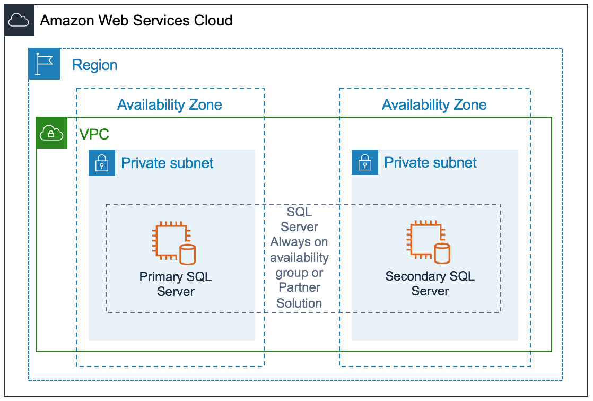

# Architecture Options

SAP NetWeaver applications based on SQL Server can be installed in three different ways:

- **Standard system or single host installation**: ABAP System Central Services (ASCS)/System Central Services (SCS), Database, and Primary Application Server (PAS) of SAP NetWeaver run in single Amazon EC2 instance. This option is suited for non-critical and non-production workloads.
- **Distributed system**: ASCS/SCS, Database, and PAS of SAP NetWeaver run on separate Amazon EC2 instances. For example, you can choose to run ASCS and PAS on one Amazon EC2 instance and database on another Amazon EC2 instance or other possible combinations. This option is suited for production and non-production workloads.
- **High Availability (HA) system**: For your SAP application to be highly available, you need to protect the single point of failures. Database is one single point of failure in SAP applications. There are two methods you can use to protect SQL Server and make it highly available.

      + Database native solution: [SQL Server Always On](https://docs.microsoft.com/en-us/sql/database-engine/availability-groups/windows/always-on-availability-groups-sql-server?view=sql-server-2017 "https://docs.microsoft.com/en-us/sql/database-engine/availability-groups/windows/always-on-availability-groups-sql-server?view=sql-server-2017") availability group.
      + Third-party solutions: For example, [SIOS Data Keeper](https://us.sios.com/solutions/sql-server-high-availability/ "https://us.sios.com/solutions/sql-server-high-availability/"), [NEC ExpressCluster](https://www.necam.com/ExpressCluster/high_Availability/Microsoft_SQL/ "https://www.necam.com/ExpressCluster/high_Availability/Microsoft_SQL/"), [Veritas InfoScale](https://www.veritas.com/support/en_US/doc/ka6j000000009eOAAQ "https://www.veritas.com/support/en_US/doc/ka6j000000009eOAAQ").

  Regardless of which option you choose to make your SQL Server database highly available, AWS recommends that you deploy a primary and secondary SQL Server in different AWS Availability Zones within an AWS Region. The following diagram provides a high-level architecture for SQL Server high availability on AWS. This option is suited for business-critical applications.

