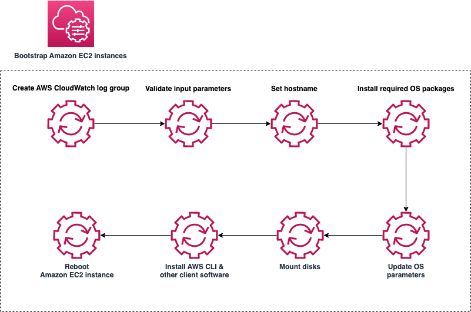

# Configuring automated SAP installation

The sections below contain detailed instructions on how to configure automated SAP NetWeaver on AWS installation.

## Customize the Systems Manager document

This section shows you how to customize the AWS Systems Manager document (SSM document) for the automated SAP installation. For more information about SSM documents, see [AWS Systems Manager Documents](../../../systems-manager/latest/userguide/sysman-ssm-docs.md "../../../systems-manager/latest/userguide/sysman-ssm-docs.md") in the _AWS Systems Manager User Guide_.

This section details the content that goes into the SSM document. For information about how to create the document, see [Create an SSM document (console)](../../../systems-manager/latest/userguide/create-ssm-console.md "../../../systems-manager/latest/userguide/create-ssm-console.md") in the _AWS Systems Manager User Guide_.

As you create your SSM document, we recommend you do the following:

- Use schema version 2.2. For more information, see [SSM document schema features and examples](../../../systems-manager/latest/userguide/document-schemas-features.md "../../../systems-manager/latest/userguide/document-schemas-features.md") in the _AWS Systems Manager User Guide_.
- Use Parameter Store to easily reference parameters that you use often. For more information, see [AWS Systems Manager Parameter Store](../../../systems-manager/latest/userguide/systems-manager-parameter-store.md "../../../systems-manager/latest/userguide/systems-manager-parameter-store.md") in the _AWS Systems Manager User Guide_.

###### Tip

You can find sample SSM documents and parameter files in the [aws-samples/terraform-aws-sap-netweaver-on-hana](https://github.com/aws-samples/terraform-aws-sap-netweaver-on-hana/tree/master/modules/sap-deploymentscripts/scripts/module-automations "https://github.com/aws-samples/terraform-aws-sap-netweaver-on-hana/tree/master/modules/sap-deploymentscripts/scripts/module-automations") GitHub repository.

### Bootstrap Amazon EC2 instances

Bootstrapping in Amazon EC2 consists of adding commands or scripts to the user data section of the instance. These commands and scripts can be executed when the instance starts. This simplifies configuration tasks. For more information, see [Run commands on your Linux instance at launch](../../../AWSEC2/latest/UserGuide/user-data.md "../../../AWSEC2/latest/UserGuide/user-data.md") in the _Amazon Elastic Compute Cloud User Guide for Linux Instances_.

For SAP installation, bootstrapping includes several tasks, such as setting the hostname, installing operating system packages, setting operating system parameters, installing AWS Data Provider for SAP, installing agents for monitoring, logging, and alerting, and mounting disks for the SAP HANA database instance and SAP application servers.

The image below shows the steps required for the bootstrap instance SSM document.



The SSM document accepts required and optional parameters. The code below is an example parameter section for bootstrapping an SAP HANA database instance or any SAP NetWeaver application server instance:

```
parameters:
    AutomationAssumeRole:
        type: String
        description: "(Optional) The ARN of the role that allows Automation to perform the actions on your behalf. "
        default: ''
    InstanceId:
        type: String
        description: "(Required) The instance ids to bootstrap before SAP HANA installation"
        default: ''
    HostnameTagKey:
        type: String
        description: "(Required) The tag key where the hostname is stored"
        default: 'Hostname'
    DnsPrivateZoneName:
        type: String
        description: "(Optional) DNS Zone name to specify FQDN in hosts"
        default: 'sapteam.net'
    EfsFileSystemId:
        type: String
        description: (Required) The EFS file system id for /sapmnt folder
        default: ‘fs-7df7edae’
    MasterPassword:
        type: String
        description: '(Required) SAP NetWeaver Master Password'
        default: ''
    IniFile:
        type: String
        description: '(Required) Path to INI file'
        default: '/sapmnt/software/sapinstall.params'
    CloudWatchLogGroupName:
        type: String
        description: "(Required) Cloud Watch log group for the log output"
        default: '/customer/SAP/dev-setup-logs'
```

The next section of the SSM document is the `mainSteps` section.

A composite SSM document is a custom document that performs a series of actions by running one or more secondary SSM documents. Composite documents promote infrastructure as code by allowing you to create a standard set of SSM documents for common tasks, such as bootstrapping software or domain-joining instances. For example, you can create a composite document with secondary SSM documents for each bootstrap item, as listed below:

- Setting the hostname
- Installing operating system packages for SAP HANA
- Setting the operating system parameters for SAP HANA
- Mounting disks for SAP HANA
- Installing the AWS Data Provider agent for SAP

Composite and secondary documents can be stored in Systems Manager, private and public GitHub repositories, or Amazon S3. They can be created in JSON or YAML. For more information, see [Creating composite documents](../../../systems-manager/latest/userguide/composite-docs.md "../../../systems-manager/latest/userguide/composite-docs.md") in the _AWS Systems Manager User Guide_.

The code below shows the `mainSteps` section of the SSM document with the composite and secondary documents:

```
mainSteps:
- name: Prepare_logs
  action: aws:runCommand
  inputs:
    DocumentName: d4h-prepare-sap-installation-logs
    InstanceIds:
    - '{{ InstanceId }}'
    CloudWatchOutputConfig:
      CloudWatchLogGroupName: '{{ CloudWatchLogGroupName }}'
      CloudWatchOutputEnabled: True
- name: Set_hostname
  action: aws:runCommand
  inputs:
    DocumentName: d4h-set-hostname
    InstanceIds:
    - '{{ InstanceId }}'
    Parameters:
      PrivateZone: '{{ DnsPrivateZoneName }}'
      Hostname: '{{ Get_hostname.Hostname }}'
    CloudWatchOutputConfig:
      CloudWatchLogGroupName: '{{ CloudWatchLogGroupName }}'
      CloudWatchOutputEnabled: True
- name: Install_Packages
  action: aws:runCommand
  inputs:
    DocumentName: d4h-install-sap-packages
    InstanceIds:
    - '{{ InstanceId }}'
    CloudWatchOutputConfig:
      CloudWatchLogGroupName: '{{ CloudWatchLogGroupName }}'
      CloudWatchOutputEnabled: True
- name: Set_OS_Parameters
  action: aws:runCommand
  inputs:
    DocumentName: d4h-set-sap-hana-parameters
    InstanceIds:
    - '{{ InstanceId }}'
    CloudWatchOutputConfig:
      CloudWatchLogGroupName: '{{ CloudWatchLogGroupName }}'
      CloudWatchOutputEnabled: True
- name: Mount_Disks
  action: aws:runCommand
  inputs:
    DocumentName: d4h-mount-hana-disks
    InstanceIds:
    - '{{ InstanceId }}'
    CloudWatchOutputConfig:
      CloudWatchLogGroupName: '{{ CloudWatchLogGroupName }}'
      CloudWatchOutputEnabled: True
- name: Install_Aws_Sap_Data_Provider
  action: aws:runCommand
  isCritical: false
  inputs:
    DocumentName: d4h-install-sap-aws-data-provider
    InstanceIds:
    - '{{ InstanceId }}'
    CloudWatchOutputConfig:
      CloudWatchLogGroupName: '{{ CloudWatchLogGroupName }}'
      CloudWatchOutputEnabled: True
```

### Install the SAP HANA database

After you bootstrap the Amazon EC2 instances, you must install the SAP HANA database. For this installation, you can store the SAP HANA master password in the SSM document Parameter Store or use it as an input to the SSM document and reference it in the `passfile.xml` file.

The code below is an example SSM document for an SAP HANA installation:

```
mainSteps:
- action: "aws:runShellScript"
  name: "Run_installer"
  inputs:
    runCommand:
    - #!/bin/bash
    - HANA_MEDIA=`find /software/hana -name "DATA_UNITS"`
    - if [ -z "$HANA_MEDIA" ]
    - then
    -   echo "Could not find the DATA_UNITS folder in /software/hana. Check if everything was downloaded successfully. Exiting..." | tee -a $SSM_LOG_FILE
    -   exit 1
    - fi
    - PASSFILE=$HANA_MEDIA/../passfile.xml
    - chmod +x $HANA_MEDIA/HDB_LCM_LINUX_X86_64/hdblcm
    - HOSTNAME=`(hostname)`
    - INSTANCE=`(instancenumber)`
    - SID=`echo "{{sid}}" | tr a-z A-Z`
    - echo "Executing installation from $HANA_MEDIA/HDB_LCM_LINUX_X86_64/hdblcm for SID $SID, instance $INSTANCE, hostname $HOSTNAME..."
    - cat $PASSFILE | $HANA_MEDIA/HDB_LCM_LINUX_X86_64/hdblcm --action=install --components=client,server --batch --autostart=1 -sid=$SID  --hostname=$HOSTNAME --number=$INSTANCE  --read_password_from_stdin=xml | tee -a $SSM_LOG_FILE
    - echo "`date` Installation finished. Please check logs..." | tee -a $SSM_LOG_FILE
    - rm $INIFILE
```

### Install SAP

Installing SAP includes ABAP SAP Central Services (ASCS), the database instance, and the primary and additional application server installation.

First, you create a parameter file with the required parameters. Refer to the SAP installation guide for the parameters that are specific to your installation. The code below is an example parameter file:

```
mainSteps:
- action: "aws:runShellScript"
  name: "Prepare_sapinstall_ini"
  inputs:
    runCommand:
    - #!/bin/bash
    - SAPINSTALL_INI_FILE={{ IniFile }}
    - SID=`echo "{{Sid}}" | tr a-z A-Z`
    - SAPSYSUID=`sapsysuid`
    - SIDADMUID=`sidadmuid`
    - SWTARGET=/sapmnt/software/
    - DOMAINNAME={{ DnsPrivateZoneName }}
    - HOSTNAME=`hostname`
    - FQDN=${LHOSTNAME}.${DOMAINNAME}
    - sed -i "s|default_scsVirtualHostname|${HOSTNAME}|g" ${SAPINSTALL_INI_FILE}
    - sed -i "s|default_scsInstanceNumber|00|g" ${SAPINSTALL_INI_FILE}
    - sed -i "s|default_ssmpass|{{ MasterPassword }}|g" ${SAPINSTALL_INI_FILE}
    - sed -i "s|default_sid|${SID}|g" ${SAPINSTALL_INI_FILE}
    - sed -i "s|default_fqdn|${DOMAINNAME}|g" ${SAPINSTALL_INI_FILE}
    - sed -i "s|default_sapsysGID|${SAPSYSUID}|g" ${SAPINSTALL_INI_FILE}
    - sed -i "s|default_AdmUID|${SIDADMUID}|g" ${SAPINSTALL_INI_FILE}
    - sed -i "s|default_downloadBasket|${SWTARGET}|g" ${SAPINSTALL_INI_FILE}
    - echo '`date` Prepared the Ini File:...' | tee -a $SSM_LOG_FILE
```

The next step is to start the installation using the SAP silent, or unattended, installation mode, referring to the parameter file as in the example code below:

```
mainSteps:
- action: "aws:runShellScript"
  name: "Execute_installation"
  inputs:
    runCommand:
    - #!/bin/bash
    - echo '`date` Starting the Installation process...' | tee -a $
    - SYSTEMNUMBER=`systemnumber`
    - SAPAliasName=`hostname`
    - SWPMFILE=`find /sapmnt/software/SWPM-SUM/ -name SWPM*SAR`
    - chmod 775 /sapmnt/software/utils/sapcar
    - /sapmnt/software/utils/sapcar -xvf $SWPMFILE -R /sapmnt/software/SWPM
    - chmod 755 /sapmnt/software/SWPM/sapinst
    - cd /sapmnt/software/SWPM
    - ./sapinst SAPINST_INPUT_PARAMETERS_URL=/sapmnt/software/sapinstall.params SAPINST_EXECUTE_PRODUCT_ID={{ProductId}} SAPINST_USE_HOSTNAME=${SAPAliasName} SAPINST_SKIP_DIALOGS="true" SAPINST_START_GUISERVER=false | tee -a $SSM_LOG_FILE
```

You can add additional sections in the SSM document to validate the SAP installation by checking the SAP process running on the host and sending the results to the SSM document log file. The following code is an example of how to do this:

```
- action: "aws:runShellScript"
  name: "Validate_Installation"
  inputs:
    runCommand:
    - #!/bin/bash
    - sid=`echo {{ Sid }} | tr '[:upper:]' '[:lower:]'}`
    - SID=`echo {{ Sid }} | tr '[:lower:]' '[:upper:]'}`
    - HOSTNAME=`hostname`
    - SIDADM=${sid}adm
    - su - $SIDADM -c "stopsap $HOSTNAME" | tee -a $SSM_LOG_FILE
    - su - $SIDADM -c "startsap $HOSTNAME" | tee -a $SSM_LOG_FILE
    - sleep 15
    - _SAP_UP=$(netstat -an | grep 3200 | grep tcp | grep LISTEN | wc -l )
    - echo "This is the value of SAP_UP - $_SAP_UP" | tee -a $SSM_LOG_FILE
    - if [ "$_SAP_UP" -eq 1 ]
    - then
    -   echo "$(date) __ done installing ASCS." | tee -a $SSM_LOG_FILE
    -   exit 0
    - else
    -   echo "$(date) __ ASCS could not be installed successfully. Fix the issue and rerun the automation" | tee -a $SSM_LOG_FILE
    -   exit 1
    - fi
- action: "aws:runShellScript"
  name: "Save_services_file"
  inputs:
    runCommand:
    - #!/bin/bash
    - grep -i sap /etc/services > /sapmnt/services
    - if [ -s /sapmnt/services ]
    - then
    -   echo "Services file copied to sapmnt" | tee -a $SSM_LOG_FILE
    -   exit 0
    - else
    -   echo "Services file could not be copied" | tee -a $SSM_LOG_FILE
    -   exit 1
    - fi
```

## Tag the Systems Manager document

A tag is a label that you assign to an AWS resource. Each tag consists of a key and a value, both of which you define. For an overview of tagging Systems Manager resources, see [Tagging Systems Manager resources](../../../systems-manager/latest/userguide/tagging-resources.md "../../../systems-manager/latest/userguide/tagging-resources.md") in the _AWS Systems Manager User Guide_.

For detailed instructions on how to tag SSM documents, see [Tagging Systems Manager documents](../../../systems-manager/latest/userguide/tagging-documents.md "../../../systems-manager/latest/userguide/tagging-documents.md") in the _AWS Systems Manager User Guide_.

**Example - tags and access management**

You can use tagging for a variety of purposes. For example, if you’re using AWS Identity and Access Management (IAM), you can control which users in your account can create, edit, or delete tags, and you can implement attribute-based access control (ABAC). For more information, see [Grant permission to tag resources during creation](../../../AWSEC2/latest/UserGuide/supported-iam-actions-tagging.md "../../../AWSEC2/latest/UserGuide/supported-iam-actions-tagging.md") and [Control access to Amazon EC2 resources using resource tags](../../../AWSEC2/latest/UserGuide/control-access-with-tags.md "../../../AWSEC2/latest/UserGuide/control-access-with-tags.md") in the _Amazon Elastic Compute Cloud User Guide for Linux Instances_.

**Example - tags and billing**

You can use tags to organize your AWS bill in a way that reflects your cost structure. To do this, sign up to get your AWS account bill with tag key values included. For more information about setting up a cost allocation report with tags, see [Monthly cost allocation report](../../../awsaccountbilling/latest/aboutv2/configurecostallocreport.md "../../../awsaccountbilling/latest/aboutv2/configurecostallocreport.md") in the _AWS Billing User Guide_. To see the cost of your combined resources, you can organize your billing information based on resources that have the same tag key values. For example, you can tag several resources with a specific application name, and then organize your billing information to see the total cost of that application across several services. For more information, see [Using cost allocation tags](../../../awsaccountbilling/latest/aboutv2/cost-alloc-tags.md "../../../awsaccountbilling/latest/aboutv2/cost-alloc-tags.md") in the _AWS Billing User Guide_.
