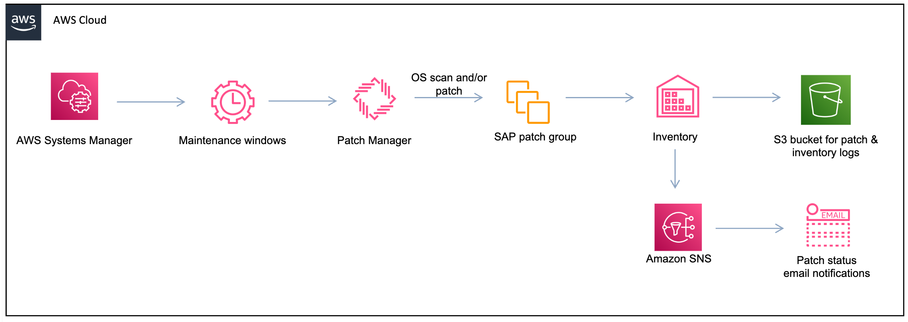

# Automated operating system patching architecture

The diagram below highlights the AWS services that you can use to set up automated operating system patching and optional notifications on the patch status using Amazon Simple Notification Service (Amazon SNS).

The topics below contain descriptions of key components of the automated operating system patching setup. Familiarize yourself with them before continuing to the prerequisites.

###### Topics

- [Patch Manager](#automation-os-patch-patchmanager "#automation-os-patch-patchmanager")
- [Lifecycle hooks](#auto-os-patch-lifecycle-hooks "#auto-os-patch-lifecycle-hooks")

## Patch Manager

Patch Manager is a capability of AWS Systems Manager that automates the process of patching managed nodes with security-related and general operating system updates. You can use Patch Manager to apply patches for operating systems and applications, such as installing service packs on Microsoft Windows nodes and performing minor version upgrades on Linux nodes.

Patch Manager helps to patch fleets of Amazon EC2 instances according to operating system type. This includes versions of Red Hat Enterprise Linux (RHEL), SUSE Linux Enterprise Server (SLES), Oracle Linux, and Microsoft Windows Server that are supported by SAP on AWS. You can patch your instances on a schedule or on-demand by creating a patching configuration. You can also scan instances to see a report of missing patches or to automatically install missing patches.

Patch Manager integrates with AWS Identity and Access Management (IAM), Amazon CloudWatch Events, and AWS Security Hub to provide a secure patching experience that includes event notifications and the ability to audit usage.

## Lifecycle hooks

Patch Manager allows you to add lifecycle hooks that enable a multi-step, custom patching process. These hooks let you perform a custom action on instances when the corresponding lifecycle event occurs.

When you patch the operating system of an SAP application, lifecycle hooks can help you perform SAP-specific operations and automate the operating system patching lifecycle. You can automate the following tasks using lifecycle hooks:

- Stop the SAP application and necessary database services
- Initiate database or storage snapshot backup
- Patch the operating system and reboot if necessary
- Start the SAP application and the database after successful operating system patch update

For more information about lifecycle hooks, see the following documentation:

- [About the AWS-RunPatchBaselineWithHooks SSM document](../../../systems-manager/latest/userguide/patch-manager-about-aws-runpatchbaseline.md "../../../systems-manager/latest/userguide/patch-manager-about-aws-runpatchbaseline.md") in the _AWS Systems Manager User Guide_
- [Orchestrating multi-step](https://aws.amazon.com/blogs/mt/orchestrating-custom-patch-processes-aws-systems-manager-patch-manager/ "https://aws.amazon.com/blogs/mt/orchestrating-custom-patch-processes-aws-systems-manager-patch-manager/") in the _AWS Cloud Operations & Migrations Blog_
