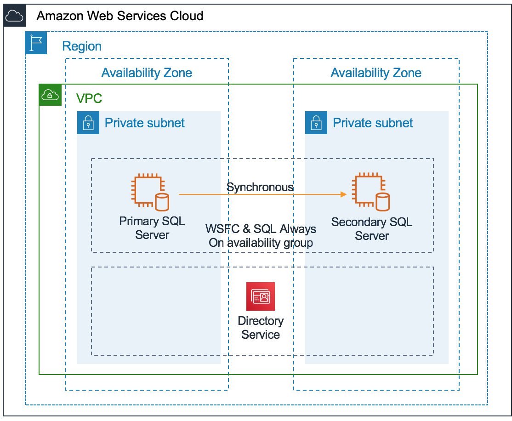

# Business Continuity

We recommend that you architect your business-critical applications to be fault tolerant. Depending on your availability requirements, there are different ways in which you can achieve this. This section discusses how you can set up highly available SQL Server for SAP applications.

## High Availability

You can configure high availability for SQL Server database on AWS using Always On availability groups or third-party tools.

### SQL Server Always On Availability Groups

A prerequisite for deploying a SQL Server Always On availability group is Windows Server Failover Clustering (WSFC). SQL Server Always On uses WSFC to increase application availability. WSFC provides infrastructure features that complement the high availability and disaster recovery scenarios supported in the AWS Cloud. Implementing WSFC cluster on AWS is very similar to deploying it on-premises provided you meet two key requirements:

- Deploy the cluster nodes inside an Amazon VPC.
- Deploy the cluster nodes in separate subnets that are in different Availability Zones.

See [Overview of Always On Availability Groups (SQL Server)](https://docs.microsoft.com/en-us/sql/database-engine/availability-groups/windows/overview-of-always-on-availability-groups-sql-server?view=sql-server-2017 "https://docs.microsoft.com/en-us/sql/database-engine/availability-groups/windows/overview-of-always-on-availability-groups-sql-server?view=sql-server-2017") for details.

The following figure provides an overview of architecture for SQL Server Always On availability groups on AWS. This architecture includes following components

- A VPC configured with private subnets across two Availability Zones. This provides the network infrastructure for your SQL Server deployment.
- AWS Directory Service for Microsoft Active Directory deployed in private subnet. Alternatively, you can also manage your own AD DS deployed on Amazon EC2 instance.
- In a private subnet, Windows Servers configured with WSFC for SQL Server Enterprise edition with SQL Server Always On availability groups.

### Third-Party Solutions

You can also use third-party tools like SIOS Data Protection Suite, NEC ExpressCluster, or Veritas InfoScale to provide high-availability for SQL Server. These solutions use WSFC and replicate data from primary to secondary with block level replication of the Amazon EBS volume.

## Disaster Recovery

Disaster recovery is about preparing for and recovering from a disaster. Any event that has a negative impact on your business continuity or finances could be termed a disaster. To implement a cost effective Disaster recovery strategy for your SAP applications and databases that meets your business objective you need to consider the following requirements.

### Separate DR Strategy from HA Design

First you must evaluate whether a separate DR strategy is required in addition to the HA design offered by AWS protection.

On AWS, we recommend that you deploy business critical application in high availability architecture across two Availability Zones in an AWS Region. Each Availability Zone is designed as an independent failure zone. This means that Availability Zones are physically separated within a typical metropolitan region and are located in lower risk flood plains. Availability Zones include a discrete uninterruptable power supply (UPS) and onsite backup generation facilities, and are each fed via different grids from independent utilities to further reduce single points of failure. The level of protection provided by Availability Zone design is sufficient for most customers and is able to meet their business objectives.

### DR in AWS Regions

If you determine that you need a separate DR strategy, next you must decide if you need a DR plan in a different AWS Region than your primary AWS Region or in same AWS Region as you primary (for example, using third Availability Zone of your primary AWS Region as DR). Data sovereignty is the primary reason that influences this decision. However, there may be other reasons, such as proximity to users, cost, ease of management, and so on.

### DR Architecture

Finally, you must decide on the DR architecture and understand the infrastructure required to implement it. The Recovery Time Objective (RTO) and Recovery Point Objective (RPO) are the primary factors that influence DR architecture. We recommend any of the following three DR architectures:

- **Cold:** This architecture essentially relies on backups. Backups are taken (database – data and log, AMI, Snapshots) on a regular basis and used to rebuild the systems in the target AWS Region to recover for any disaster. Because this architecture completely depends on backups, the RPO depends on how frequently you take backups, and RTO depends on how large the database is to be recovered.
- **Pilot Light:** This option provides better RTO/RPO over cold option because the SQL server database is synchronously or asynchronously getting replicated to a smaller EC2 instance. If you choose this architecture, you mus resize SQL Server EC2 instances, create application server from AMIs before starting production operations. You can use [AWS CloudFormation](https://aws.amazon.com/cloudformation/ "https://aws.amazon.com/cloudformation/") to automate these tasks.
- **Hot DR:** SQL Server database for DR EC2 instances are sized the same as production instances which helps to reduce recovery time over Pilot light because you do not need to resize the instances before starting production operations. For application servers, you can choose to replicate the volumes with CloudEndure or other third-party tools, like SIOS, ATAMotion, and so on.

Depending on your specific RTO/RPO, you can implement cold, pilot light, or hot DR architecture. The following table below provides a comparison between cold and pilot light DR for achievable RTO/RPO.

| Table 3 - Cold versus Pilot light DR | DR Architecture                                            | Strategy                | RTO/RPO                                                                                                                                                                                                                                                        |
| ------------------------------------ | ---------------------------------------------------------- | ----------------------- | -------------------------------------------------------------------------------------------------------------------------------------------------------------------------------------------------------------------------------------------------------------- |
| Cold                                 | SQL Server backup/restore                                  | High/High\*             |
| Cold                                 | Amazon AMI                                                 | Low/High                |
| Cold                                 | Amazon AMI with frequent DB volumes (Data & Log) snapshots | Low/Low\*               |
| Pilot Light                          | Sync Replication (with-in primary region)                  | Low/Near-Zero           |
| Pilot Light                          | Async Replication (in different region)                    | Low/Few Minutes         |
| Hot                                  | Async Replication (in different region)                    | Few Minutes/Few Minutes | \*The exact time it will take to recover database in DR scenario depends on how much you need to catch up to achieve point in time required for Cold architecture. **High** – couple of hours to a day or more. **Low** –less than an hour to couple of hours. |
