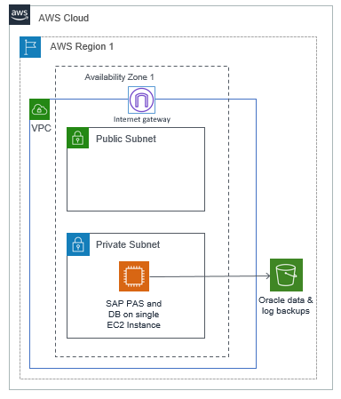
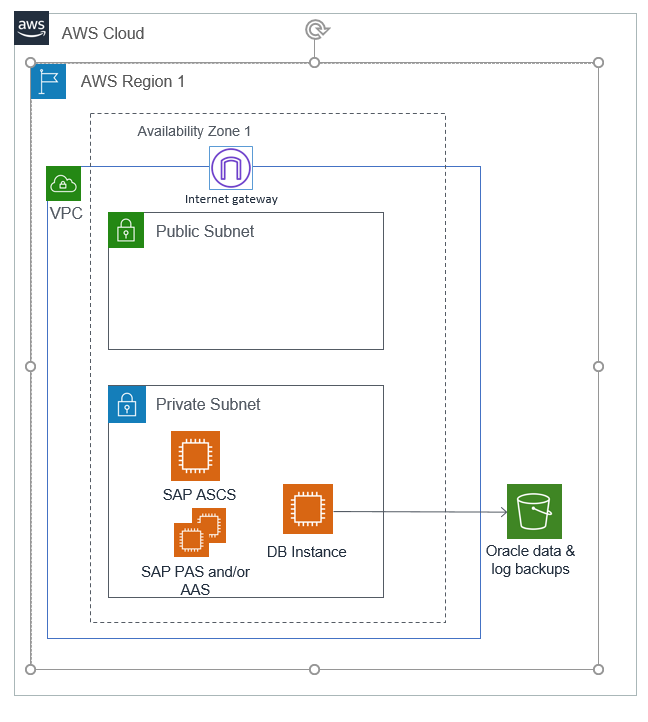
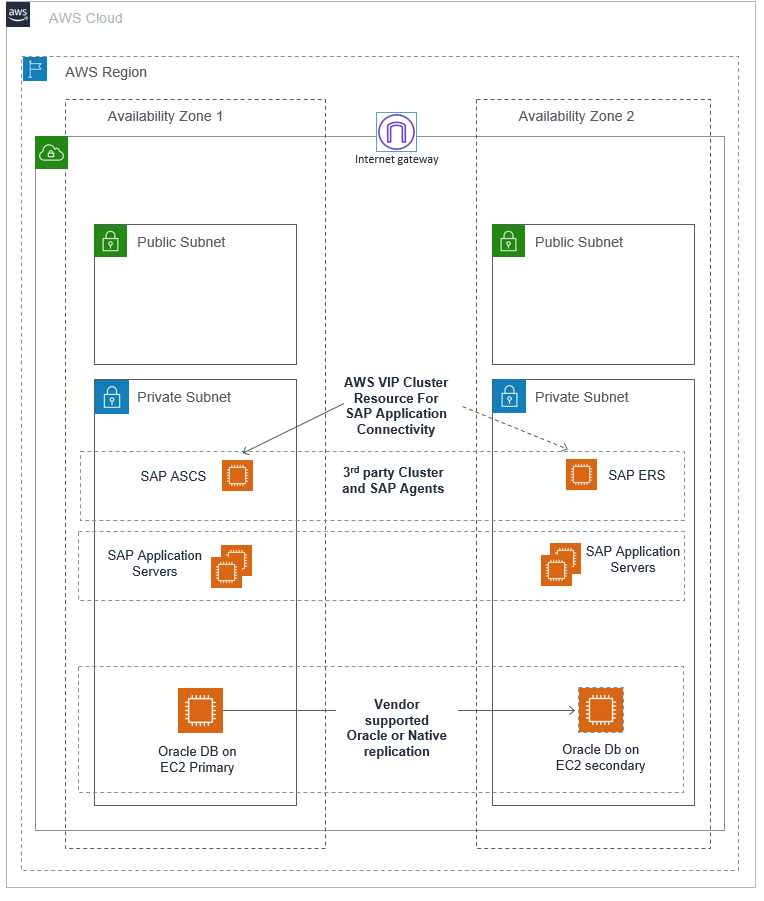
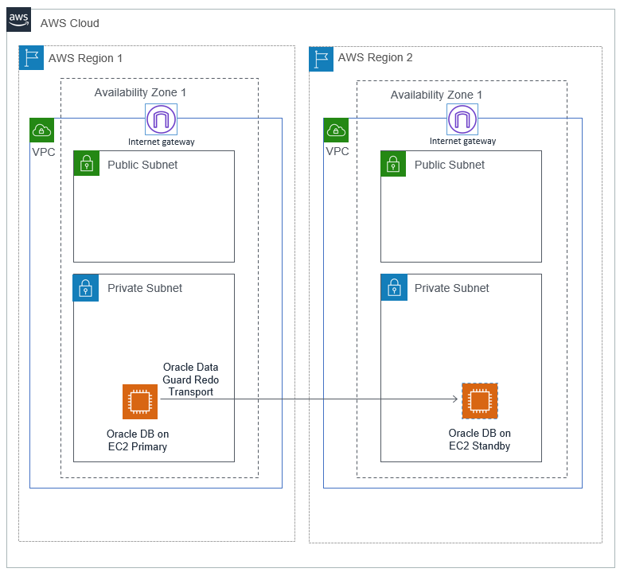
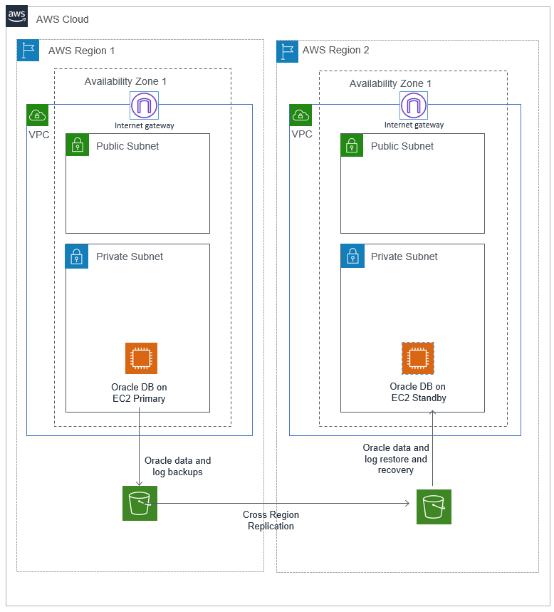

# Deployment options

To install Oracle for SAP NetWeaver, you have four deployment options:

## Standalone deployment

In standalone deployment (also known as single host installation), all components of the SAP NetWevaer, ABAP SAP Central Services (ASCS), and database Primary Application Server (PAS) run on one Amazon EC2 instance. One Amazon EC2 instance in a single Availability Zone in a single Region runs the Oracle database. This option can be optimal for non-production workloads. You can use [Amazon EC2 auto recovery](../../../AWSEC2/latest/UserGuide/ec2-instance-recover.md "../../../AWSEC2/latest/UserGuide/ec2-instance-recover.md") feature to protect your instance against infrastructure issues like loss of network connectivity or system power. However, this solution is not database state aware and does not protect your database against storage failure, OS issues, Availability Zone or Region failure.

## Distributed deployment

In distributed deployment, every instance of SAP NetWeaver (ASCS/SCS, database, PAS, and optionally AAS) can run on a separate Amazon EC2 instance. This system also deploys Oracle database in a single Availability Zone. You can use [Amazon EC2 auto recovery](../../../AWSEC2/latest/UserGuide/ec2-instance-recover.md "../../../AWSEC2/latest/UserGuide/ec2-instance-recover.md") feature to protect your instance against infrastructure issues like loss of network connectivity or system power.

## High availability deployment

In high availability deployment, you deploy two Amazon EC2 instances across two Availability Zones within a Region, and the Oracle database with Oracle Data Guard or a third-party high availability solution.

###### Note

When using native Oracle with SAP and AWS features, the design must be a subset of supported features, as described in [SAP Note 105047](https://launchpad.support.sap.com/#/notes/105047 "https://launchpad.support.sap.com/#/notes/105047") and [SAP Note 2358420](https://launchpad.support.sap.com/#/notes/2358420 "https://launchpad.support.sap.com/#/notes/2358420").

**Option 1: high availability with Oracle Data Guard**

Oracle Data Guard is a feature of the Oracle database enterprise edition. It provides a set of tools to manage one or more Oracle standby databases for high availability and disaster recovery. To create an Oracle standby database, replicate the Oracle primary database to a secondary server by backup/restore or RMAN duplicate method. When the standby database is set up, any changes to the primary database are replicated on the standby database. This ensures that both the databases are in sync. The following table describes the replication methods associated with the Oracle Data Guard protection modes.

Oracle Data Guard protection modes| **Protection mode** | **Replication** | **Behavior** |
| Maximum performance | Asynchronous | Primary database is not affected by any delays in writing redo data to the standby database. |
| Maximum availability | Synchronous | Commit occurs when all the redo data needed to recover transactions has been written to the online redo log and to at least one synchronized standby database. If Data Guard is not able to write to the standby database, the behavior will be similar to the maximum performance protection mode. |
| Maximum protection | Synchronous | Changes must be written to both, the online redo log and to the standby database for every transaction. If Data Guard is unable to write the redo stream to at least one standby, it will shut down the primary database. |

All Availability Zones within an AWS Region are connected with high-bandwidth over fully redundant and dedicated metro fiber, providing high-throughput and low-latency networking between Availability Zones. For a high availability configuration, you can set up a primary and standby relationship between two Oracle databases with synchronous replication, running on Amazon EC2 instances in different Availability Zones within the same Region.

The maximum protection mode can cause a shutdown of the primary database in case of a standby database failure. Unless you need to meet a compliance requirement, we recommend using the maximum availability option for high availability.

You can use manual failover or switchover to the standby database by following the steps in the [Data Guard Broker Switchover and Failover Operations](https://docs.oracle.com/database/121/DGBKR/sofo.htm#DGBKR330 "https://docs.oracle.com/database/121/DGBKR/sofo.htm#DGBKR330"). Alternatively, you can automate this process. For more information, see [Oracle Data Guard Fast-Start Failover](https://www.oracle.com/technical-resources/articles/smiley-fsfo.html "https://www.oracle.com/technical-resources/articles/smiley-fsfo.html"). To reconnect the SAP applications after the failover is complete, refer to the Reconnect SAP instance to database section in the https://www.sap.com/documents/2016/12/a67bac51-9a7c-0010-82c7-eda71af511fa.html.

**Option 2: high availability using third-party products**

You can use third-party products to achieve Oracle database high availability in your SAP on AWS environment. Here are two examples:

- [Using SIOS to Protect your Critical Core on AWS](https://aws.amazon.com/blogs/awsforsap/using-sios-to-protect-your-critical-core-on-aws/ "https://aws.amazon.com/blogs/awsforsap/using-sios-to-protect-your-critical-core-on-aws/")
- [High Availability Configuration in AWS Cloud using InfoScale Enterprise](https://www.veritas.com/support/en_US/doc/ka6j000000009eOAAQ "https://www.veritas.com/support/en_US/doc/ka6j000000009eOAAQ")

_For a complete list of certified partners, see the [SAP wiki](https://wiki.scn.sap.com/wiki/display/SI/Certified+HA-Interface+Partners "https://wiki.scn.sap.com/wiki/display/SI/Certified+HA-Interface+Partners")._

These products provide end-to-end high availability for SAP applications and databases. They also detect failures and perform automatic failovers, making them a good option for production environments with low recovery time objective. Using a virtual IP address makes the user or application redirection automatic in case of failover. For more information, see the vendor documentation.

Both of the preceding mentioned third-party examples are using their own storage (Data Keeper for SIOS and Veritas Volume Replicator for Veritas) and not database native replication. In option 1, the database is replicated using the Oracle Data Guard. The Guard supports SIOS but is not controlled by the SIOS application recovery kits, that is, a database failover is handled by the Guard. The Guard also supports Veritas, you can replicate using either the Guard or the Veritas Volume Replicator.

## Disaster recovery deployment

With disaster recovery deployment of your SAP systems on AWS Cloud, you can achieve business continuity. Based on recovery time objective, recovery point objective, and cost, you can set up disaster recovery deployment with one of the following three scenarios:

- backup and restore
- pilot light
- hot standby

To setup disaster recovery across AWS Regions, setup additional Amazon EC2 instances in a secondary Region for standby Oracle database. Also, configure Oracle Data Guard or a third-part solution for data replication across AWS Regions.

**Option 1:**disaster recovery using Oracle Data Guard

Using Oracle Data Guard, you can set up pilot light or hot standby DR deployment in your AWS Region. The maximum performance (asynchronous copy) option must be used in Data Guard.

Hot standby Amazon EC2 instance is of the same size as your production Amazon EC2 instance. This makes it more efficient to switch over during a DR test or event. Alternatively, you can use a pilot light approach wherein a smaller size Amazon EC2 instance is running in the AWS DR Region as the target of data replication. This Amazon EC2 instance should have enough resources to take over the load of data replication. This option costs less than hot standby. However, during a DR test or event, you have to perform an additional step of resizing the Amazon EC2 instance. Before switchover, you must resize the DR Amazon EC2 instance to the same size as production, so that it can take over the production workloads. This step increases the time required to switchover to DR. You must also factor in the latency of running a non-production environment in another Region.

Pilot light option can run a non-production environment that is the same size as production in the DR Region. This ensures availability of Amazon EC2 instance in case of a DR event.

**Option 2:**passive disaster recovery using backup and recovery

This option uses Oracle database backup and recovery feature to set up your DR. You can store your database backups in Amazon Simple Storage Service (Amazon S3) and use the Amazon S3 Cross-region replication (CRR) to replicate your backup to your target Region. It enables automatic, asynchronous copying of objects across buckets in different AWS Regions. You can install and configure Oracle database on an Amazon EC2 instance in your target DR Region and shut down the instance to save cost. You can then restart it and perform database restore and recovery as needed.

Alternatively, you can use automation such as AWS CloudFormation or Cloud Development Kit or third-party automation tools to launch an Amazon EC2 instance and install and configure SAP applications Oracle database when needed. Any automation must be created and tested in advance and we recommend performing frequent DR drills. This helps you save cost for Amazon EC2 instances and Amazon EBS volumes.

Note that the time to recover your database is dependent on the size of database. Any log files that were not copied to the DR Regions are lost and cannot be used for recovery. This option typically has higher RTO and RPO as compared to other options that use data replication technologies. However, it offers lower TCO in comparison to other options.

_You can choose to deploy high availability and disaster recovery for the same production database instance._

**If you want to use Oracle Data Guard for HA and DR, see [Multiple Standby Databases Best Practices](https://www.oracle.com/cn/a/tech/docs/technical-resources/maa10gr2multiplestandbybp-1.pdf "https://www.oracle.com/cn/a/tech/docs/technical-resources/maa10gr2multiplestandbybp-1.pdf")**.
