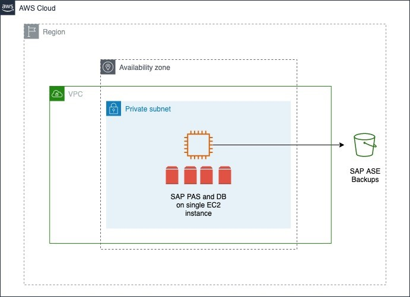
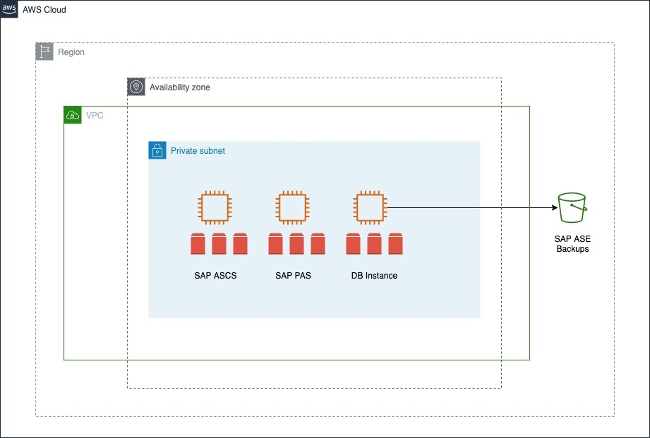
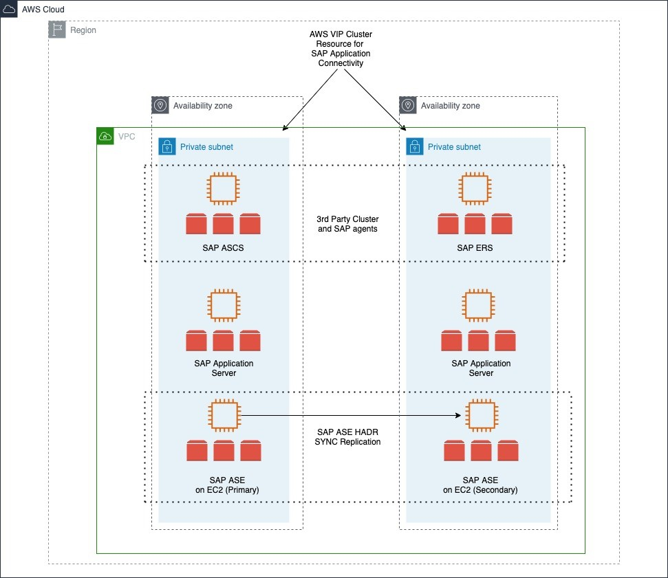
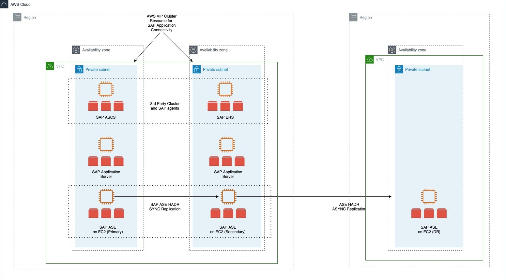
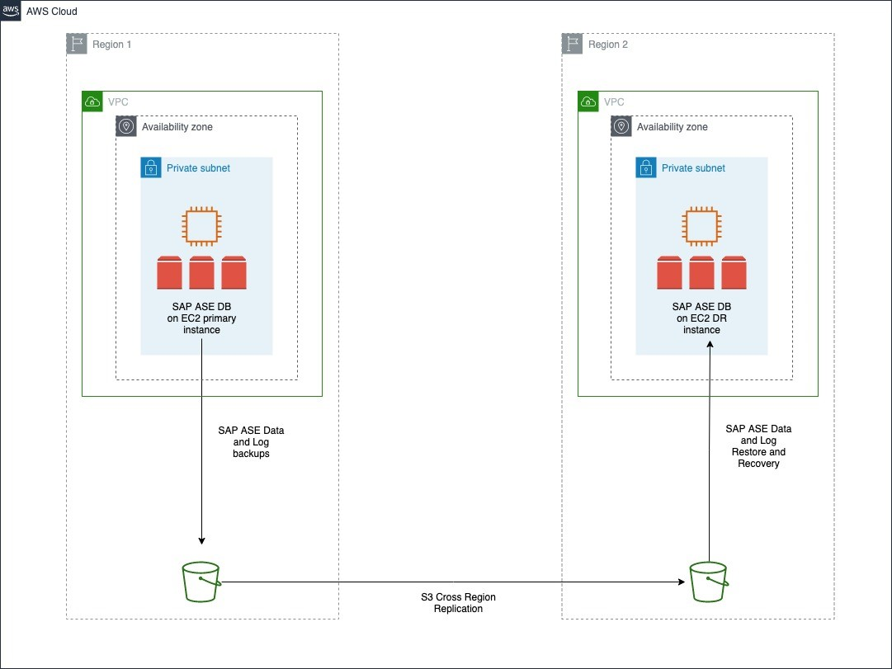
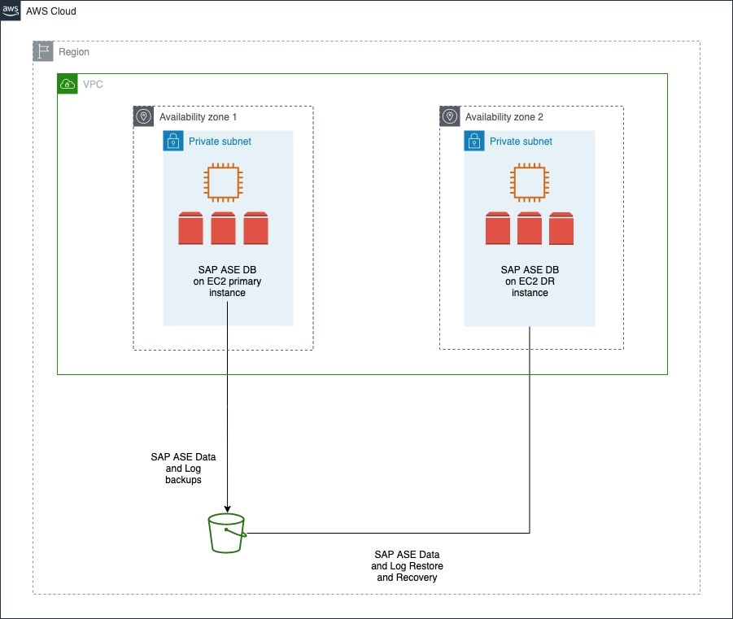
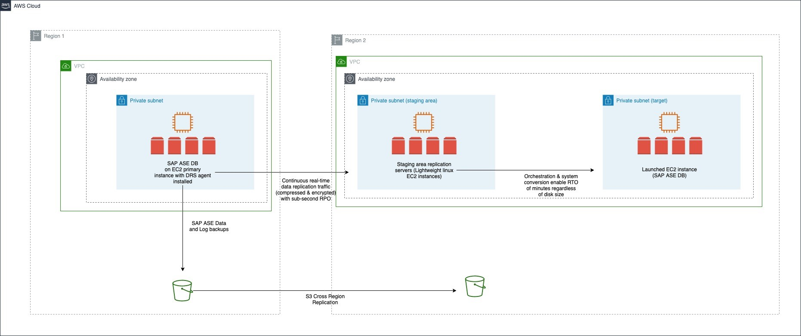

# Deployment options

To install SAP ASE for SAP NetWeaver, you have four deployment options:

## Standalone deployment

In standalone deployment (also known as single host installation), all components of the SAP NetWevaer, ABAP SAP Central Services (ASCS), and database Primary Application Server (PAS) run on one Amazon EC2 instance using a single Availability Zone in an AWS Region. This option is recommended for non-production workloads. You can use [Amazon EC2 auto recovery](../../../AWSEC2/latest/UserGuide/ec2-instance-recover.md "../../../AWSEC2/latest/UserGuide/ec2-instance-recover.md") feature to protect your instance against infrastructure issues like loss of network connectivity or system power. This solution is not database state aware, and does not protect your database against storage failure, OS issues, Availability Zone or Region failure.

## Distributed deployment

In distributed deployment, every instance of SAP NetWeaver (ASCS/SCS, database, PAS, and optionally AAS) can run on a separate Amazon EC2 instance. This system also deploys SAP ASE database in a single Availability Zone. You can use [Amazon EC2 auto recovery](../../../AWSEC2/latest/UserGuide/ec2-instance-recover.md "../../../AWSEC2/latest/UserGuide/ec2-instance-recover.md") feature to protect your instance against infrastructure issues like loss of network connectivity or system power. This solution is not database state aware, and does not protect your database against storage failure, OS issues, Availability Zone or Region failure.

## High availability deployment

In a high availability deployment, you deploy two Amazon EC2 instances across two Availability Zones within a Region, and the SAP ASE database with a combination of the Data Movement Component and Database Fault Manager.

All Availability Zones within an AWS Region are connected with high-bandwidth over fully redundant and dedicated metro fiber, providing high-throughput and low-latency networking between Availability Zones. For a high availability configuration, you can set up a primary and standby relationship between two SAP ASE databases with synchronous replication, running on Amazon EC2 instances in different Availability Zones within the same Region.

The SAP ASE always-on option is a high availability/disaster recovery system that contains two or more SAP ASE servers – the primary server where all of the transaction processing takes place, and the warm standby (companion) server. The primary and standby nodes are deployed in different Availability Zones, providing protection against zonal failures. You can also integrate Fault Manager to automatically failover the system in case of failures. You can learn more about this on the SAP Help Portal’s [SAP Adaptive Servers Enterprise HADR Users Guide](https://help.sap.com/docs/SAP_ASE/efe56ad3cad0467d837c8ff1ac6ba75c/a6645e28bc2b1014b54b8815a64b87ba.html "https://help.sap.com/docs/SAP_ASE/efe56ad3cad0467d837c8ff1ac6ba75c/a6645e28bc2b1014b54b8815a64b87ba.html").

_We recommend referring to the following SAP Notes (SAP portal access required) for a high availability deployment._

- _[SAP Note 1650511 – SYB: High Availability Offerings with SAP Adaptive Server Enterprise](https://launchpad.support.sap.com/#/notes/1650511 "https://launchpad.support.sap.com/#/notes/1650511")_
- _[SAP Note 2808173 – Special Instructions when Installing and Upgrading HADR with SAP Business Suite on SAP ASE](https://launchpad.support.sap.com/#/notes/2808173 "https://launchpad.support.sap.com/#/notes/2808173")_

## Disaster recovery deployment

You can increase business continuity with disaster recovery deployment of your SAP systems on AWS Cloud. Based on recovery time objective, recovery point objective, and cost, you can set up disaster recovery deployment with one of the following three options.

### Option 1 – disaster recovery using the SAP ASE HADR feature

You can use the SAP ASE HADR feature to replicate your database in a secondary AWS Region or Availability Zone, based on your business and audit requirements. You can also integrate this DR node in an existing HADR landscape. This setup enables you to increase the overall system resiliency.

With this option, you can either choose pilot light, where the recovery instance is smaller than the current instance, or hot standby, where the recovery instance is of the same size as the current instance. You must consider your recovery time objectives and manual effort required when choosing between pilot light or hot standby. The recovery instance for the pilot light option must be resized before assuming disaster recovery.

_For more details, check the following SAP resources._

- _[HADR System with DR Node Users Guide](https://help.sap.com/doc/f0a13ab3128b4eb0a5042281050c95d8/16.0.3.6/en-US/HADR_System_with_DR_Node_Users_Guide.pdf "https://help.sap.com/doc/f0a13ab3128b4eb0a5042281050c95d8/16.0.3.6/en-US/HADR_System_with_DR_Node_Users_Guide.pdf")_
- _[2934459 - HADR support of two ASE servers on Primary and Companion machines - SAP ASE](https://launchpad.support.sap.com/#/notes/2934459 "https://launchpad.support.sap.com/#/notes/2934459") (requires SAP portal access)_

### Option 2 – passive disaster recovery using backup and recovery

You can store database backups in Amazon S3 and use Amazon S3 Cross-Region Replication (CRR) to replicate your backup in target Region. This method enables automatic, asynchronous copying of objects across Amazon S3 buckets in different AWS Regions. To save costs, you can install and configure SAP ASE database on an Amazon EC2 instance in your disaster recovery Region, and shut the instance. Restart the instance to restore and recover database from the replicated Amazon S3 bucket as needed.

Alternatively, you can use AWS CloudFormation, AWS Cloud Development Kit (AWS CDK) or third-party automation tools to launch an Amazon EC2 instance and to install and configure the SAP ASE database when needed. This helps save costs on Amazon EC2 and Amazon EBS. You must create and test automations before implementation. We recommend performing frequent disaster recovery drills on automations.

The time to recover the database is dependent on the size of the database. Any log files that are not copied over to the disaster recovery Regions are lost and cannot be used for recovery. This option has higher recovery time and point objectives but offers lower costs in comparison to other options. You can use Amazon S3 Replication Time Control to reduce your recovery point objective. For more information, see [Using Amazon S3 Replication Time Control](../../../AmazonS3/latest/userguide/replication-time-control.md#enabling-replication-time-control "../../../AmazonS3/latest/userguide/replication-time-control.md#enabling-replication-time-control").

You can also recover the SAP ASE database backups in the same AWS Region, in case of an Availability Zone failure. Amazon EBS snapshots and Amazon S3 bucket data is automatically replicated within the Region. In the event of an Availability Zone failure, an Amazon EC2 instance can be created in a different Availability Zone of the same Region. It is created from the Amazon EBS snapshots of the source Amazon EC2 instance. The SAP ASE database is restored from the backups in the Amazon S3 bucket. Amazon S3 One Zone-IA is the only exception to automatic replication. For more information, see [Amazon S3 Storage Classes](https://aws.amazon.com/s3/storage-classes/ "https://aws.amazon.com/s3/storage-classes/").

### Option 3 – disaster recovery using AWS Elastic Disaster Recovery

You can use AWS Elastic Disaster Recovery to replicate source servers from the primary Region to a secondary Region. Elastic Disaster Recovery uses block-level replication, and is not application-aware.

Elastic Disaster Recovery is only used for disaster recovery. You can use Amazon S3 Cross Region Replication for backup.

For more information, see [Disaster recovery for SAP workloads on AWS using AWS Elastic Disaster Recovery](../general/dr-sap.md "../general/dr-sap.md").

