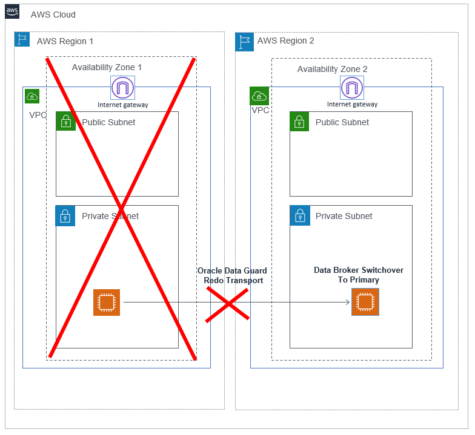

# HA/DR operations

## Oracle Data Guard

You can use manual failover or switchover to the standby database using steps described in the [Switchover and Failover Operations](https://docs.oracle.com/en/database/oracle/oracle-database/19/dgbkr/using-data-guard-broker-to-manage-switchovers-failovers.html#GUID-44E7A982-7CD4-4A51-B00E-62C0698C5CD6 "https://docs.oracle.com/en/database/oracle/oracle-database/19/dgbkr/using-data-guard-broker-to-manage-switchovers-failovers.html#GUID-44E7A982-7CD4-4A51-B00E-62C0698C5CD6"). You can also automate this process by following the steps in [Oracle Data Guard Fast-Start Failover](https://www.oracle.com/technetwork/articles/smiley-fsfo-084973.html "https://www.oracle.com/technetwork/articles/smiley-fsfo-084973.html"). When using this feature with the observer node, you must place the observer node in the third Availability Zone. Ensure that you have the license to use the fast-start failover, it may not be included with the Data Guard. You can also use supported third-party products that provide automatic failover operation with the Data Guard. To reconnect the SAP applications post-failover, see the _Reconnect SAP instance to database_ section-premises in https://www.sap.com/documents/2016/12/a67bac51-9a7c-0010-82c7-eda71af511fa.html.

## Perform a DNS change

In case of manual failover, you may install SAP application servers using a virtual hostname and perform a DNS change to direct the SAP application servers to the new primary database server. For a DNS resolution in AWS, you can use any of the following options.

- [Amazon Route 53](../../../Route53/latest/DeveloperGuide/dns-configuring.md "../../../Route53/latest/DeveloperGuide/dns-configuring.md") enables you to create a private hosted zone for your environment and an A record for the virtual hostname used for Oracle database. Initially, this A record is mapped to the IP address of the primary Oracle database instance.
- You can maintain your own DNS server on-premise or on your Amazon EC2 instances. You can create an A record there for your virtual hostname used for Oracle database. Initially, this A record is mapped to the IP address of the primary Oracle database instance.
- With the [AWS Directory Service](https://aws.amazon.com/directoryservice/ "https://aws.amazon.com/directoryservice/"), you can create an A record for the virtual hostname used for Oracle database.

With any of the previously mentioned options, you can change the A record to a private IP address of the primary database instance in case of a failover. This DNS change can also be automated using AWS services and scripts.
