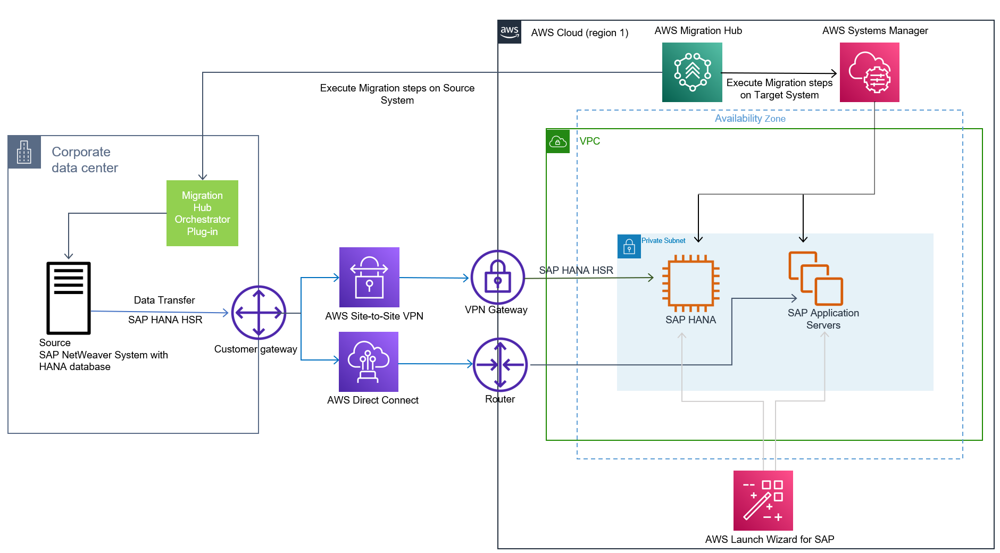
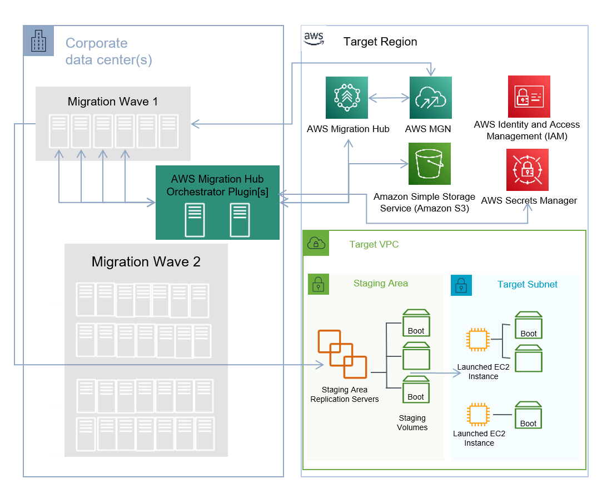

# Migrate SAP NetWeaver applications with AWS Migration Hub Orchestrator

AWS Migration Hub Orchestrator simplifies and automates the migration of servers and enterprise applications to AWS. It provides a single location to run and track your migrations. It helps reduce migration costs and time by automating many migration tasks. Migration Hub Orchestrator offers templates to create a migration workflow that can be customized to fit your unique migration requirements.

With Migration Hub Orchestrator, you can migrate SAP NetWeaver based applications running on SAP HANA or any other database, such as Oracle, MSSQL, SAP ASE, etc., to AWS. For more information, see [What is AWS Migration Hub Orchestrator?](../../../migrationhub-orchestrator/latest/userguide/what-is-migrationhub-orchestrator.md "../../../migrationhub-orchestrator/latest/userguide/what-is-migrationhub-orchestrator.md")

You can access AWS Migration Hub Orchestrator from link: [https://console.aws.amazon.com/migrationhub/orchestrator/](https://console.aws.amazon.com/migrationhub/orchestrator/ "https://console.aws.amazon.com/migrationhub/orchestrator/") or from the AWS Command Line Interface.

###### Topics

- [Migrate applications with SAP HANA](#hana "#hana")
- [Migrate applications with any database](#anydb "#anydb")

## Migrate applications with SAP HANA

To migrate SAP NetWeaver based applications running on SAP HANA database, use the [Migrate SAP NetWeaver based applications and SAP HANA databases to AWS](../../../migrationhub-orchestrator/latest/userguide/migrate-sap.md "../../../migrationhub-orchestrator/latest/userguide/migrate-sap.md") template.

The following diagram illustrates an application migration with this template.

## Migrate applications with any database

To migrate SAP NetWeaver based applications running on any database _other than SAP HANA_, use the [Rehost applications on Amazon EC2](../../../migrationhub-orchestrator/latest/userguide/rehost-on-ec2.md "../../../migrationhub-orchestrator/latest/userguide/rehost-on-ec2.md") Migration Hub Orchestrator template.

The following diagram illustrates an application migration with this template.

