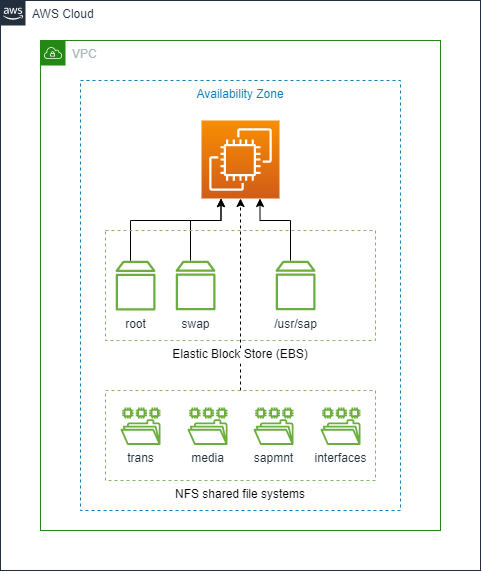

# Disk Layout

For SAP standard installation, we recommend the following file systems layout.

| File system | Supported AWS storage service                                                      | Comments                                            |
| ----------- | ---------------------------------------------------------------------------------- | --------------------------------------------------- |
| root        | Amazon Elastic Block Store (Amazon EBS)                                            | N/A                                                 |
| swap        | Amazon Elastic Block Store (Amazon EBS)                                            | N/A                                                 |
| /usr/sap    | Amazon Elastic Block Store (Amazon EBS) Amazon Elastic File System (Amazon EFS) | N/A                                                 |
| sapmnt      | Amazon Elastic File System (Amazon EFS) Amazon FSx for NetApp ONTAP             | Single Availability Zone or Multi-Availability Zone |
| trans       | Amazon Elastic File System (Amazon EFS) Amazon FSx for NetApp ONTAP             | Single Availability Zone or Multi-Availability Zone |
| interfaces  | Amazon Elastic File System (Amazon EFS) Amazon FSx for NetApp ONTAP             | Single Availability Zone or Multi-Availability Zone |
| media       | Amazon Elastic File System (Amazon EFS) Amazon FSx for NetApp ONTAP             | Single Availability Zone or Multi-Availability Zone |

###### Note

In a standard installation, `/usr/sap` can also be mounted on Amazon EFS. Directories for interfaces and media are optional.
