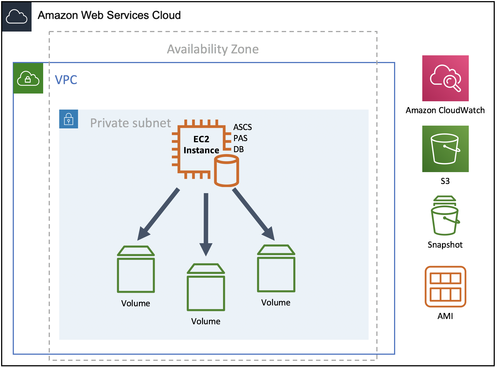

# Standard System Deployment

Standard system or single host installation: all main instances of SAP NetWeaver (ASCS/SCS, database, and PAS) run on one Amazon EC2 instance. This option is best suited for non-production workloads.

