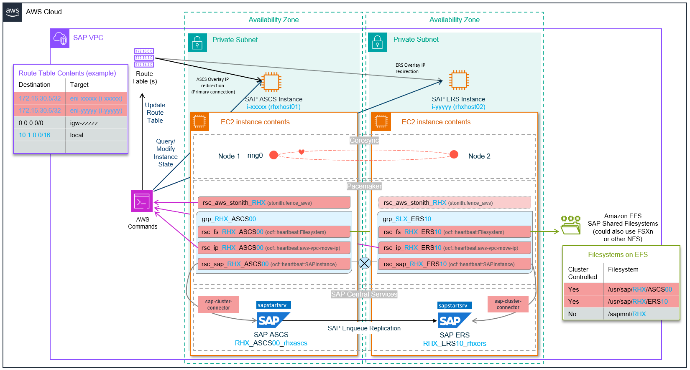
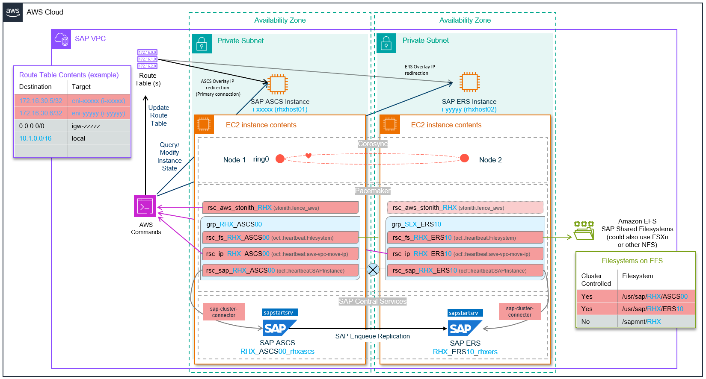

# Architecture diagrams

This guide covers two architectures for SAP cluster solutions on RHEL for SAP – simple-mount and classic (previous standard). See the following images to learn more.

###### Topics

- [Pacemaker - simple-mount architecture](#simple-mount-diagram-nw-rhel "#simple-mount-diagram-nw-rhel")
- [Pacemaker - classic architecture](#classic-diagram-nw-rhel "#classic-diagram-nw-rhel")

## Pacemaker - simple-mount architecture

See the following image for more details.

## Pacemaker - classic architecture

See the following image for more details.

