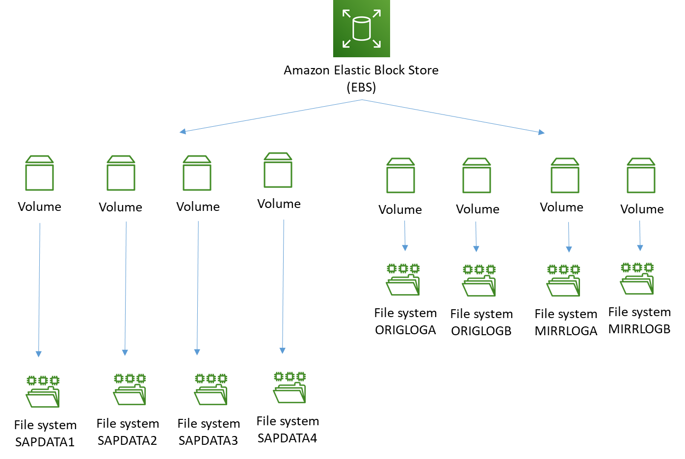
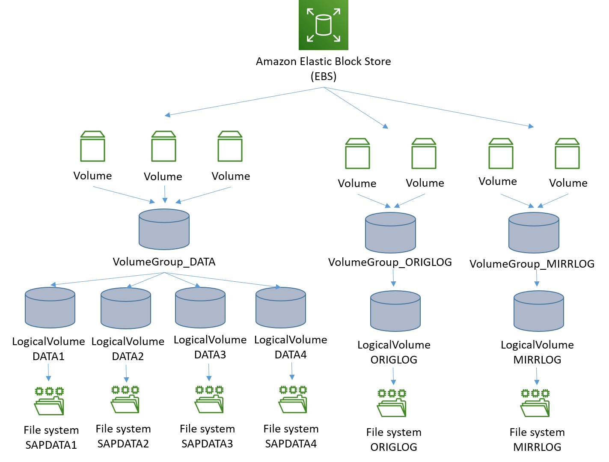

# Storage for Oracle

This section describes the key considerations for designing storage layout of Oracle for SAP NetWeaver on AWS. Before defining the layout, we recommend familiarizing yourself with IOPS and throughput offered by [Amazon EBS volume types](../../../AWSEC2/latest/UserGuide/ebs-volume-types.md "../../../AWSEC2/latest/UserGuide/ebs-volume-types.md") and learning to calculate the baseline and burstable IOPS and throughput for these volumes. Amazon EC2 instances also have IOPS and throughput limits. For more details, see [Amazon EBS-optimized instances](../../../AWSEC2/latest/UserGuide/ebs-optimized.md "../../../AWSEC2/latest/UserGuide/ebs-optimized.md").

## Amazon FSx for NetApp ONTAP

FSx for ONTAP is certified for Oracle databases on SAP NetWeaver. For more information, see [SAP Note 1656250 - SAP on AWS: Support prerequisites](https://launchpad.support.sap.com/#/notes/1656250 "https://launchpad.support.sap.com/#/notes/1656250") (portal access required).

## File system

The file system structure for SAP Oracle deployment may differ with the database version. Refer to the following SAP Notes for individual Oracle database versions:

- [SAP Note 2660017](https://launchpad.support.sap.com/#/notes/2660017 "https://launchpad.support.sap.com/#/notes/2660017")
- [SAP Note 1915301](https://launchpad.support.sap.com/#/notes/1915301 "https://launchpad.support.sap.com/#/notes/1915301")
- [SAP Note 1524205](https://launchpad.support.sap.com/#/notes/1524205 "https://launchpad.support.sap.com/#/notes/1524205")

The directory structure for database installation requires several file systems. This section only focuses on the storage layout of the file systems mentioned in the following table. The other file systems (used for storing Oracle software binaries, trace, and log files) are critical for operations but do not have heavy performance requirements as compared to the following files.

|                            |                                    |
| -------------------------- | ---------------------------------- | --------------------------------------------------------------------------------------------------------------------------------------------------------------------------------------------------------------------------------------------------------------------------------------------------------------------------------------------------------------------------------------------------------------------------------------------------------------------------------------------------------------------------------------------------------------------------------------------------------------------------------------------------------------------------------------------------------------------------------------------------------------------------------------------------------------------------------------------------------------------------------------------------------------------------------------------------------------------------------------------------------------------------------------------------------------------------------------------------------------------------------------------------------------------------------------------------------------------------------------------------------------------------------------------------------------------------------------------------------------------------------------------------------------------------------------------------------------------------------------------------------------------------------------------------------------------------------------------------------------------------------------------------------------------------------------------------------------------------------------------------------------------------------------------------------------------------------------------------------------------------------------------------------------------------------------------------------------------------------------------------------------------------------------------------------------------------------------------------------------------------------------------------------------------------------------------------------------------------------------------------------------------------------------------------------------------------------------------------------------------------------------------------------------------------------------------------------------------------------------------------------------------------------------------------------------------------------------------------------------------------------------------------------------------------------------------------------------------------------------------------------------------------------------------------------------------------------------------------------------------------------------------------------------------------------------------------------------------------------------------------------------------------------------------------------------------------------------------------------------------------------------------------------------------------------------------------------------------------------------------------------------------------------------------------------------------------------------------------------------------------------------------------------------------------------------------------------------------------------------------------------------------------------------------------------------------------------------------------------------------------------------------------------------------------------------------------------------------------------------------------------------------------------------------------------------------------------------------------------------------------------------------------------------------------------------------------------------------------------------------------------------------------------------------------------------------------------------------------------------------------------------------------------------------------------------------------------------------------------------------------------------------------------------------------------------------------------------------------------------------------------------------------------------------------------------------------------------------------------------------------------------------------------------------------------------------------------------------------------------------------------------------------------------------------------------------------------------------------------------------------------------------------------------------------------------------------------------------------------------------------------------------------------------------------------------------------------------------------------------------------------------------------------------------------------------------------------------------------------------------------------------------------------------------------------------------------------------------------------------------------------------------------------------------------------------------------------------------------------------------------------------------------------------------------------------------------------------------------------------------------------------------------------------------------------------------------------------------------------------------------------------------------------------------------------------------------------------------------------------------------------------------------------------------------------------------------------------------------------------------------------------------------------------------------------------------------------------------------------------------------------------------------------------------------------------------------------------------------------------------------------------------------------------------------------------------------------------------------------------------------------------------------------------------------------------------------------------------------------------------------------------------------------------------------------------------------------------------------------------------------------------------------------------------------------------------------------------------------------------------------------------------------------------------------------------------------------------------------------------------------------------------------------------------------------------------------------------------------------------------------------------------------------------------------------------------------------------------------------------------------------------------------------------------------------------------------------------------------------------------------------------------------------------------------------------------------------------------------------------------------------------------------------------------------------------------------------------------------------------------------------------------------------------------------------------------------------------------------------------------------------------------------------------------------------------------------------------------------------------------------------------------------------------------------------------------------------------------------------------------------------------------------------------------------------------------------------------------------------------------------------------------------------------------------------------------------------------------------------------------------------------------------------------------------------------------------------------------------------------------------------------------------------------------------------------------------------------------------------------------------------------------------------------------------------------------------------------------------------------------------------------------------------------------------------------------------------------------------------------------------------------------------------------------------------------------------------------------------------------------------------------------------------------------------------------------------------------------------------------------------------------------------------------------------------------------------------------------------------------------------------------------------------------------------------------------------------------------------------------------------------------------------------- |
| **Description**            | **File system**                    |
| Database data files        | / oracle/<DBSID>/ sapdata(1,2…​.n) |
| Database online redo logs  | / oracle/<DBSID>/ origlog(A,B…​)   |
| Database mirror redo logs  | / oracle/<DBSID>/ mirrlog(A,B…​)   |
| Database offline redo logs | / oracle/<DBSID>/ oraarch          | You can calculate the capacity requirements from your existing database for migrations or using the SAP Quick Sizer tool for new implementations. ## Calculate the IOPS The most efficient way to estimate the actual IOPS that is necessary for your database is to query the system tables over a period of time and find the peak IOPS usage of your existing database. To perform this task, measure IOPS over a period of time and select the highest value. You can access this information from the GV$SYSSTAT dynamic performance view, a special view in the Oracle database that provides performance information. The view is continuously updated while the database is open and in use. Oracle Enterprise Manager and Automatic Workload Repository reports access this view to gather data. Alternatively, you can use the native storage tools to calculate the IOPS requirements. If storage tools are not available, you can use a script. For more information, see [Determining the IOPS Needs for Oracle Database on AWS](../../../whitepapers/latest/determining-iops-needs-oracle-db-on-aws/determining-iops-needs-oracle-db-on-aws.md "../../../whitepapers/latest/determining-iops-needs-oracle-db-on-aws/determining-iops-needs-oracle-db-on-aws.md"). ## Amazon EBS volume types AWS has multiple options for database storage, based on your throughput and IOPS requirements. **Two options for general purpose SSD**:  • `gp3` volumes deliver a consistent baseline rate of 3,000 IOPS and 125 MiB/s, included with the price of storage. You can provision additional IOPS (up to 16,000) and throughput (up to 1,000 MiB/s) for an additional cost.  • `gp2` volumes deliver performance linked to the size of the volume. We recommend new customers to use `gp3` volumes. Existing `gp2` users can migrate to `gp3` easily with [Amazon EBS Elastic Volumes](../../../AWSEC2/latest/UserGuide/ebs-modify-volume.md "../../../AWSEC2/latest/UserGuide/ebs-modify-volume.md"). It enables modification of volume types, IOPS or throughput of your existing Amazon EBS volumes without interrupting the Amazon EC2 instances. **Three options for provisioned IOPS SSD**:  • `io1` is designed to deliver a consistent baseline performance of up to 50 IOPS/GB to a maximum of 64,000 IOPS, and provide up to 1,000 MiB/s of throughput per volume.  • `io2` is designed to deliver a consistent baseline performance of up to 500 IOPS/GB to a maximum of 64,000 IOPS, and provide up to 1,000 MiB/s of throughput per volume.  • `io2 Block Express` is designed for workloads that require sub-millisecond latency, sustained IOPS performance, more than 64,000 IOPS, and 1,000 MiB/s of throughput per volume. **Comparisons** _Choosing between general purpose and provisioned IOPS SSD_ We recommend using `gp3` on Oracle for SAP on AWS workloads. It provides a better option for price over performance. You can dynamically switch from one volume type to another, if needed. *Choosing between `*io1*`and`*io2*`* We recommend you to use `io2` for provisioned IOPS use case. It provides lower annual failure rate and higher configurable IOPS per GB. *Choosing between `*gp3*`and`*io2*`* `io2` provides lower annual failure rate and higher maximum IOPS per volume but costs more than `gp3`. You can decide to use either of the two based your requirements regarding failure rate, IOPS, and cost. *Choosing between `*io2*`and`*io2 Block Express*`* `io2 Block Express` should be chosen over `io2` for workloads that require sub-millisecond latency and more than 64,000 IOPS and 1,000 MiB/s of throughput from a single volume. If `io2 Block Express` doesn’t support your Amazon EC2 instance and Amazon EBS volume, use `io2`. ###### Note Check the [Amazon EBS volume types](../../../AWSEC2/latest/UserGuide/ebs-volume-types.md "../../../AWSEC2/latest/UserGuide/ebs-volume-types.md") to ensure that your chosen volume supports the Amazon EC2 instance in use. ## Best practices Follow these best practices for maximizing your database performance and storage resilience:  • Use [Amazon EBS-optimized instances](../../../AWSEC2/latest/UserGuide/ebs-optimized.md "../../../AWSEC2/latest/UserGuide/ebs-optimized.md") for database storage. They have a dedicated path between Amazon EC2 and Amazon EBS volumes.  • To achieve higher IOPS and throughput, you can use Linux Volume Manager (LVM) to create Linux file systems with striping across multiple Amazon EBS volumes or Oracle [Automatic Storage Management](https://help.sap.com/doc/saphelp_nw73ehp1/7.31.19/en-US/f6/9d54b0698c446588f18c071d68ae9e/content.htm?no_cache=true "https://help.sap.com/doc/saphelp_nw73ehp1/7.31.19/en-US/f6/9d54b0698c446588f18c071d68ae9e/content.htm?no_cache=true"). For Automatic Storage Management, you can use multiple Amazon EBS volumes for creating disk groups, as recommended in the SAP installation guide for Oracle database.  • In case of backup to local file system, overall data throughput of the Amazon EBS volumes used to create the file system is crucial for backup performance.In AWS, you can use throughput optimized (`st1`) type Amazon EBS volumes for database backups to local file system. For larger file systems, `st1` type volumes have higher maximum throughput per volume at a lower cost when compared with `gp3` or `io1/io2`. Other volume types can be considered if `st1` doesn’t meet your requirement. Ensure that the backup storage window can meet the required backup window available for database backups.  • When running SAP NetWeaver on Oracle database, you are required to have the `/sapmnt/[SID]` directory mounted on the database server. We recommend that you use Amazon EFS to host the `/sapmnt` directory and mount this on all SAP servers using the NFS protocol.  • Data and log files should be on separate volumes.  • Origlog and mirrlog should be on separate volumes.  • Copies of control files should be stored on file systems that are created on separate volumes.  • Redo log files are written sequentially by the Oracle database instance Log Writer (LGWR) process. Log file systems must be designed to support such I/O activity. ## Example configuration You need to set up the Oracle database with the following requirements:  • Data file system with 48,000 peak IOPS, 3,000 MiB/s throughput and 12 TB capacity  • Each of the archive log, online and mirror redo log files with 3,800 peak IOPS and 25 GB capacity  • Oracle based file system for all other directories under `/oracle` with 300 GB capacity The following is an example storage design to achieve the previously mentioned performance and capacity requirements. **Data file system with provisioned IOPS using `gp3` or `io2` and without LVM:** Create one Amazon EBS volume for each file system size and use provisioned IOPS and throughput, as per the individual file system requirements. For data volumes, higher size and IOPS can be assigned to application tablespace volumes as needed. Since size, type, and IOPS can be changed dynamically, you can adjust these parameters with changing requirements. This is a simpler approach and doesn’t require any volume striping using Linux LVM or similar technology. However, with this approach, you are still limited by the maximum size and IOPS supported by individual Amazon EBS volumes.  **Data file system with provisioned IOPS using `gp3` or `io2` and with LVM:** Create a single data volume group using stripping and four Amazon EBS volumes of 3 TB/each. This provides 12 TB of file system capacity. Each data volume can be configured with 12,000 IOPS and 750 MiB/s throughput to provide combined IOPS of 48,000 and throughput of 3,000 MiB/s. Multiple `sapdata` logical volumes and file systems can be created under this volume group. You can also create multiple volume groups for data file systems alone. Creating volume groups increases the recovery time, in case one of the underlying Amazon EBS volumes becomes unusable. In this case, many data files residing on this volume group may be impacted as all `sapdata` file systems are stripped across all Amazon EBS volumes. The benefit of using this approach is that you don’t need to have the IOPS and throughput requirements of individual `sapdata` file systems. The requirements of the Oracle database data file system are sufficient. Also, `sapdata` shares the IOPS and throughput, leading to better utilization of baseline performance when using `gp3` volumes. **Online redo logs** Use 25 GB `gp3` Amazon EBS volumes with 3,800 provisioned IOPS.  |
