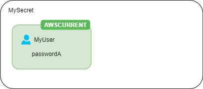
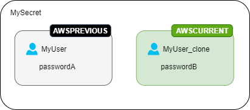
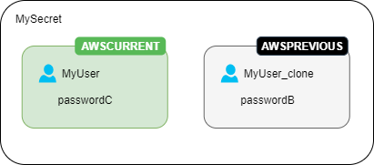

# Lambda function rotation strategies

For [Rotation by Lambda function](rotate-secrets_lambda.md "rotate-secrets_lambda.md"), for database secrets, Secrets Manager offers two rotation strategies.

## Rotation strategy: single user

This strategy updates credentials for one user in one secret. For Amazon RDS Db2 instances, because users can't change their own passwords, you must provide admin credentials in a separate secret. **This is the simplest rotation strategy, and it is appropriate for most use cases.** In particular, we recommend you use this strategy for credentials for one-time (ad hoc) or interactive users.

When the secret rotates, open database connections are not dropped. While rotation is
happening, there is a short period of time between when the password in the database changes
and when the secret is updated. During this time, there is a low risk of the database denying
calls that use the rotated credentials. You can mitigate this risk with an [appropriate
retry strategy](https://aws.amazon.com/blogs/architecture/exponential-backoff-and-jitter/ "https://aws.amazon.com/blogs/architecture/exponential-backoff-and-jitter/"). After rotation, new connections use the new credentials.

## Rotation strategy: alternating users

This strategy updates credentials for two users in one secret. You
create the first user, and during the first rotation, the rotation function clones it to
create the second user. Every time the secret rotates, the rotation function alternates
which user's password it updates. Because most users don't have permission to clone themselves, you must provide the credentials
for a `superuser` in another secret. We recommend using the single-user rotation strategy when cloned users in your database don't have the same permissions as the original user, and for credentials for one-time (ad hoc) or interactive users.

This strategy is appropriate for databases with permission models where one role owns the database
tables and a second role has permission to access the database tables. It is also appropriate for
applications that require high availability. If an application retrieves the secret during rotation, the application still gets a valid set
of credentials. After rotation, both `user` and `user_clone` credentials are
valid. There is even less chance of applications
getting a deny during this type of rotation than single user rotation. If the database is hosted on
a server farm where the password change takes
time to propagate to all servers, there is a risk of the database denying calls that
use the new credentials. You can mitigate this risk with an [appropriate retry
strategy](https://aws.amazon.com/blogs/architecture/exponential-backoff-and-jitter/ "https://aws.amazon.com/blogs/architecture/exponential-backoff-and-jitter/").

Secrets Manager creates the cloned user with the same permissions as the original user. If you change the original user's permissions after the clone is created, you must also change the cloned user's permissions.

For example, if you create a secret with a database user's credentials, the secret contains one version with those credentials.

**First rotation** – The rotation function creates a clone of your user with a generated password, and those credentials become the current secret version.

**Second rotation** – The rotation function updates the password for the original user.

**Third rotation** – The rotation function updates the password for the cloned user.

