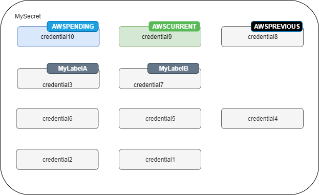

# What's in a Secrets Manager secret?

In Secrets Manager, a _secret_ consists of secret information, the
_secret value_, plus metadata about the secret. A secret value can be a
string or binary.

To store multiple string values in one secret, we recommend that you use a JSON text
string with key-value pairs, for example:

```
{
  "host"       : "ProdServer-01.databases.example.com",
  "port"       : "8888",
  "username"   : "administrator",
  "password"   : "`EXAMPLE-PASSWORD`",
  "dbname"     : "MyDatabase",
  "engine"     : "mysql"
}
```

For database secrets, if you want to turn on automatic rotation, the secret must contain connection information for the database in the correct JSON structure. For more information, see [JSON structure of AWS Secrets Manager secrets](reference_secret_json_structure.md "reference_secret_json_structure.md") .

## Metadata

A secret's metadata includes:

- An Amazon Resource Name (ARN) with the following format:

```
arn:aws:secretsmanager:`<Region>`:`<AccountId>`:secret:`SecretName`-`6RandomCharacters`
```

Secrets Manager includes six random characters at the end of the secret name to help ensure that the secret ARN is unique. If the original secret is deleted, and then a new secret is created with the same name, the two secrets have different ARNs because of these characters. Users with access to the old secret don't automatically get access to the new secret because the ARNs are different.

- The name of the secret, a description, a resource policy, and tags.
- The ARN for an _encryption key_, an AWS KMS key that Secrets Manager uses
  to encrypt and decrypt the secret value. Secrets Manager stores secret text in an encrypted
  form and encrypts the secret in transit. See [Secret encryption and decryption in AWS Secrets Manager](security-encryption.md "security-encryption.md").
- Information about how to rotate the secret, if you set up rotation. See [Rotate AWS Secrets Manager secrets](rotating-secrets.md "rotating-secrets.md").

Secrets Manager uses IAM permissions policies to make sure that only authorized users can access
or modify a secret. See [Authentication and access control for AWS Secrets Manager](auth-and-access.md "auth-and-access.md").

A secret has _versions_ that hold copies of the encrypted secret value.
When you change the secret value, or the secret is rotated, Secrets Manager creates a new version. See
[Secret versions](#term_version "#term_version").

You can use a secret across multiple AWS Regions by _replicating_ it.
When you replicate a secret, you create a copy of the original or _primary
secret_ called a _replica secret_. The replica secret remains
linked to the primary secret. See [Replicate AWS Secrets Manager secrets across Regions](replicate-secrets.md "replicate-secrets.md").

See [Manage secrets with AWS Secrets Manager](managing-secrets.md "managing-secrets.md").

## Secret versions

A secret has _versions_ that hold copies of the encrypted secret value.
When you change the secret value, or the secret is rotated, Secrets Manager creates a new
version.

Secrets Manager doesn't store a linear history of secrets with versions. Instead, it keeps track of
three specific versions by labeling them:

- The current version – `AWSCURRENT`
- The previous version – `AWSPREVIOUS`
- The pending version (during rotation) – `AWSPENDING`

A secret always has a version labeled `AWSCURRENT`, and Secrets Manager returns that version by default when you retrieve the secret value.

You can also label versions with your own labels by calling [`update-secret-version-stage`](../../../cli/latest/reference/secretsmanager/update-secret-version-stage.md "../../../cli/latest/reference/secretsmanager/update-secret-version-stage.md") in the AWS CLI. You can attach up to 20 labels to versions in a secret. Two versions of a secret can't have the same staging label. Versions can have multiple labels.

Secrets Manager never removes labeled versions, but unlabeled versions are considered deprecated. Secrets Manager removes deprecated versions when there are more than 100. Secrets Manager doesn't remove versions created less than 24 hours ago.

The following figure shows a secret that has AWS labeled versions and customer labeled versions. The versions without labels are considered deprecated and will be removed by Secrets Manager at some point in the future.


