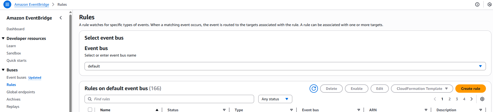
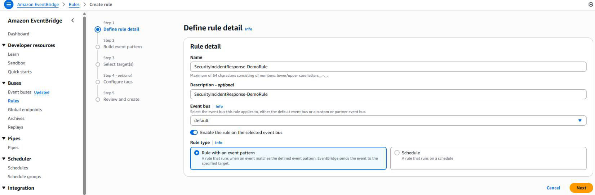
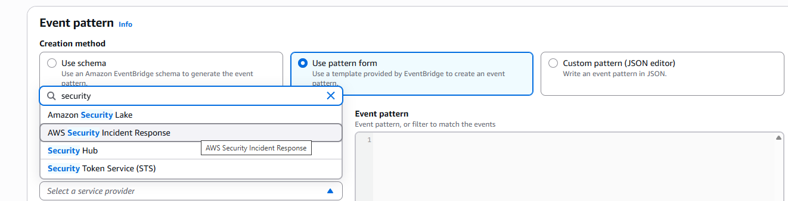
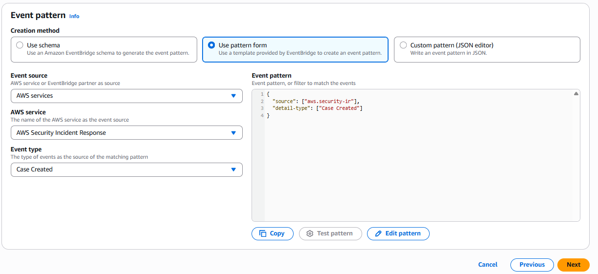
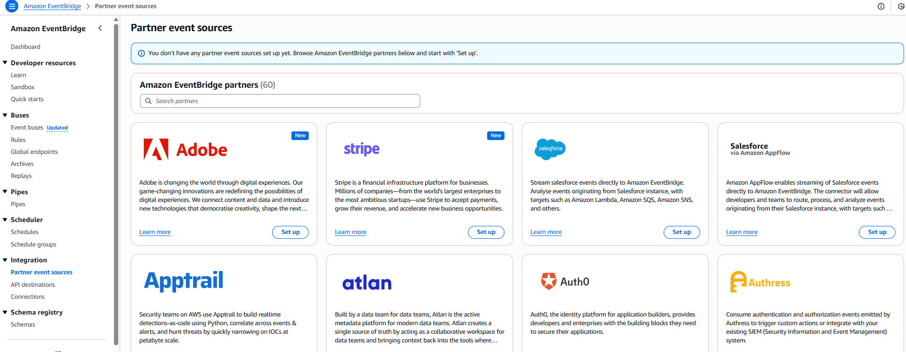

# Amazon EventBridge

Amazon EventBridge enables event-driven architecture for Security Incident Response, allowing case activity to trigger downstream services (SNS, Lambda, SQS, Step-Functions) or external tools (Jira, ServiceNow, Teams, Slack, PagerDuty).

**To configure EventBridge rules:**

1. Access Amazon EventBridge
2. Select **Rules** from the **Buses**
   dropdown

 3. Choose **Create Rule** 4. Enter the Rule Detail 5. Choose **Next**

 6. Scroll down to AWS service and via the drop down 7. Select **AWS Security Incident Response**

 8. Select the drop down for **Event Type** 9. Select the event or API call you want to create a pattern for. 10. You can manually edit the pattern to include more than one event 11. Choose **Next**

###### Note

Select one or more targets (SNS, Lambda, SSM document, Step-Function) for your events. Configure cross-account targets if necessary.

You can check for partner integration patterns under Partner Event Sources in the EventBridge Integration menu. Available partners include Atlassian (Jira), DataDog, New Relic, PagerDuty, Symantec, and Zendesk, among many others.

