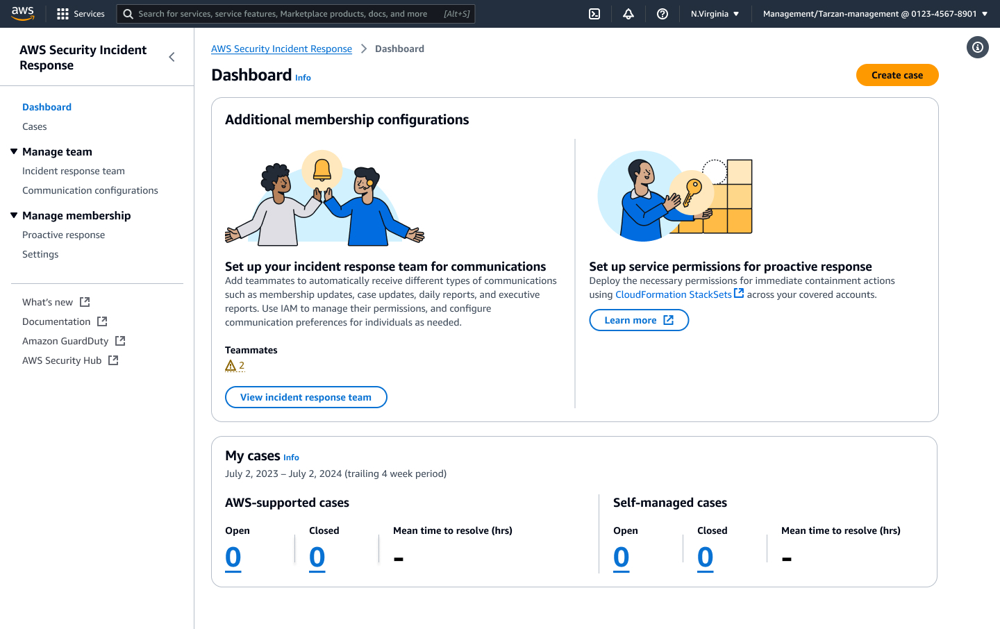
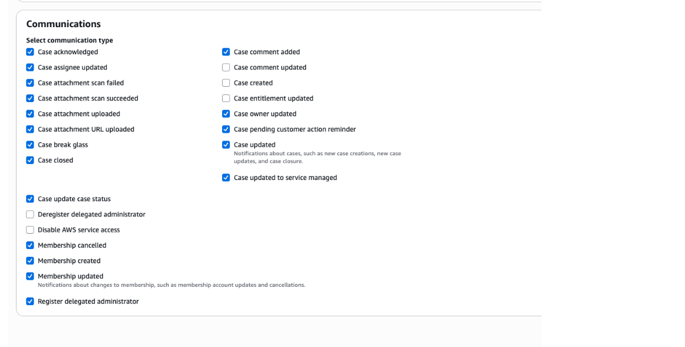

# Communication Preferences

Configure your communication preferences to control how you receive notifications and interact with the incident response system during security incidents.

###### Manage Team Communication Preferences

You can configure communication preferences for individuals in your incident response team from the dashboard page.

Follow these steps to manage team member communication settings:

1. Navigate to the incident response team page from your dashboard
2. Select a teammate whose communication preferences you want to update
3. Choose **Edit** to modify their settings, or choose **Add teammate** to add a new team member
4. In the form, configure the communication preferences as needed
5. Save your changes

###### Configure Your Personal Communication Preferences

Follow these steps to customize your personal communication settings:

1. Navigate to the Incident Response Team page
2. Select either a member to Edit or Add to create a new team member
3. At the bottom of the form you will see Communications
4. Select the checkboxes for communications you want to receive
5. Clear the checkboxes for communications you do not want to receive
6. Choose Save to apply your changes

###### Default Communication Settings

By default, the two contacts configured during initial sign-up will have all communications enabled in the incident response team page. You can modify these settings at any time using the steps above.

###### Communication Options

Your communication preferences control how you interact with the incident response system and how notifications are delivered to you during security incidents.

###### Note

These preferences apply to all future communications within the Security Incident Response system. You can modify these settings at any time by repeating the steps above.
