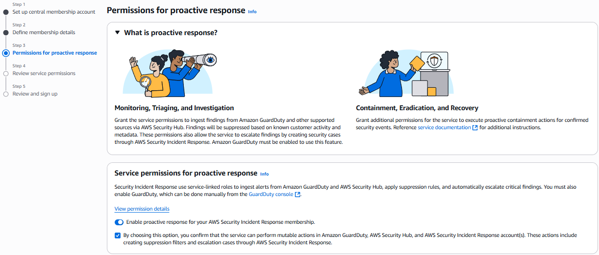
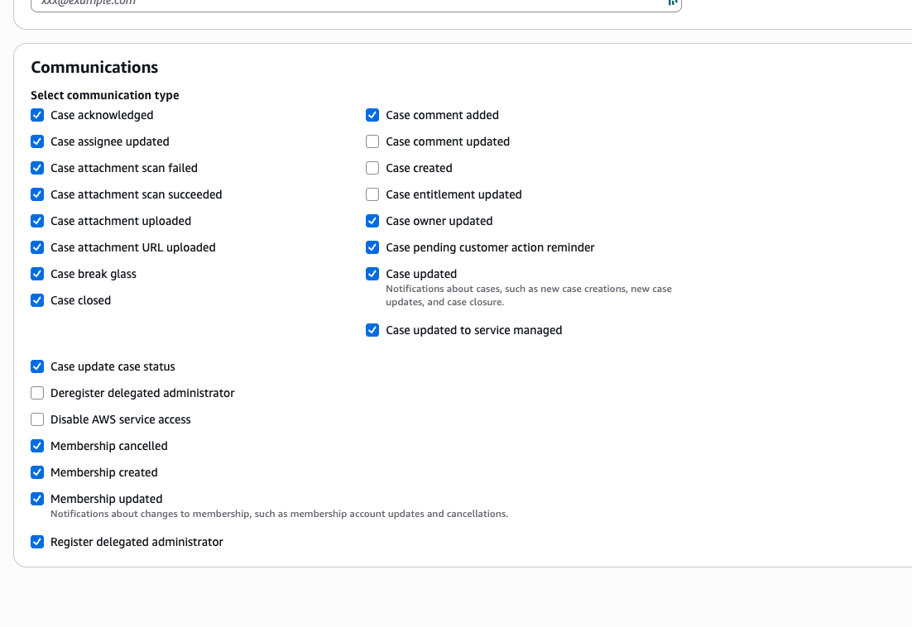

# Communication Preferences

Configure your communication preferences to control how you receive notifications and interact with the Security Incident Response system. AWS Security Incident Response now provides customizable communication preferences so you can focus on the updates that matter most to your role.

You can choose from various notification types including case changes, membership updates, and AWS Organizations changes, giving you granular control over communications rather than receiving every update regardless of relevance. You can manage communication settings for your incident response team members.

Follow these steps to customize your personal communication settings:

1. In the top-right corner, choose your name to open the user settings menu
2. In the left navigation panel, choose **Communications**
3. Select the checkboxes for communications you want to receive
4. Clear the checkboxes for communications you do not want to receive
5. Choose **Save** to apply your changes

You can also configure communication preferences for individuals in your incident response team from the dashboard page.

Follow these steps to manage team member communication settings:

1. Navigate to the incident response team page from your dashboard
2. Select a teammate whose communication preferences you want to update
3. Choose **Edit** to modify their settings, or choose **Add teammate** to add a new team member
4. In the form, configure the communication preferences as needed
5. Save your changes

By default, the two contacts configured during initial sign-up will have all communications enabled in the incident response team page. You can modify these settings at any time using the steps above.

Your communication preferences control how you interact with the incident response system and how notifications are delivered to you during security incidents.

###### Note

These preferences apply to all future communications within the Security Incident Response system. You can modify these settings at any time by repeating the steps above.
