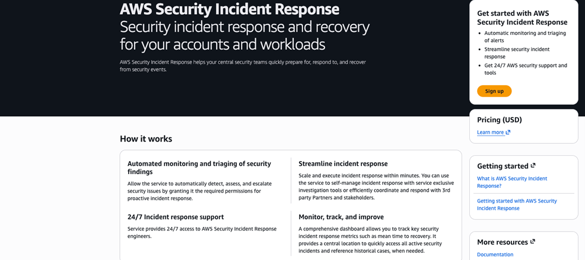
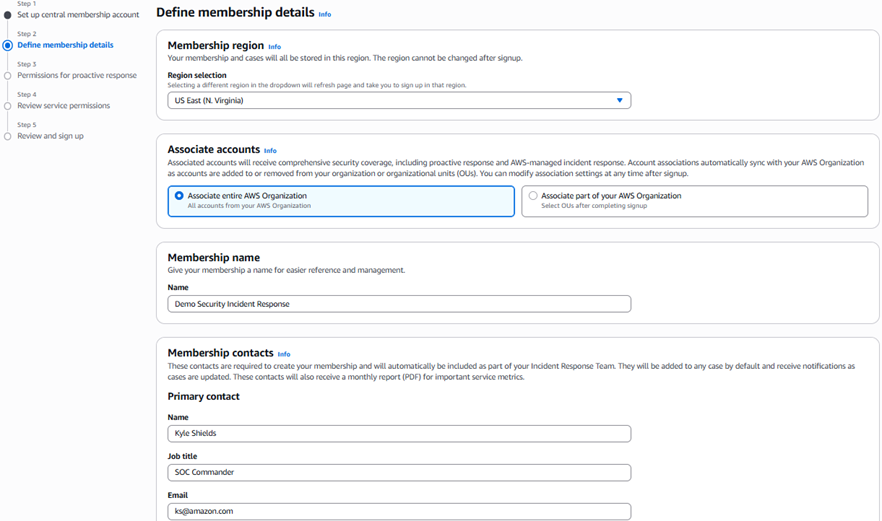
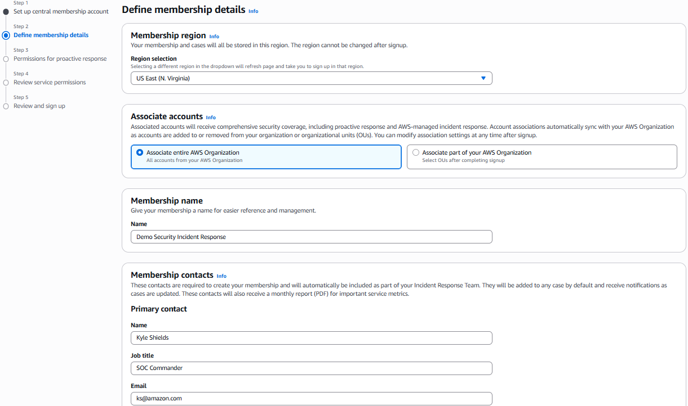

# Deploy and Configure Security Incident Response

1. Access Security Incident Response from the Management Account console
2. Choose **Sign up**

 3. Select a **security tooling** account as Delegated
Administrator from the Management Account.

    * [Security Reference Architecture](../../../prescriptive-guidance/latest/security-reference-architecture/introduction.md "../../../prescriptive-guidance/latest/security-reference-architecture/introduction.md")
    * [Delegated Administrator documentation](../../../prescriptive-guidance/latest/security-reference-architecture/security-tooling.md "../../../prescriptive-guidance/latest/security-reference-architecture/security-tooling.md")

    

4. Log into the delegated administrator account
5. Enter membership details and associate accounts

