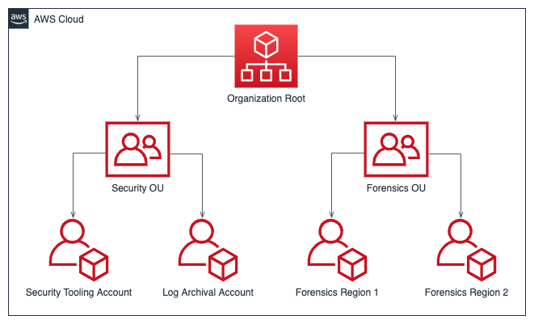

# Develop AWS account structure

[AWS Organizations](https://aws.amazon.com/organizations/ "https://aws.amazon.com/organizations/") helps centrally
manage and govern an AWS environment as you grow and scale AWS resources. An AWS organization
consolidates your AWS accounts so that you can administer them as a single unit. You can use
organizational units (OUs) to group accounts together to administer as a single unit.

For incident response, it’s helpful to have an AWS account structure that supports the
functions of incident response, which includes a _security OU_ and
a _forensics OU_. Within the security OU, you should have accounts for:

- **Log archival** – Aggregate logs in a log archival
  AWS account.
- **Security tooling** – Centralize security services in
  a security tool AWS account. This account operates as the delegated administrator for
  security services.

Within the forensics OU, you have the option to implement a single forensics account or
accounts for each Region that you operate in, depending on which works best for your
business and operational model. For an example of a per-Region account approach, if you
only operate in US East (N. Virginia) (us-east-1) and US West (Oregon) (us-west-2), then
you would have two accounts in the forensics OU: one for us-east-1 and one for us-west-2.
Because it takes time to provision new accounts, it is imperative to create and instrument
the forensics accounts well ahead of an incident so that responders can be prepared to
effectively use them for response.

The following diagram displays a sample account structure including a forensics OU with per-Region forensics accounts:

_Per-region account structure for incident response_
