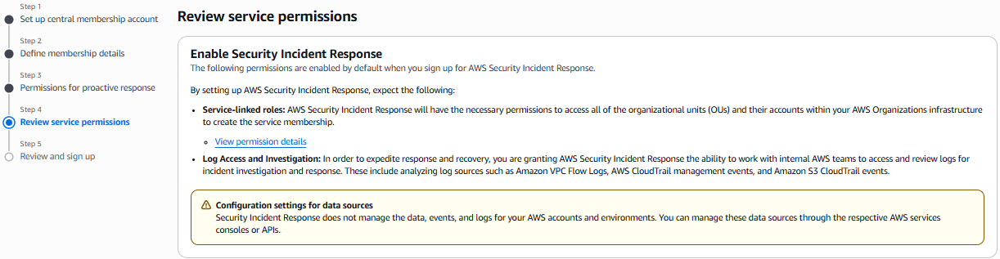
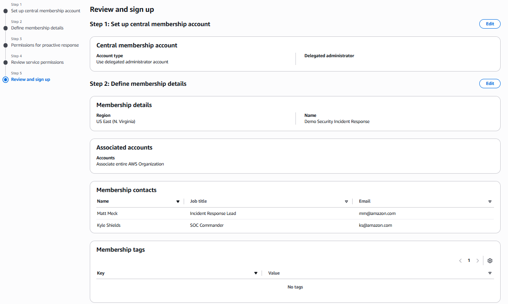

# Enable Proactive Response

Proactive response enables Security Incident Response to monitor and investigate alerts generated from Amazon GuardDuty and AWS Security Hub integrations across your organization. When enabled, Security Incident Response triages low-priority alerts with service automation so your team can focus on the most critical issues.

To enable proactive response during onboarding:

1. In the Security Incident Response console, navigate to the onboarding workflow.
2. Review the service permissions that allow Security Incident Response to monitor findings across all covered accounts and active supported AWS Regions in your organization.
3. Choose **Sign Up** to enable the feature.

This feature automatically creates a service-linked role in all covered member accounts within your AWS Organization. However, you must manually create the service-linked role in the management account by working with AWS CloudFormation stack sets.

**Next steps:** For more information about how Security Incident Response works with Amazon GuardDuty and AWS Security Hub, see _Detect and Analyze_ in the _AWS Security Incident Response User Guide_.
