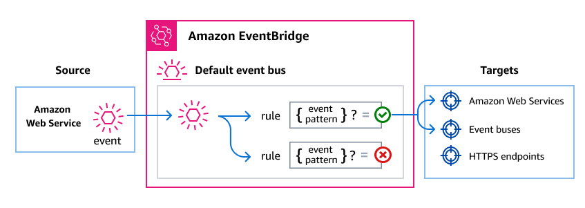

# Managing Security Incident Response events using Amazon EventBridge

Amazon EventBridge is a serverless service that uses events to connect application
components together, making it easier for you to build scalable event-driven applications.
Event-driven architecture is a style of building loosely-coupled software systems that work
together by emitting and responding to events. Events represent a change in a resource or
environment.

Here's how it works:

As with many AWS services, Security Incident Response generates and sends events to the EventBridge default
event bus. (The default event bus is automatically provisioned in your AWS account.) An
event bus is a router that receives events and delivers them to zero or more destinations,
or _targets_. Rules you specify for the event bus evaluate events as they
arrive. Each rule checks whether an event matches the rule's _event
pattern_. If the event does match, the event bus sends the event to the
specified target(s).



## Delivering Security Incident Response events using EventBridge rules

To have the EventBridge default event bus send Security Incident Response events to a target, you must create
a rule. Each rule contains an event pattern, which EventBridge matches against each event received on the event bus. If the event data matches the specified event pattern, EventBridge delivers that event to the rule's target(s).

For comprehensive instructions on creating event bus rules, see [Creating rules that
react to events](../../../eventbridge/latest/userguide/eb-create-rule.md "../../../eventbridge/latest/userguide/eb-create-rule.md") in the _Amazon EventBridge User Guide_.

### Creating event pattern

that match Security Incident Response events

Each event pattern is a JSON object that contains:

- A `source` attribute that identifies the service sending the event.
  For Security Incident Response events, the source is `"aws.security-ir"`.
- (Optional): A `detail-type` attribute that contains an array of the
  event types to match.
- (Optional): A `detail` attribute containing any other event data on
  which to match.

For example, the following event pattern matches against all `Case Updated by AWS Security Incident Response Service` events for a specified AWS account:

```

                {
                  "version": "0",
                  "id": "a1b2c3d4-5678-90ab-cdef-EXAMPLE11111",
                  "detail-type": "Case Updated",
                  "source": "aws.security-ir",
                  "account": "111122223333",
                  "time": "2023-05-12T03:45:00Z",
                  "region": "us-west-2",
                  "resources": [
                    "arn:aws:security-ir:us-west-2:111122223333:case/1234567890"
                  ],
                  "detail": {
                    "caseId": "1234567890",
                    "updatedBy": "security-ir.amazonaws.com"
                  }
                }

```

For more information on writing event patterns, see [Event patterns](../../../eventbridge/latest/userguide/eb-event-patterns.md "../../../eventbridge/latest/userguide/eb-event-patterns.md")
in the _EventBridge User Guide_.
