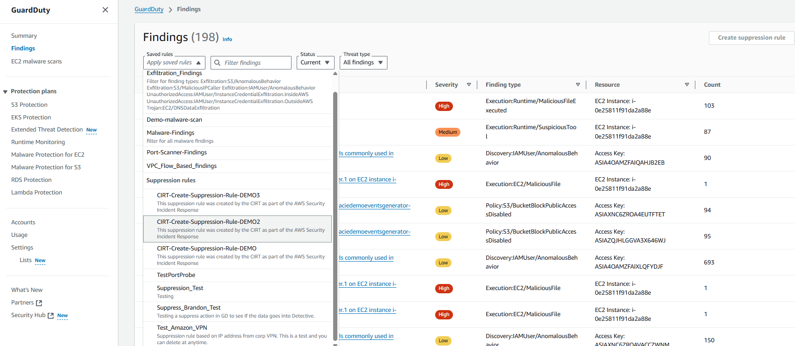

# GuardDuty Findings and Suppression Rules

AWS Security Incident Response proactively ingests, triages, and responds to all GuardDuty findings and Security Hub CSPM findings from CrowdStrike, FortinetCNAPP (Lacework), and Trend Micro. Our auto-triage technology eliminates internal analysis requirements. The service creates suppression and auto-archive rules in GuardDuty and Security Hub for benign findings. View or modify these rules under "Findings" in the GuardDuty console.

**To quickly review enabled GuardDuty Suppression Rules:**

1. Access the GuardDuty console
2. Choose Findings

 3. Select the down arrow and notice the naming convention of the suppression rule.

###### Note

Organizations using SIEM technology will see significantly reduced GuardDuty finding volumes over time, improving both Security Incident Response service and SIEM efficiency.
