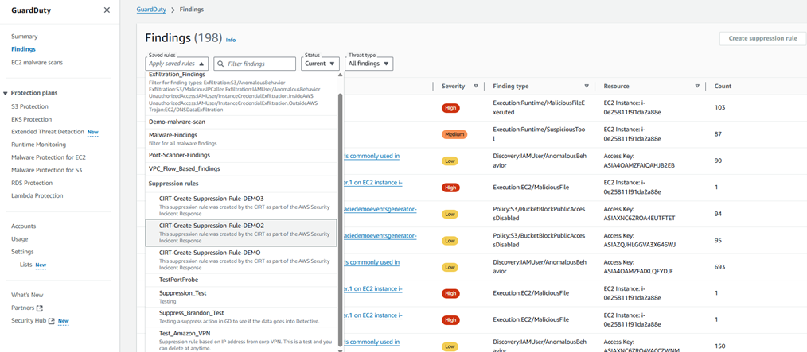
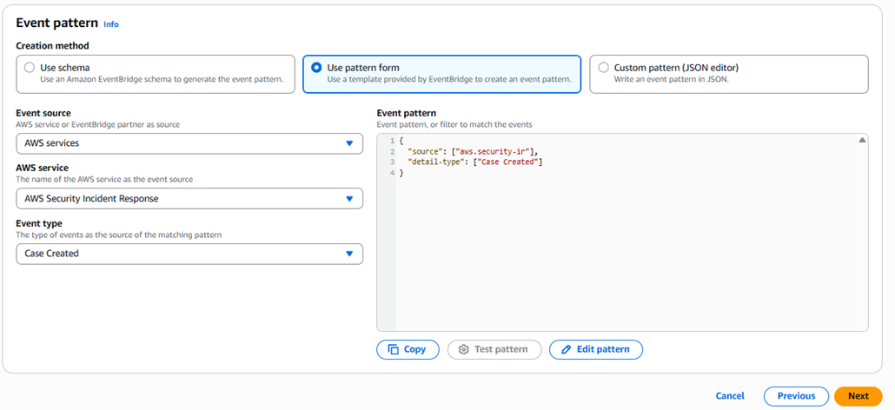
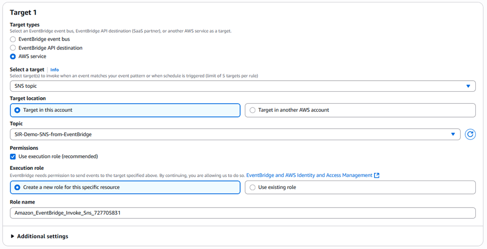

# Step 4: Integrate with your existing tools

AWS Security Incident Response integrates with your existing security tools and workflows to streamline incident response operations. You can configure automatic finding ingestion from GuardDuty, set up event-driven workflows with EventBridge, connect to ITSM platforms like Jira and ServiceNow, and collaborate with your SIEM and MDR providers.

###### The following topics are discussed in this section:

- [GuardDuty findings and suppression rules](#guard-duty-findings "#guard-duty-findings")
- [Amazon EventBridge](#amazon-eventbridge-integration "#amazon-eventbridge-integration")
- [Jira, Slack, and ServiceNow integrations](#jira-slack-servicenow "#jira-slack-servicenow")
- [SIEM and external tooling](#siem-external-tooling "#siem-external-tooling")

## GuardDuty findings and suppression rules

AWS Security Incident Response automatically ingests, triages, and responds to GuardDuty findings and Security Hub CSPM findings from third-party integrations. The auto-triage technology handles analysis as an added layer of detection and analysis. The service can create auto-archive rules in GuardDuty after escalating on a false-positive finding. Responders will always discuss this with you before implementing the rule.

###### To review GuardDuty suppression rules

1. Open the GuardDuty console.

 2. Choose **Findings**. 3. In the navigation pane, choose **Suppression rules**. The **Suppression rules** page displays a list of all the suppression rules for your account. 4. To review or change the settings for a rule, choose the rule, and then choose **Update suppression rule** from the **Actions** menu.

###### Note

Organizations using SIEM technology will see reduced GuardDuty finding volumes over time, which improves both AWS Security Incident Response efficiency and SIEM performance.

## Amazon EventBridge

[Amazon EventBridge](../../../eventbridge/latest/userguide/eb-what-is.md "../../../eventbridge/latest/userguide/eb-what-is.md") enables event-driven workflows for AWS Security Incident Response. You can configure case activity to trigger downstream AWS services (Amazon Simple Notification Service, AWS Lambda, Amazon Simple Queue Service, AWS Step Functions) or external tools such as Jira, ServiceNow, Slack, and PagerDuty.

###### To configure an EventBridge rule for AWS Security Incident Response

1. Sign in to the delegated administrator account for AWS Security Incident Response.
2. Open the EventBridge console.
3. In the navigation pane, under **Buses**, choose **Rules**.
4. Choose **Create rule**, complete the rule details, then choose **Next**.
5. Under **AWS service**, select **AWS Security Incident Response** from the dropdown.
6. For **Event type**, select the event or API call you want to match. You can edit the pattern manually to include multiple events.
7. Choose **Next**.

 8. Select one or more targets for your events, such as Amazon SNS, AWS Lambda, an SSM document, or Step Functions. Configure cross-account targets if needed.

 9. Review and create the rule.

To use pre-built partner integrations, check **Partner Event Sources** in the EventBridge console. Available partners include Atlassian (Jira), Datadog, New Relic, PagerDuty, Symantec, and Zendesk.

## Jira, Slack, and ServiceNow integrations

AWS provides fully developed solutions for bi-directional integration with Jira, Slack, and ServiceNow. These integrations keep AWS Security Incident Response cases and your ITSM or ChatOps platforms in sync — updates in one system are automatically reflected in the other.

**Benefits of integration**

Integrating AWS Security Incident Response with your existing ITSM platform streamlines your security operations by centralizing incident tracking and response workflows. These pre-built solutions eliminate the need for custom development, allowing your security teams to maintain visibility across both AWS native and enterprise-wide incident management systems. By leveraging EventBridge for event-driven automation, updates flow seamlessly between platforms in real-time, helping make sure that security incidents are tracked consistently regardless of where they originate. This unified approach reduces context switching for security analysts, improves response times, and provides comprehensive audit trails across your entire incident response lifecycle.

For deployment instructions, see [AWS sample solutions for Jira, Slack, and ServiceNow](https://github.com/aws-samples/sample-aws-security-incident-response-integrations/blob/main/README.md "https://github.com/aws-samples/sample-aws-security-incident-response-integrations/blob/main/README.md").

## SIEM and external tooling

AWS Security Incident Response doesn't directly ingest findings from your SIEM. However, when you open an AWS-supported case, Security Incident Response Engineering responders analyze and investigate SIEM findings in parallel with your team. Security Incident Response Engineering helps identify correlations across hybrid and multi-cloud environments and assists with scoping threat actor activity across providers.

Security Incident Response Engineering also collaborates directly with your MDR providers and third-party investigation teams to help establish effective coordination processes before an incident occurs.
