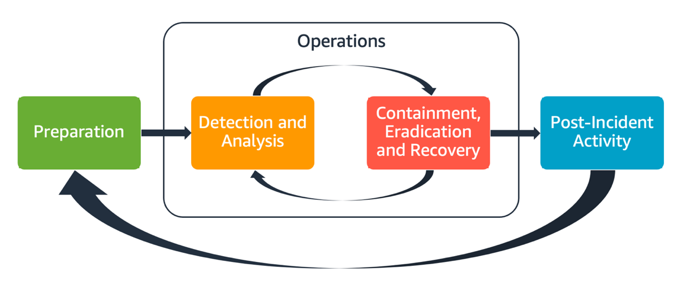
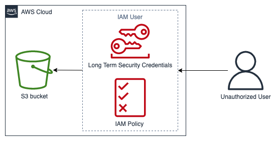

# Introduction

Security is the top priority at AWS. AWS customers benefit from data centers and
network architecture built to help support the needs of the most security-sensitive
organizations. AWS has a shared responsibility model: AWS manages the security _of_ the
cloud, and customers are responsible for security _in_ the cloud. This means that you
have full control of your security implementation, including access to several tools
and services to help meet your security objectives. These capabilities help you
establish a security baseline for applications running in the AWS Cloud.

When a deviation from the baseline occurs, such as by a misconfiguration or changing
external factors, you will need to respond and investigate. To successfully do so, you
need to understand the basic concepts of security incident response within your AWS
environment and the requirements to prepare, educate, and train cloud teams before
security issues occur. It is important to know which controls and capabilities you can
use, review topical examples for resolving potential concerns, and identify remediation
methods that use automation to improve response speed and consistency. Additionally,
you should understand your compliance and regulatory requirements as they relate to
building a security incident response program to fulfill those requirements.

Security incident response can be complex, so we encourage you to implement an
iterative approach: begin with the core security services, build foundational
detection and response capabilities, then develop playbooks to create an initial
library of incident response mechanisms upon which to iterate and improve.

## Before you begin

Before you begin learning about incident response for security events in AWS,
familiarize yourself with the relevant standards and frameworks for
AWS security and incident response. These foundations will help you
understand the concepts and best practices presented in this guide.

### AWS security standards and frameworks

To start, we encourage you to review the [Best Practices for Security, Identity, and Compliance, Security Pillar - AWS Well-Architected Framework](https://aws.amazon.com/architecture/security-identity-compliance/ "https://aws.amazon.com/architecture/security-identity-compliance/")
and the [Security Perspective of the Overview of the AWS Cloud Adoption Framework (AWS CAF)](../../../whitepapers/latest/overview-aws-cloud-adoption-framework/security-perspective.md "../../../whitepapers/latest/overview-aws-cloud-adoption-framework/security-perspective.md") whitepaper.

The AWS CAF provides guidance supporting coordination between different parts of
organizations moving to the cloud. The AWS CAF guidance is divided into several focus areas,
referred to as perspectives, that are relevant to building cloud-based IT systems. The security
perspective describes how to implement a security program across workstreams, one of which is
incident response. This document is a product of our experiences working with customers to help
them build effective and efficient security incident response programs and capabilities.

### Industry incident response standards and frameworks

This whitepaper follows the incident response standards and best practices from the
[Computer Security Incident Handling Guide SP 800-61 r3](https://csrc.nist.gov/pubs/sp/800/61/r3/final "https://csrc.nist.gov/pubs/sp/800/61/r3/final"),
which was created by the National Institute of Standards and Technology (NIST).
Reading and understanding the concepts introduced by NIST is a helpful prerequisite.
Concepts and best practices from this NIST guide will be applied to AWS technologies in this paper.
However, on-premises incident scenarios are out of scope for this guide.

## AWS incident response overview

To start, it’s important to understand how security operations and incident
response are different in the cloud. To build response capabilities that are
effective in AWS, you will need to understand the deviations from traditional
on-premises response and their impact to your incident response program. Each
of these differences, as well as core AWS incident response design principles,
are detailed in this section.

### Aspects of AWS incident response

All AWS users within an organization should have a basic understanding of security
incident response processes, and security staff should understand how to respond to
security issues. Education, training, and experience are vital to a successful cloud
incident response program and are ideally implemented well in advance of having to
handle a possible security incident. The foundation of a successful incident response
program in the cloud is _Preparation_, _Operations_,
and _Post-Incident Activity_.

To understand each of these aspects, consider the following descriptions:

- **Preparation** – Prepare your incident response team to
  detect and respond to incidents within AWS by enabling detective controls and
  verifying appropriate access to the necessary tools and cloud services. Additionally,
  prepare the necessary playbooks, both manual and automated, to verify reliable
  and consistent responses.
- **Operations** – Operate on security events and
  potential incidents following NIST’s phases of incident response:
  detect, analyze, contain, eradicate, and recover.
- **Post-incident activity** – Iterate on the
  outcome of your security events and simulations to improve the efficacy
  of your response, increase value derived from response and investigation,
  and further reduce risk. You have to learn from incidents and have strong
  ownership of improvement activities.

Each of these aspects are explored and detailed in this guide.
The following diagram shows the flow of these aspects, aligning with the
previously mentioned NIST incident response lifecycle, but with operations
encompassing detection and analysis with containment, eradication, and recovery.

_Aspects of AWS incident response_

### AWS incident response principles and design goals

While the general processes and mechanisms of incident response as defined by the
[NIST SP 800-61 Computer Security Incident Handling Guide](https://csrc.nist.gov/publications/detail/sp/800-61/rev-2/final "https://csrc.nist.gov/publications/detail/sp/800-61/rev-2/final")
are sound, we encourage you to also consider these specific design goals that
are relevant to responding to security incidents in a cloud environment:

- **Establish response objectives** – Work with
  stakeholders, legal counsel, and organizational leadership to determine the goal of
  responding to an incident. Some common goals include containing and mitigating the
  issue, recovering the affected resources, preserving data for forensics, returning to
  known safe operations, and ultimately learning from incidents.
- **Respond using the cloud** – Implement response
  patterns within the cloud, where the event and data occurs.
- **Know what you have and what you need** – Preserve
  logs, resources, snapshots, and other evidence by copying and storing them in a
  centralized cloud account dedicated to response. Use tags, metadata, and mechanisms
  that enforce retention policies. You’ll need to understand what services you use and
  then identify the requirements for investigating those services. To help you understand
  your environment, you can also use tagging, which is covered later in this document in
  the [Develop and implement a tagging strategy](develop-and-implement-tagging-strategy.md "develop-and-implement-tagging-strategy.md") section.
- **Use redeployment mechanisms** – If a security
  anomaly can be attributed to a misconfiguration, the remediation might be as simple as
  removing the variance by redeploying resources with the proper configuration. If a
  possible compromise is identified, verify that your redeployment includes successful
  and verified mitigation of the root causes.
- **Automate where possible** – As issues arise or
  incidents repeat, build mechanisms to programmatically triage and respond to common
  events. Use human responses for unique, complex, or sensitive incidents where
  automations are insufficient.
- **Choose scalable solutions** – Strive to match the
  scalability of your organization's approach to cloud computing. Implement detection
  and response mechanisms that scale across your environments to effectively reduce the
  time between detection and response.
- **Learn and improve your process** – Be proactive
  in identifying gaps in your processes, tools, or people, and implement a plan to fix
  them. Simulations are safe methods to find gaps and improve processes. Refer to the
  [Post-incident activity](post-incident-activity.md "post-incident-activity.md") section of this document for details on how to
  iterate on your processes.

These design goals are a reminder to review your architecture implementation for the
ability to conduct both incident response and threat detection. As you plan your
cloud implementations, think about responding to an incident, ideally with a
forensically sound response methodology. In some cases, this means you might have
multiple organizations, accounts, and tools specifically set up for these response
tasks. These tools and functions should be made available to the incident responder
by deployment pipeline. They should not be static because it can cause a larger risk.

### Cloud security incident domains

To effectively prepare for and respond to security events in your AWS environment,
you need to understand the commons types of cloud security incidents. There are
three domains within the customer's responsibility where security incidents might
occur: service, infrastructure, and application. Different domains require different
knowledge, tools, and response processes. Consider these domains:

- **Service domain** – Incidents in the service
  domain might affect your AWS account,
  [AWS Identity and Access Management](https://aws.amazon.com/iam/ "https://aws.amazon.com/iam/") (IAM)
  permissions, resource metadata, billing, or other areas. A service domain event is one
  that you respond to exclusively with AWS API mechanisms, or where you have root causes
  associated with your configuration or resource permissions, and might have related
  service-oriented logging.
- **Infrastructure domain** – Incidents in the
  infrastructure domain include data or network-related activity, such as processes and
  data on your [Amazon Elastic Compute Cloud](https://aws.amazon.com/ec2/ "https://aws.amazon.com/ec2/") (Amazon EC2) instances, traffic to your
  Amazon EC2 instances within the virtual private cloud (VPC), and other areas, such as
  containers or other future services. Your response to infrastructure domain events
  often involves acquiring incident-related data for forensic analysis. It likely
  includes interaction with the operating system of an instance, and, in various cases,
  might also involve AWS API mechanisms. In the infrastructure domain, you can use a
  combination of AWS APIs and digital forensics/incident response (DFIR) tooling within
  a guest operating system, such as an Amazon EC2 instance dedicated to performing
  forensic analysis and investigations. Infrastructure domain incidents might involve
  analyzing network packet captures, disk blocks on an [Amazon Elastic Block Store](https://aws.amazon.com/ebs/ "https://aws.amazon.com/ebs/")
  (Amazon EBS) volume, or volatile memory acquired from an instance.
- **Application domain** – Incidents in the
  application domain occur in the application code or in software deployed to the
  services or infrastructure. This domain should be included in your cloud threat
  detection and response playbooks and might incorporate similar responses to those in
  the infrastructure domain. With an appropriate and thoughtful application architecture,
  you can manage this domain with cloud tools by using automated acquisition, recovery,
  and deployment.

In these domains, consider the actors who might act against AWS accounts, resources,
or data. Whether internal or external, use a risk framework to determine specific
risks to the organization and prepare accordingly. Additionally, you should develop
threat models, which can help with your incident response planning and thoughtful
architecture building.

### Key differences of incident response in AWS

Incident response is an integral part of a cyber security strategy either
on-premises or in the cloud. Security principles such as least privilege and
defense in depth intend to protect the confidentiality, integrity, and availability of data
both on-premises and in the cloud. Several incident response patterns
that support these security principles follow suit, including log retention, alert
selection derived from threat modeling, playbook development, and security information
and event management (SIEM) integration. The differences begin when customers start
architecting and engineering these patterns in the cloud. The following are the key
differences of incident response in AWS.

#### Difference #1: Security as a shared responsibility

The responsibility for security and compliance is shared between AWS and its customers.
This shared responsibility model relieves some of the customer’s operational burden
because AWS operates, manages, and controls the components from the host operating
system and virtualization layer down to the physical security of the facilities in
which the service operates. For more details on the shared responsibility model,
refer to the [Shared Responsibility Model](https://aws.amazon.com/compliance/shared-responsibility-model/ "https://aws.amazon.com/compliance/shared-responsibility-model/")
documentation.

As your shared responsibility in the cloud changes, your options for
incident response also change. Planning for and understanding these tradeoffs
and matching them with your governance needs is a crucial step in incident response.

In addition to the direct relationship you have with AWS, there might be
other entities that have responsibilities in your particular responsibility
model. For example, you might have internal organizational units that take
responsibility for some aspects of your operations. You might also have relationships
with other parties that develop, manage, or operate some of your cloud technology.

Creating and testing an appropriate incident response plan and appropriate
playbooks that match your operating model is extremely important.

#### Difference #2: Cloud service domain

Because of the differences in security responsibility that exist in cloud
services, a new domain for security incidents was introduced: the service
domain, which was explained earlier in the [Incident domain](#cloud-security-incident-domains "#cloud-security-incident-domains") section. The
service domain encompasses a customer's AWS account, IAM permissions,
resource metadata, billing, and other areas. This domain is different for
incident response because of how you respond. Response within the service
domain is typically done by reviewing and issuing API calls, rather than
traditional host-based and network-based response. In the service domain,
you won’t interact with an affected resource’s operating system.

The following diagram shows an example of a security event in the service
domain based on an architectural anti-pattern. In this event, an unauthorized
user obtains the long-term security credentials of an IAM user. The IAM
user has an IAM policy that allows them to retrieve objects from an
[Amazon Simple Storage Service](https://aws.amazon.com/s3/ "https://aws.amazon.com/s3/")
(Amazon S3) bucket. To respond to this security event, you would use
AWS APIs to analyze AWS logs such as [AWS CloudTrail](https://aws.amazon.com/cloudtrail/ "https://aws.amazon.com/cloudtrail/") and Amazon S3
access logs. You would also use AWS APIs to contain and recover from the incident.

_Service domain example_

#### Difference #3: APIs for provisioning infrastructure

Another difference comes from the [Cloud
characteristic of on-demand self-service](https://csrc.nist.gov/publications/detail/sp/800-145/final "https://csrc.nist.gov/publications/detail/sp/800-145/final"). The main facility customers
interact with the AWS Cloud by using a RESTful API through public and private endpoints
available in many geographical locations around the globe. Customers can access these
APIs with AWS credentials. In contrast to on-premises access control, these credentials
are not necessarily bound by a network or a Microsoft Active Directory domain. Credentials
are instead associated with an IAM principal inside of an AWS account. These API
endpoints can be accessed outside of your corporate network, which will be important
to understand when you respond to an incident where credentials are used outside
of your expected network or geography.

Because of the API-based nature of AWS, an important log source for responding
to security events is AWS CloudTrail, which tracks the management API calls made
in your AWS accounts and where you can find information about the source location
of the API calls.

#### Difference #4: Dynamic nature of the cloud

The cloud is dynamic; it allows you to quickly create and delete
resources. With automatic scaling, resources can be spun up and spun
down based on increases in traffic. With short-lived infrastructure
and fast-paced changes, a resource that you’re investigating might
no longer exist or might have been modified. Understanding the ephemeral
nature of AWS resources and how you can track the creation and deletion
of AWS resources will be important for incident analysis. You can use
[AWS Config](https://aws.amazon.com/config/ "https://aws.amazon.com/config/")
to track the configuration history of your AWS resources.

#### Difference #5: Data access

Data access is also different in the cloud. You can’t plug
into a server in order to collect the data you need for a security
investigation. Data is collected over the wire and through API calls.
You’ll need to practice and understand how to perform data collection over
APIs in order to be prepared for this shift, and verify appropriate storage
for effective collection and access.

#### Difference #6: Importance of automation

For customers to fully realize the benefits of cloud adoption, their operational
strategy must embrace automation. Infrastructure as code (IaC) is a pattern of
highly efficient automated environments where AWS services are deployed,
configured, re-configured, and destroyed using code facilitated by native
IaC services such as [AWS CloudFormation](https://aws.amazon.com/cloudformation/ "https://aws.amazon.com/cloudformation/") or third-party solutions. This pushes the
implementation of incident response to be highly automated, which is desirable to
avoid human mistakes, especially when handling evidence. While automation is used on-premises,
it is essential and simpler in the AWS Cloud.

#### Addressing these differences

To address these differences,
follow the steps outlined in the next section to
verify that your incident response program across people,
processes, and technology is well prepared.
