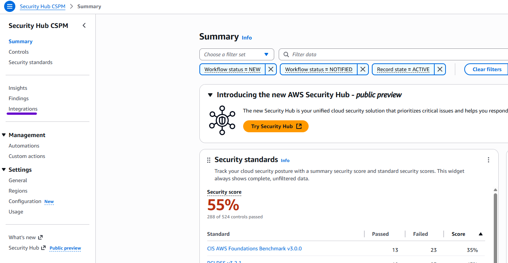
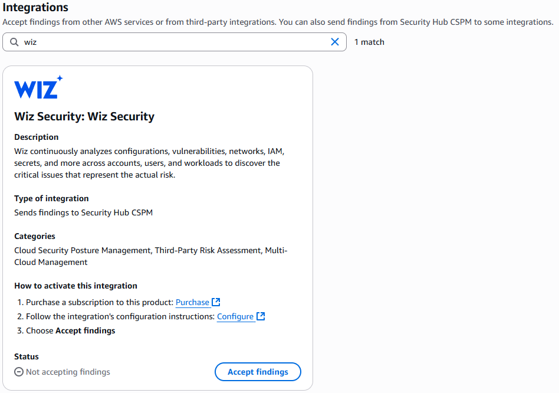

# Onboarding Guide

The AWS onboarding guide will walk you through prerequisites, security incident response onboarding and security incident response containment actions to perform threat containment actions during onboarding.

###### Important

Prerequisites

1. The only deployment prerequisite is enabling [AWS Organizations](../../../organizations/latest/userguide/orgs_introduction.md "../../../organizations/latest/userguide/orgs_introduction.md")
2. While not required, we recommend enabling [Amazon
   GuardDuty](../../../guardduty/latest/ug/what-is-guardduty.md "../../../guardduty/latest/ug/what-is-guardduty.md") and [AWS Security Hub CSPM](../../../securityhub/latest/userguide/what-are-securityhub-services.md "../../../securityhub/latest/userguide/what-are-securityhub-services.md") across all accounts and active regions to maximize
   Security Incident Response benefits.
3. Review GuardDuty and Security Incident Response
4. Review [GuardDuty
   best practices guide](../../../guardduty/latest/ug/what-is-guardduty.md "../../../guardduty/latest/ug/what-is-guardduty.md")
   Security Hub CSPM will ingest findings from 3rd party endpoint detection and
   response (EDR) vendors (CrowdStrike, FortinetCNAPP (Lacework) and Trend Micro, among
   others. If these findings are ingested into Security Hub CSPM, they will be auto-triaged
   by Security Incident Response for proactive case creation as well. To setup 3rd party
   EDR with Security Hub CSPM, follow our [Detection and Analysis service documentation](detect-and-analyze.md "detect-and-analyze.md")

To setup 3rd party EDR with Security Hub CSPM:

1. Navigate to the Security Hub CSPM Integrations page to validate the 3rd party integration
   exists
2. From the console, navigate to the Security Hub CSMP service page.
3. Choose **Integrations** (using Wiz.IO as an
   example):

 4. Search for the vendor you would like to integrate

###### Note

You’ll be asked for account or
subscription information, then you’re complete and Security Incident Response is
ingesting 3rd party findings. Pricing for the ingestion of 3rd party findings can be found on the Integrations page of Security Hub CSPM.
