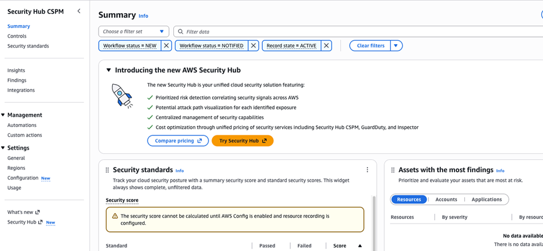

# Onboarding prerequisites

The only required prerequisite is enabling [AWS Organizations](../../../organizations/latest/userguide/orgs_introduction.md "../../../organizations/latest/userguide/orgs_introduction.md") with **All Features** enabled. Consolidated billing alone is not sufficient.

###### Note

The AWS Identity and Access Management (IAM) principal used to sign in to the delegated administrator account during enablement
must have `AdministratorAccess` permissions. Without these permissions, the
enablement process fails.

While not required, we strongly recommend enabling [Amazon GuardDuty](../../../guardduty/latest/ug/what-is-guardduty.md "../../../guardduty/latest/ug/what-is-guardduty.md") and [AWS Security Hub CSPM](../../../securityhub/latest/userguide/what-is-securityhub.md "../../../securityhub/latest/userguide/what-is-securityhub.md") across all accounts and active AWS Regions to get the most value from AWS Security Incident Response.

- [GuardDuty and AWS Security Incident Response](guardduty.md "guardduty.md")
- [GuardDuty best practices](../../../guardduty/latest/ug/guardduty_best_practices.md "../../../guardduty/latest/ug/guardduty_best_practices.md")

## Third-party EDR integration

Security Hub CSPM can ingest findings from third-party endpoint detection and response (EDR) vendors. When ingested, these findings are auto-triaged by AWS Security Incident Response for proactive case creation. To set up a third-party EDR integration, follow the steps in the [Security Hub CSPM integrations documentation](../../../securityhub/latest/userguide/securityhub-partner-providers.md "../../../securityhub/latest/userguide/securityhub-partner-providers.md").

###### Note

You don't need to enable Security Hub CSPM standards or controls. Only the vendor integrations are required for AWS Security Incident Response to ingest third-party findings.

**Pricing**: The first 10,000 Security Hub CSPM findings are free. After that, the cost is $0.00003 per finding. For more information, see [Security Hub CSPM pricing](https://aws.amazon.com/security-hub/pricing/ "https://aws.amazon.com/security-hub/pricing/").
