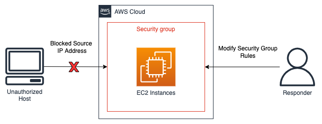

# Source containment

Source containment is the use and application of filtering or routing within an
environment to prevent access to resources from a specific source IP address or
network range. Examples of source containment using AWS services are highlighted here:

- **Security groups** – Creating and applying isolation
  security groups to Amazon EC2 instances or removing rules from an existing security group can
  help to contain unauthorized traffic to an Amazon EC2 instance or AWS resource. It is
  important to note that existing tracked connections won’t be shut down as a result of
  changing security groups – only future traffic will be effectively blocked by the new
  security group (refer to [this Incident Response Playbook](https://github.com/aws-samples/aws-customer-playbook-framework/blob/main/docs/Ransom_Response_EC2_Linux.md "https://github.com/aws-samples/aws-customer-playbook-framework/blob/main/docs/Ransom_Response_EC2_Linux.md") and [Security group
  connection tracking](../../../AWSEC2/latest/UserGuide/security-group-connection-tracking.md "../../../AWSEC2/latest/UserGuide/security-group-connection-tracking.md") for additional information on tracked and untracked
  connections).
- **Policies** – Amazon S3 bucket policies can be
  configured to block or allow traffic from an IP address, a network range, or a VPC
  endpoint. Policies create the ability to block suspicious addresses and access to the Amazon S3
  bucket. Additional information on bucket policies can be found at
  [Adding a bucket policy
  using the Amazon S3 console](../../../AmazonS3/latest/userguide/add-bucket-policy.md "../../../AmazonS3/latest/userguide/add-bucket-policy.md").
- **AWS WAF** – Web access control lists (web ACLs) can
  be configured on AWS WAF to provide fine-grained control over web requests that
  resources respond to. You can add an IP address or network range to an IP set configured
  on AWS WAF, and apply match conditions, such as block, to the IP set. This will block
  web requests to a resource if the IP address or network ranges from the originating
  traffic match those configured in the IP set rules.

An example of source containment can be seen in the following diagram with an incident
response analyst modifying a security group of an Amazon EC2 instance in order to restrict new
connections to only certain IP addresses. As stated in the security groups bullet,
existing tracked connections won’t be shut down as a result of changing security groups.

_Source containment example_

###### Note

Security Groups and Network ACLs do not filter traffic to Amazon Route 53. When containing an EC2 instance,
if you want to prevent it from contacting external hosts, ensure you also explicitly block DNS communications.
