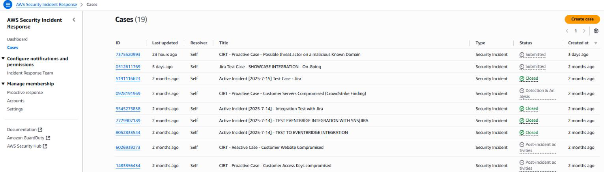
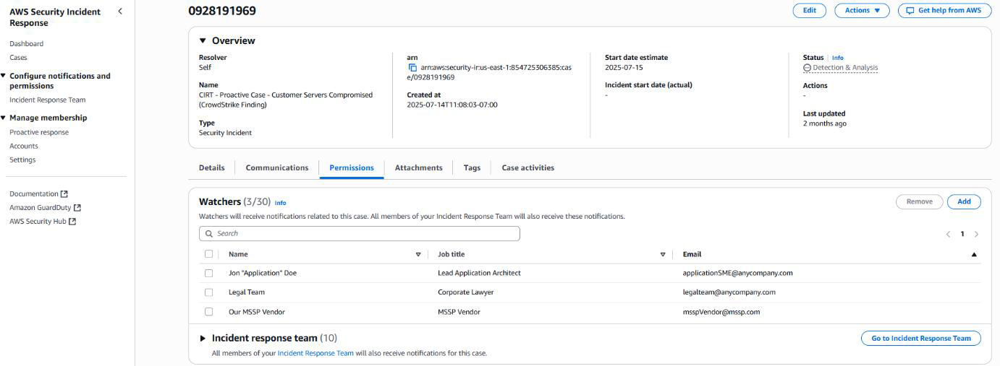
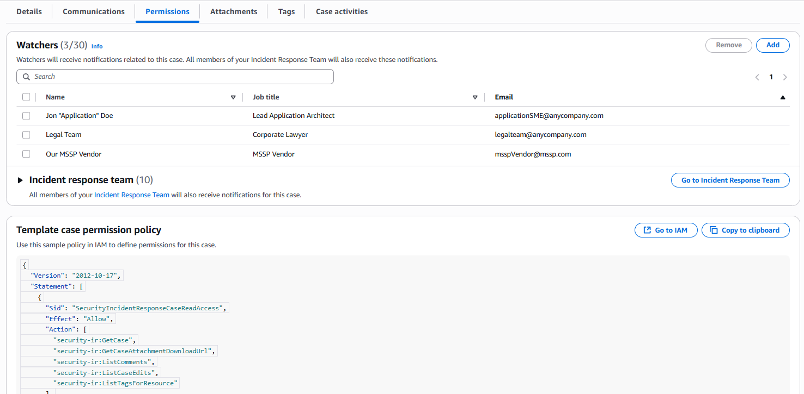

# AWS Supported Case

AWS Security Incident Response provides a subscription-based case management portal where your organization directly engages with our Security Incident Response engineers. We assist with security investigations and active incidents with a 15-minute SLO, with no limit on reactive cases. Please refer to our Create an AWS Supported Case documentation.

**Expand the Investigation Team**

Through the Case Management Portal, you may grant case visibility to external parties by adding Watchers and IAM policies. Use these options for partners, legal teams, or subject matter experts.

**To add Watchers to a case:**

1. Open any case from the Security Incident Response Cases portal

 2. Choose the Permissions tab

 3. Select Add

###### Note

Each case includes a pre-populated IAM policy granting access to only that specific case, maintaining least privilege. Copy and paste this policy directly to IAM roles or users for third-party MDR partners or specific investigation teams to enable their contribution.
