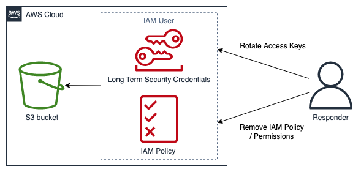

# Technique and access containment

Prevent unauthorized use of a resource by limiting the functions and IAM principals with access
to the resource. This includes restricting the permissions of IAM principals that have access to
the resource; it also includes temporary security credentials revocation. Examples
of technique and access containment using AWS services are highlighted here:

- **Restrict permissions** – Permissions assigned to an
  IAM principal should follow the [Principle of Least Privilege](../../../IAM/latest/UserGuide/best-practices.md#grant-least-privilege "../../../IAM/latest/UserGuide/best-practices.md#grant-least-privilege"). However, during an active security event, you
  might need to restrict access to a targeted resource from a specific IAM principal even
  further. In this case, it is possible to contain access to a resource by removing the
  permissions from the IAM principal to be contained. This is done with the IAM service
  and can be applied using the AWS Management Console, the AWS CLI, or an AWS SDK.
- **Revoke keys** – IAM access keys are used by IAM
  principals to access or manage resources. These are long-term static credentials to sign
  programmatic requests to the AWS CLI or AWS API and begin with the prefix
  _AKIA_ (for additional information, refer to the
  _Understanding unique ID prefixes_ section in [IAM
  identifiers](../../../IAM/latest/UserGuide/reference_identifiers.md "../../../IAM/latest/UserGuide/reference_identifiers.md")). To contain access for an IAM principal where an IAM access key
  has been compromised, the access key can be deactivated or deleted. It is important to
  note the following:
  - An access key can be reactivated after it has been deactivated.
  - An access key is not recoverable once it has been deleted.
  - An IAM principal can have up to two access keys at any given time.
  - Users or applications using the access key will lose access once the key is either deactivated or deleted.

- **Revoke temporary security credentials** – Temporary
  security credentials can be employed by an organization to control access to AWS
  resources and begin with the prefix _ASIA_ (for additional
  information, see the _Understanding unique ID prefixes_ section in
  [IAM
  identifiers](../../../IAM/latest/UserGuide/reference_identifiers.md "../../../IAM/latest/UserGuide/reference_identifiers.md")). Temporary credentials are typically used by IAM roles and do not
  have to be rotated or explicitly revoked because they have a limited lifetime. In cases
  where a security event occurs involving a temporary security credential before the
  temporary security credential expiration, you might need to alter the effective
  permissions of the existing temporary security credentials. This can be completed [using the IAM service within AWS Management Console](../../../IAM/latest/UserGuide/id_roles_use_revoke-sessions.md "../../../IAM/latest/UserGuide/id_roles_use_revoke-sessions.md"). Temporary security
  credentials can also be issued to IAM users (as opposed to IAM roles); however, as of
  the time of this writing, there is no option to revoke the temporary security
  credentials for an IAM user within the AWS Management Console. For security events where
  a user’s IAM access key is compromised by an unauthorized user who created temporary
  security credentials, the temporary security credentials can be revoked using two
  methods:
  - Attach an inline policy to the IAM user that prevents access based on the security
    token issue time (refer to the _Denying access to temporary security
    credentials issued before a specific time_ section in
    [Disabling
    permissions for temporary security credentials](../../../IAM/latest/UserGuide/id_credentials_temp_control-access_disable-perms.md "../../../IAM/latest/UserGuide/id_credentials_temp_control-access_disable-perms.md") for more detail).
  - Delete the IAM user that owns the compromised access keys. Re-create the user if needed.

- **AWS WAF** - Certain techniques employed by
  unauthorized users include common malicious traffic patterns, such as requests that
  contain SQL injection and cross-site scripting (XSS). AWS WAF can be configured to match
  and deny traffic employing these techniques using the AWS WAF built-in rule statements.

An example of technique and access containment can be seen in the following diagram, with an
incident responder rotating access keys or removing an IAM policy to prevent an IAM user from accessing an Amazon S3 bucket.

_Technique and access containment example_
