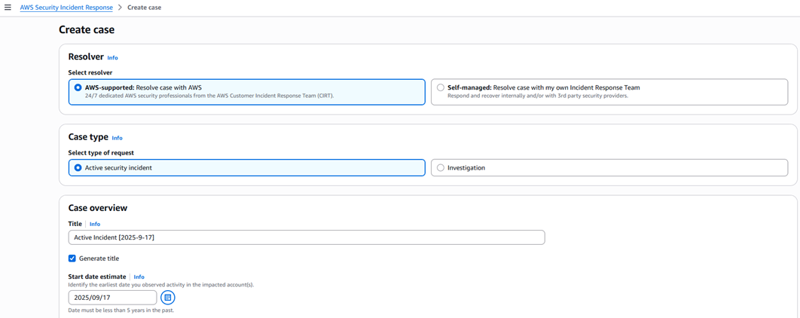

# Step 3: Understand case types and management

AWS Security Incident Response provides two types of cases to manage security events: proactive cases that are automatically created when threats are detected, and reactive cases that you create when you need assistance from Security Incident Response Engineering. You can also grant case visibility to external parties such as partners, legal teams, or subject matter experts.

###### The following topics are discussed in this section:

- [Proactive cases](#proactive-cases "#proactive-cases")
- [Reactive cases](#reactive-cases "#reactive-cases")
- [Watchers](#watchers "#watchers")

## Proactive cases

The auto-triage feature continuously reviews high-volume alerts to filter out noise and focus on critical, high-impact threats. When a potential threat is detected, the system escalates the finding to an Security Incident Response Engineering responder for investigation. If the finding is confirmed as a genuine threat, a proactive case is created in the case management portal and all configured stakeholders are notified automatically.

No manual configuration is required for proactive cases beyond enabling GuardDuty and integrating third-party security solutions with Security Hub CSPM. The service also integrates with an AI investigative agent that correlates data from multiple sources to accelerate investigations. This capability is currently available for reactive, AWS-supported cases.

## Reactive cases

AWS Security Incident Response provides a subscription-based case management portal where your organization works directly with Security Incident Response Engineering. Security Incident Response Engineering assists with security investigations and active incidents with a **15-minute service level objective (SLO)**. There is no limit on the number of reactive cases you can open.

###### To create a case

1. Open the AWS Security Incident Response console.
2. Choose **Cases**, then choose **Create case**.
3. Choose a case type:

   - **AWS-supported**: Escalated directly to Security Incident Response Engineering for investigation and guidance (15-minute SLO).
   - **Self-managed**: Kept internal to your organization for tracking and documentation.

4. Complete all relevant fields. Include as much detail as possible to support an efficient investigation.

Both case types use the same data fields. You can escalate a self-managed case to Security Incident Response Engineering at any time by choosing **Get help from AWS** in the upper-right corner of the case.

For detailed instructions, see [Cases](cases.md "cases.md").

## Watchers

You can grant case visibility to external parties using Watchers or IAM policies. These options let you include partners, risk and compliance teams, legal counsel, or subject matter experts in your investigations. Watchers receive notifications for all updates to a specific case. IAM policies provide direct console access with least-privilege permissions.

###### To add a watcher to a case

1. Open the AWS Security Incident Response console and choose **Cases**.
2. Open the case you want to share.
3. Choose the **Permissions** tab, then choose **Add**.

 4. Copy the pre-populated IAM policy and apply it to the appropriate IAM roles or users.

###### Note

Each case includes a pre-populated IAM policy scoped to that specific case. This maintains least-privilege access for third-party MDR partners and investigation teams.
