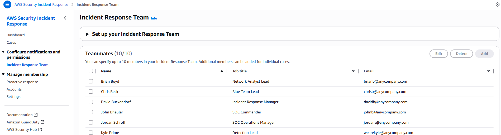

# Update the Incident Response Team

1. Ensure you are subscribed and have completed the above steps
2. Select Incident Response Team from the left navigation
3. Select the teammates you wish to add to your team

###### Note

Team can include organization leadership, legal counsel, MDR partners, cloud engineers, and others. You can add up to 10 additional members. Include only name, title, and email address for each member.
