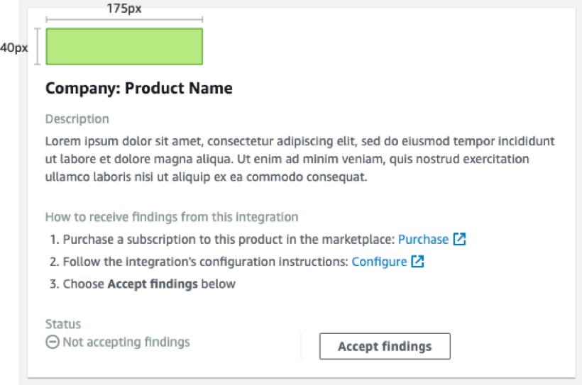
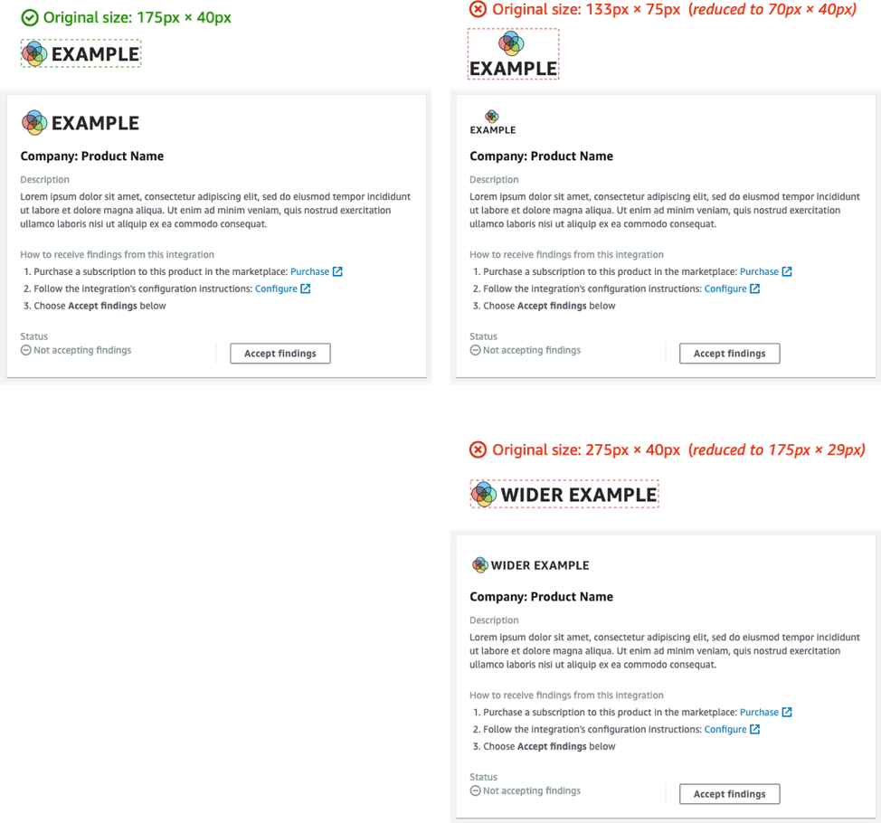
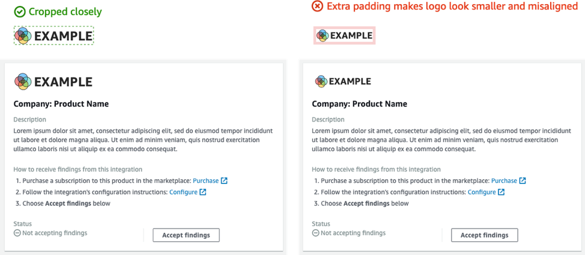

# Guidelines for the logo to display on the AWS Security Hub CSPM

console

For the logo to display on the AWS Security Hub CSPM console, follow these guidelines.

**Light and dark modes**

You must provide both a light mode and a dark mode version of the logo.

**Format**

SVG file format

**Background color**

Transparent

**Size**

Ideal ratio is 175 px wide by 40 px high.

Minimum height is 40 px.

Rectangular logos work best.

The following image shows how an ideal logo is displayed on the Security Hub CSPM console.

If your logo does not match these dimensions, Security Hub reduces the size to a maximum
height of 40 px and a maximum width of 175 px. This affects how the logo is displayed on the
Security Hub CSPM console.

The following image compares the display of a logo that used the ideal size to logos that
were wider or taller.

**Cropping**

Crop the logo image as close as possible. Do not provide extra padding.

The following image shows the difference between a logo that is cropped closely and a
logo that has extra padding.

