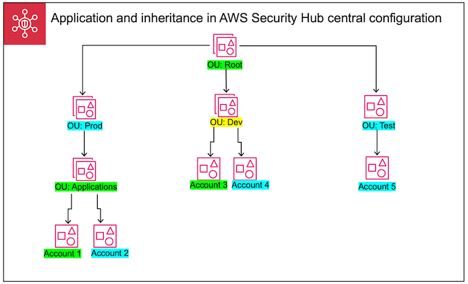

# How configuration policies work in Security Hub CSPM

The delegated AWS Security Hub CSPM administrator can create configuration policies to configure Security Hub CSPM, security standards, and
security controls for an organization. After creating a configuration policy, the delegated administrator can associate it with
specific accounts, organizational units (OUs), or the root. The policy then takes effect in the specified accounts, OUs, or the root.

For background information about the benefits of central configuration and how it works, see [Understanding central configuration in Security Hub CSPM](central-configuration-intro.md "central-configuration-intro.md").

This section provides a detailed overview of configuration policies.

## Policy considerations

Before you create a configuration policy in Security Hub CSPM, consider the following details.

- **Configuration policies must be associated to take effect** – After you
  create a configuration policy, you can associate it with one or more accounts, organizational units (OUs), or the
  root. A configuration policy can be associated with accounts or OUs through direct application, or through inheritance from a
  parent OU.
- **An account or OU can be associated with only one configuration policy** – To prevent
  conflicting settings, an account or OU can only be associated with one configuration policy at any given time. Alternatively, an account
  or OU can be self-managed.
- **Configuration policies are complete** – Configuration policies
  provide a complete specification of settings. For example, a child account can't accept settings for some controls from one policy and settings
  for other controls from another policy. When you associate a policy with a child account, ensure that the policy specifies all of the
  settings that you want the child account to use.
- **Configuration policies can't be reverted** – There's no option to
  revert a configuration policy after you associate it with accounts or OUs. For example, if you associate a configuration policy
  that disables CloudWatch controls with a specific account, and then dissociate that policy, the CloudWatch controls continue to
  be disabled in that account. To enable CloudWatch controls again, you can associate the account with a new policy that
  enables the controls. Alternatively, you can change the account to self-managed and enable each CloudWatch control in the account.
- **Configuration policies take effect in your home Region and all linked Regions** – A
  configuration policy affects all associated accounts in the home Region and all linked Regions. You
  can't create a configuration policy that takes effect in only some of these Regions and not others. The exception to this is [controls that use global resources](controls-to-disable.md#controls-to-disable-global-resources "controls-to-disable.md#controls-to-disable-global-resources").
  Security Hub CSPM automatically disables controls that involve global resources in all Regions except the home Region.

Regions that AWS introduced on or after March 20, 2019
are known as opt-in Regions. You must enable such a Region for an account before a configuration policy takes effect there. The Organizations management account
can enable opt-in Regions for a member account. For instructions on enabling opt-in Regions, see [Specify which AWS Regions your account can use](../../../accounts/latest/reference/manage-acct-regions.md#rande-manage-enable "../../../accounts/latest/reference/manage-acct-regions.md#rande-manage-enable") in the _AWS Account Management Reference Guide_.

If your policy configures a control that isn't available in the home Region or
one or more linked Regions, Security Hub CSPM skips the control configuration in unavailable
Regions but applies the configuration in Regions where the control is
available. You lack coverage for a control that isn't available in the home Region or any of the linked Regions.

- **Configuration policies are resources** – As a resource, a configuration policy has an Amazon Resource Name (ARN) and a universally unique identifier (UUID). The ARN uses the following format:
  `arn:`partition:`securityhub:`region`:`delegated administrator account ID`:configuration-policy/`configuration policy UUID``. A self-managed 
configuration has no ARN or UUID. The identifier for a self-managed configuration is `SELF_MANAGED_SECURITY_HUB`.

## Types of configuration policies

Each configuration policy specifies the following settings:

- Enable or disable Security Hub CSPM.
- Enable one or more [security standards](standards-reference.md "standards-reference.md").
- Indicate which [security controls](securityhub-controls-reference.md "securityhub-controls-reference.md") are enabled across enabled standards. You can do this by providing a list of
  specific controls that should be enabled, and Security Hub CSPM disables all other controls, including new controls when they are released. Alternatively, you
  can provide a list of specific controls that should be disabled, and Security Hub CSPM enables all other controls, including new controls when they
  are released.
- Optionally, [customize parameters](custom-control-parameters.md "custom-control-parameters.md") for select enabled controls across enabled standards.

Central configuration policies don't include AWS Config recorder settings. You must separately enable AWS Config and turn on
recording for required resources in order for Security Hub CSPM to generate control findings. For more information, see
[Considerations before enabling and configuring AWS Config](securityhub-setup-prereqs.md#securityhub-prereq-config "securityhub-setup-prereqs.md#securityhub-prereq-config").

If you use central configuration, Security Hub CSPM automatically disables
controls that involve global resources in all Regions except the home Region. Other controls that you choose to enable
though a configuration policy are enabled in all
Regions where they are available. To limit findings for these controls to just one Region, you can update your AWS Config recorder settings and
turn off global resource recording in all Regions except the home Region.

If an enabled control that involves global resources isn't supported in the home Region, Security Hub CSPM tries to
enable the control in one linked Region where the control is supported. With central configuration, you lack coverage for a control
that isn't available in the home Region or any of the linked Regions.

For a list of controls that involve global resources, see [Controls that use global resources](controls-to-disable.md#controls-to-disable-global-resources "controls-to-disable.md#controls-to-disable-global-resources").

### Recommended configuration policy

When creating a configuration policy for the _first time in the Security Hub CSPM console_, you
have the option to choose the Security Hub CSPM recommended policy.

The recommended policy enables Security Hub CSPM, the AWS Foundational Security Best Practices (FSBP) standard, and all
existing and new FSBP controls. Controls that accept parameters use the default values. The recommended policy applies to root (all accounts and OUs, both new and existing). After creating the
recommended policy for your organization, you can modify it from the delegated administrator account. For example, you can enable additional standards
or controls or disable specific FSBP controls. For instructions on modifying a configuration policy, see [Updating configuration policies](update-policy.md "update-policy.md").

### Custom configuration policy

Instead of the recommended policy, the delegated administrator can create up to 20 custom configuration policies. You can associate a single custom policy with your
entire organization or different custom policies with different accounts and OUs. For a custom configuration policy, you
specify your desired settings. For example, you can create a custom policy that enables FSBP, the Center for Internet Security (CIS)
AWS Foundations Benchmark v1.4.0, and all controls in those standards except Amazon Redshift controls. The level of granularity that you use in custom
configuration policies depends on the intended scope of security coverage throughout your organization.

###### Note

You can't associate a configuration policy that disables Security Hub CSPM with the delegated administrator account. Such a policy can be associated with
other accounts but skips association with the delegated administrator. The delegated administrator account retains its current configuration.

After creating a custom configuration policy, you can switch to the recommended configuration policy by updating your configuration policy to
reflect the recommended configuration. However, you don't see the choice to create the recommended configuration policy in the
Security Hub CSPM console after your first policy is created.

## Policy association through application and inheritance

When you first opt in to central configuration, your organization has no associations and behaves in the same
way that it did prior to opt-in. The delegated administrator can then establish associations between a configuration policy or
self-managed behavior and accounts, OUs, or the root. Associations can be established through _application_ or
_inheritance_.

From the delegated administrator account, you can directly apply a configuration policy to an account,
OU, or the root. Alternatively, the delegated administrator can directly apply a self-managed designation to
an account, OU, or the root.

In the absence of direct application, an account or OU inherits the settings of the closest parent that has a configuration policy
or self-managed behavior. If the closest
parent is associated with a configuration policy, the child inherits that policy and is
configurable only by the delegated administrator from the home Region. If the closest parent is self-managed,
the child inherits the self-managed behavior and has the ability to specify its own settings in each AWS Region.

Application takes precedence over inheritance. In other words, inheritance doesn't override a configuration policy
or self-managed designation that the delegated administrator has directly applied to an account or OU.

If you directly apply a configuration policy to a self-managed account, the policy overrides the self-managed
designation. The account becomes centrally managed and adopts the settings reflected in the configuration policy.

We recommend directly applying a configuration policy to the root. If you apply a policy to the root, then
new accounts that join your organization will automatically inherit the root policy unless you associate them with
a different policy or designate them as self-managed.

Only one configuration policy can be associated with an account or OU at a given time, either through application
or inheritance. This is designed to prevent conflicting settings.

The following diagram illustrates how policy application and inheritance work in central configuration.

In this example, a node highlighted in green has a configuration policy that's been applied to it. A node highlighted in
blue has no configuration policy that's been applied to it. A node highlighted in yellow has been designated as self-managed. Each
account and OU uses the following configuration:

- **OU:Root (Green)** – This OU uses the configuration policy that's been applied to it.
- **OU:Prod (Blue)** – This OU inherits the configuration policy from OU:Root.
- **OU:Applications (Green)** – This OU uses the configuration policy that's been applied to it.
- **Account 1 (Green)** – This account uses the configuration policy that's been applied to it.
- **Account 2 (Blue)** – This account inherits the configuration policy from OU:Applications.
- **OU:Dev (Yellow)** – This OU is self-managed.
- **Account 3 (Green)** – This account uses the configuration policy that's been applied to it.
- **Account 4 (Blue)** – This account inherits self-managed behavior from OU:Dev.
- **OU:Test (Blue)** – This account inherits the configuration policy from OU:Root.
- **Account 5 (Blue)** – This account inherits the configuration policy from OU:Root since its immediate parent, OU:Test, isn't associated with
  a configuration policy.

## Testing a configuration policy

To make sure you understand how configuration policies work, we recommend creating one policy and associating it with a
test account or OU.

###### To test a configuration policy

1. Create a custom configuration policy, and verify that the specified settings for Security Hub CSPM
   enablement, standards, and controls are correct. For instructions, see [Creating and associating configuration policies](create-associate-policy.md "create-associate-policy.md").
2. Apply the configuration policy to a test account or OU that doesn't have any child accounts or OUs.
3. Verify that the test account or OU uses the configuration policy in the expected way in your home Region and all linked Regions.
   You can also verify that all other accounts and OUs in your organization remain self-managed and can change their own settings in each Region.

After you've tested a configuration policy in a single account or OU, you can associate it with other accounts and OUs.
