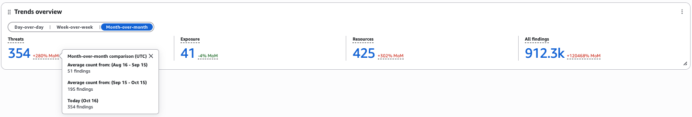
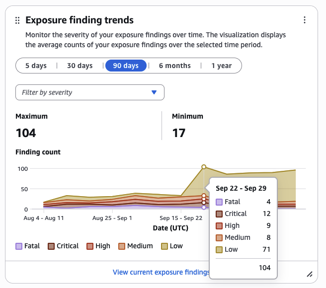
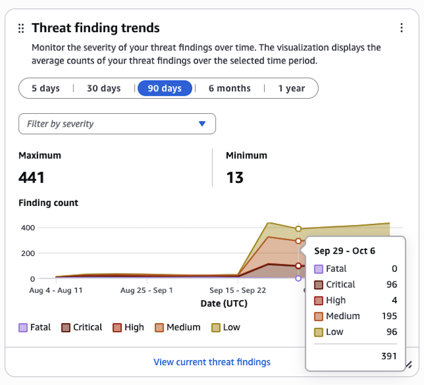
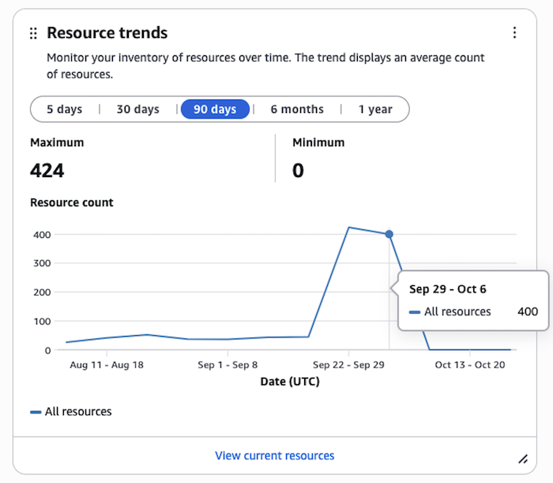
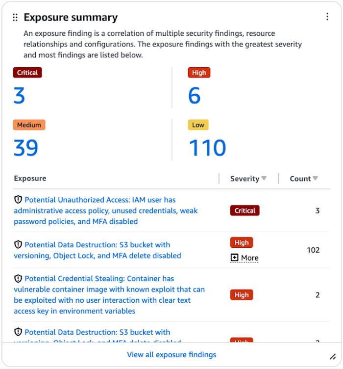
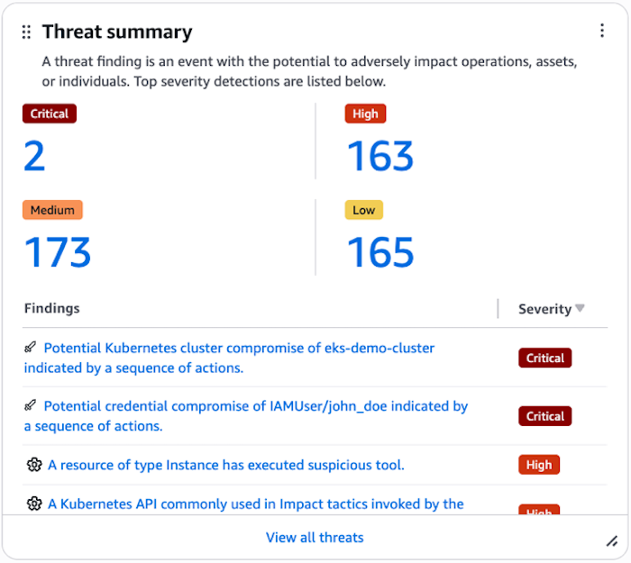
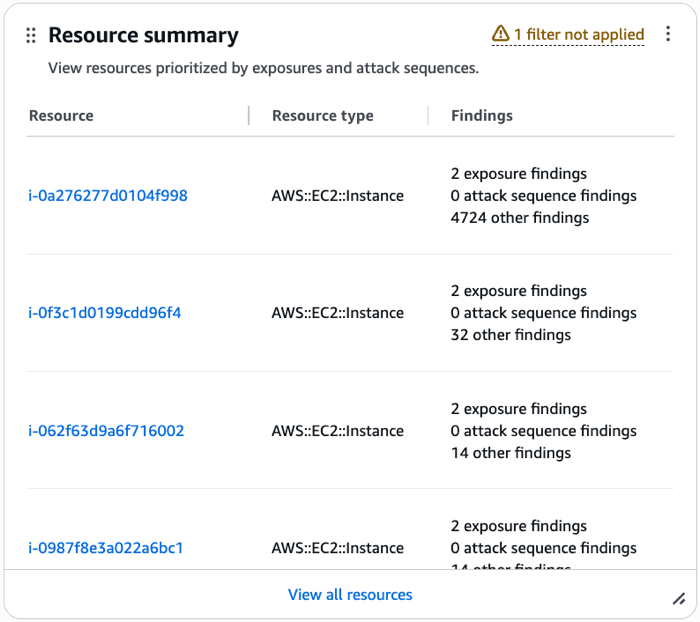
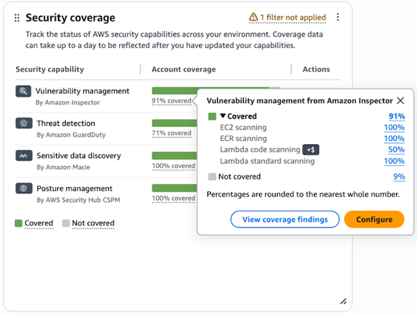
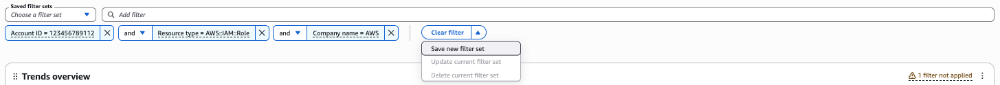
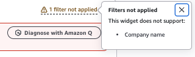

# Working in the summary dashboard in Security Hub

The **Summary** dashboard in the Security Hub console displays an overview of your exposures, threats, resources, and security coverage across security widgets.
You can customize the dashboard by adding and removing widgets and by creating and applying filter sets to retrieve data in each widget.

## Considerations

Consider the following before interacting with the dashboard:

- Customizations like saved filter sets or changes to the layout of widgets are saved automatically.
- Data automatically refreshes every time you open the dashboard.
- If you configure cross-Region aggregation, the dashboard includes findings from all of your linked regions (when viewing the dashboard in your home region).

Consider the following if your account is a delegated administrator account for an organization, member account in an organization, or standalone account.

- Customizations made by a delegated administrator account will be saved independently from customizations made by member accounts.
  Customizations might include saved filter sets or changes to the layout of widgets.
- If your account is the delegated administrator account for an organization, data includes findings for your account and member accounts.
- If your account is a member account in an organization or a standalone account, data includes findings only for your account.

As a best practice, we recommend not including confidential, sensitive, or personally identifiable information (PII) in saved filter sets, custom widgets, or other related free-form text fields.

## Available widgets

You can interact with different widgets in the **Executive** and **Triage** tabs of the **Summary** dashboard.
The **Executive** tab includes widgets that display trends data for your exposures, threats, and resources and the **Security Coverage** widget to help track your account coverage across different security capabilities.
The **Triage** tab includes widgets that display a summary of your exposures, threats, and resources.
However, you can add widgets, remove widgets, and manage the position of each widget in both tabs to customize your experience.

### Trends widgets

The following widgets display trends data for your exposures, threats, and resources, so you can analyze them over time.

#### Trends overview widget

This widget displays an overview of your exposures, threats, resources, and findings in the following time periods:

- **Month-over-month** reflects the period-over-period count for the last two months.
- **Week-over-week** reflects the period-over-period count for the past two weeks.
- **Day-over-day** reflects the period-over-period count for the past 2 days.

The number next to the percentage reflects the average period-over-period count to date.
Choosing this number directs you to its corresponding dashboard in the console.
If you navigate to another dashboard that displays trends data, the dashboard only displays trends data for the last 90 days or in a best-fit time period if your account does not contain findings or resources older than 30 days.

###### Note

To receive data in this widget, you must enable the following security services:

- **AWS Security Hub CSPM** – To receive data about exposures
- **Amazon Inspector** – To receive data about exposures
- **GuardDuty** – To receive data about threats

#### Exposure finding trends widget

This widget displays the severity of your exposure findings in the following time periods:

- **5 days**
- **30 days**
- **90 days**
- **6 months**
- **1 year**

The visualization displays the average count of your findings over the selected time period.

###### Severity filters

You can update the graph by including or excluding the following severity filters:

- **Fatal**
- **Critical**
- **High**
- **Medium**
- **Low**
- **Informational**
- **Other**
- **Unknown**

Applied severity filters show at the bottom of the visualization in different boxes.
You can hover over the visualization to review the average count of findings for specific points in time.
You can also review the average count of findings that match each applied severity filter.

You can choose **View all current exposure findings** to be directed to the **Exposure** dashboard.
By default, the **Exposure** dashboard only displays trends data for the last 90 days.
If your account does not contain exposure findings older than 30 days, the dashboard displays trends data based on a best-fit time period.

###### Note

To receive data in this widget, you must enable [Amazon Inspector](../../../inspector/latest/user/getting_started.md "../../../inspector/latest/user/getting_started.md") and [Security Hub CSPM](securityhub-settingup.md "securityhub-settingup.md").

#### Threat finding trends widget

This widget displays the severity of your threat findings in the following time periods:

- **5 days**
- **30 days**
- **90 days**
- **6 months**
- **1 year**

The visualization displays the average count of your findings over the selected time period.

###### Severity filters

You can update the graph by including or excluding the following severity filters:

- **Fatal**
- **Critical**
- **High**
- **Medium**
- **Low**
- **Informational**
- **Other**
- **Unknown**

Applied severity filters show at the bottom of the visualization in different boxes.
You can hover over the visualization to review the average count of findings for specific points in time.
You can also review the average count of findings that match each applied severity filter.

You can choose **View all current threat findings** to be directed to the **Exposure** dashboard.
By default, the **Threats** dashboard only displays trends data for the last 90 days.
If your account does not contain threat findings older than 30 days, the dashboard displays trends data based on a best-fit time period.

###### Note

To receive data in this widget, you must enable [GuardDuty](../../../guardduty/latest/ug/guardduty_settingup.md "../../../guardduty/latest/ug/guardduty_settingup.md").

#### Resource trends widget

This widget displays an inventory of your resources in the following time periods:

- **5 days**
- **30 days**
- **90 days**
- **6 months**
- **1 year**

The visualization displays the average count of your resources over the selected time period.
You can hover over the visualization to review the average count of resources for specific points in time.

You can choose **View current resources** to be directed to the **Resources** dashboard.
By default, the **Resources** dashboard only displays trends data for the last 90 days.
If your account does not contain resources older than 30 days, the dashboard displays trends data based on a best-fit time period.

This widget displays an inventory of your resources in the following time periods:

- **5 days**
- **30 days**
- **90 days**
- **6 months**
- **1 year**

#### Data retention for trends

Security Hub retains trends data for one year for all AWS accounts where Security Hub is enabled. After trends data has been retained for one year, it is deleted from Security Hub.

Trends data for delegated administrator and standalone accounts is deleted after Security Hub is disabled, or if the accounts are terminated.

Trends data retention secnarios for member accounts with Security Hub enabled:

- If a member account leaves its organization, Security Hub will still store the trends data, up to when the account left the organization, for a year.
- If Security Hub is disabled for a member account, the trends data, up to when the account was disabled, will be retained for a year.
- If a member account is terminated, the trends data will be disassociated from the terminated account (e.g., the terminated accountID will be scrubbed) and the rest of the trends data will be retained for one year.

### Summary widgets

The following widgets display a summary of your exposures, threats, and resources.

#### Exposure summary widget

This widget displays your exposures by severity.
An exposure is based on an analysis of findings and traits from Security Hub and other AWS security services, such as Amazon Inspector.
The list of exposures in this widget is limited to the eight exposures with the highest severity.
Exposures with greater severity appear first in the list.
If two or more exposures are of equal severity, the list automatically groups those exposures behind more recent exposures.
Choosing **View all exposures** directs you to the **Exposure** dashboard.

###### Note

To receive data in this widget, you must enable [Amazon Inspector](../../../inspector/latest/user/getting_started.md "../../../inspector/latest/user/getting_started.md") and [Security Hub CSPM](securityhub-settingup.md "securityhub-settingup.md").

#### Threat summary widget

This widget displays your threats by severity.
A threat refers to malicious activity or suspicious activity that can compromise the security of your environment.
The list of threats in this widget is limited to the eight threats with the highest severity.
Threats with greater severity appear first in the list.
If two or more threats are of equal severity, the list automatically groups those threats behind more recent threats.
Choosing **View all threats** directs you to the **Threats** dashboard.

###### Note

To receive data in this widget, you must [enable GuardDuty](../../../guardduty/latest/ug/guardduty_settingup.md "../../../guardduty/latest/ug/guardduty_settingup.md").

#### Resource summary widget

This widget displays resources by type and findings associated with resources.
Resources are prioritized by exposures and attack sequences.
Choosing **View all resources** directs you to the **Resource** dashboard.

#### Security coverage widget

The widget displays a summary of your account coverage for the following security capabilities:

- Vulnerability management by Amazon Inspector
- Threat detection by Amazon GuardDuty
- Sensitive data discovery by Amazon Macie
- Posture management by AWS Security Hub CSPM

Percentages in the **Account coverage** column represent the number of coverage checks that passed and failed for each security capability across AWS accounts and AWS Regions where Security Hub is enabled.
You can review which coverage checks passed and failed for a security capability by choosing a percentage.
**Covered** indicates the coverage check passed.
**Not covered** indicates the coverage check failed.
When reviewing percentages for the number of coverage checks that passed and failed, each percentage under **Covered** represents the percentage of coverage findings covered for a security capability.
In some cases, percentages for coverage checks are rounded to the nearest whole number.

###### Suppressed coverage findings

If any of your coverage findings in Security Hub are suppressed, the widget displays a message informing you that coverage has been excluded:

_Coverage for security capabilities has been excluded through suppressed coverage findings._

For more information about coverage findings, see [Coverage findings in Security Hub](coverage-findings.md "coverage-findings.md").

## Available filters

You can apply filters to security widgets using the **Add filter bar**.

Filters are organized in the following categories:

- **Shared filters** – applies to all security widgets
- **Finding filters** – applies to security widgets that display finding data
- **Resource filters** – applies to security widgets that display resource data

You can create a filter set by connecting filters using the **and**/**or** operators and then choosing **Save new filter set** in the dropdown.

### Filters applied to the Exposure finding trends widget and Threat finding trends widget

Currently, the filters supported for these widgets include the following:

- **Account ID**
- **Finding class name**
- **Finding type**
- **Product name**
- **Region**
- **Status**

### Filters applied to the Resource trends widget

Currently, the filters supported for this widget include the following:

- **Account ID**
- **Region**
- **Resource category**
- **Resource type**

### Filters not applied to widgets

If a widget does not support a filter, the filter is not applied to the widget.
In this case, the widget displays a warning message letting you know how many filters were not applied and lists the names of which filters it does not support.
