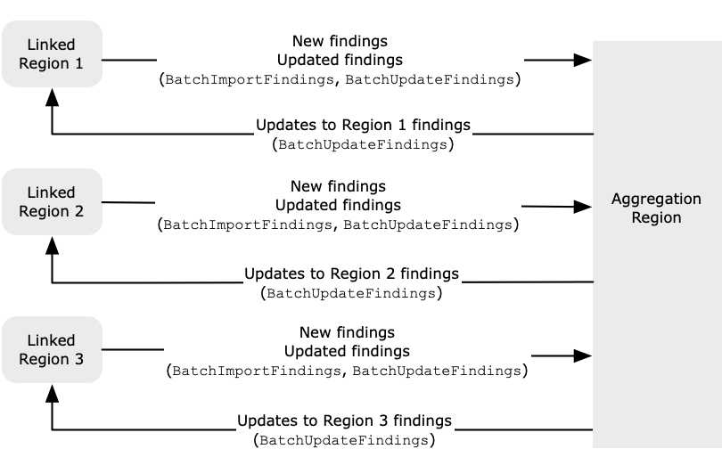

# Understanding cross-Region aggregation in Security Hub CSPM

###### Note

The _aggregation Region_ is now called the _home Region_. Some Security Hub CSPM API operations still use the older term aggregation
Region.

By using cross-Region aggregation in AWS Security Hub CSPM, you can aggregate findings, finding updates, insights,
control compliance statuses, and security scores from multiple AWS Regions to a single
home Region. You can then manage all of this data from the home Region.

Suppose you set US East (N. Virginia) as the home Region, and US West (Oregon) and
US West (N. California) as the linked Regions. When you view the **Findings**
page in US East (N. Virginia), you see the findings from all three Regions. Updates to those
findings are also reflected in all three Regions.

###### Note

In AWS GovCloud (US), cross-Region aggregation is supported only for findings, finding
updates, and insights across AWS GovCloud (US). Specifically, you can only aggregate
findings, finding updates, and insights between AWS GovCloud (US-East) and
AWS GovCloud (US-West). In the China Regions, cross-Region aggregation is supported
only for findings, finding updates, and insights across the China Regions.
Specifically, you can only aggregate findings, finding updates, and insights between
China (Beijing) and China (Ningxia).

If a control is
enabled in a linked Region but disabled in the home Region, you can see the
compliance status of the control from the home Region, but you can't enable or
disable that control from the home Region. The exception is if you use [central configuration](central-configuration-intro.md "central-configuration-intro.md"). If you
use central configuration, the delegated Security Hub CSPM administrator can configure controls in the home Region and linked Regions from the
home Region.

If you have set an home Region, [security scores](standards-security-score.md "standards-security-score.md") account for control statuses in all
 linked Regions.
To view cross-Region security scores and compliance statuses, add the following
permissions to your IAM role that uses Security Hub CSPM:

- `ListSecurityControlDefinitions`
- `BatchGetStandardsControlAssociations`
- `BatchUpdateStandardsControlAssociations`

## Types of data that are aggregated

When cross-Region aggregation is enabled with one or more linked Regions, Security Hub CSPM replicates the following data from the linked Regions to the
home Region. This occurs in every account that has cross-Region aggregation enabled.

- Findings
- Insights
- Control compliance statuses
- Security scores

In addition to new data in the previous list, Security Hub CSPM also replicates updates to this data between the linked Regions and the
home Region. Updates that occur in a linked Region are replicated to the
home Region. Updates that occur in the home Region are replicated back
to the linked Region. If there are conflicting updates in the home Region and the linked Region,
then the most recent update is used.

Cross-Region aggregation does not add to the cost of Security Hub CSPM. You are not charged
when Security Hub CSPM replicates new data or updates.

In the home Region, the **Summary** page provides a view of your
active findings across linked Regions. For information, see [Viewing a cross-Region summary of findings by severity](findings-view-summary.md "findings-view-summary.md"). Other
**Summary** page panels that analyze findings also display information
from across the linked Regions.

Your security scores in the home Region are calculated by comparing the number of
passed controls to the number of enabled controls in all linked Regions. In addition, if a
control is enabled in at least one linked Region, it is visible on the **Security
standards** details pages of the home Region. The compliance status of
controls on the standards details pages reflects findings across linked Regions. If a
security check associated with a control fails in one or more linked Regions, the compliance
status of that control shows as **Failed** on the standards details pages
of the home Region. The number of security checks includes findings from all linked
Regions.

Security Hub CSPM only aggregates data from Regions where an account has Security Hub CSPM enabled. Security Hub CSPM
is not automatically enabled for an account based on the cross-Region aggregation
configuration.

It's possible to have cross-Region aggregation enabled without any linked Regions selected. In this case, no
data replication occurs.

## Aggregation for administrator and member accounts

Standalone accounts, member accounts, and administrator accounts can configure cross-Region aggregation. If
configured by an administrator, the presence of the administrator account is essential for cross-Region aggregation
to work in administered accounts. If the administrator
account is removed or disassociated from a member account, cross-Region aggregation for the member account
stops. This is true even if the account had cross-Region aggregation enabled before the administrator-member
relationship begins.

When an administrator account enables cross-Region aggregation, Security Hub CSPM replicates the data that the administrator
account generates in all linked Regions to the home Region. In addition, Security Hub CSPM
identifies the member accounts that are associated with that administrator, and each member account inherits
the cross-Region aggregation settings of the administrator.
Security Hub CSPM replicates the data that a member account generates in all linked Regions to the home Region.

The administrator can access and manage security findings from all member accounts within the administered regions.
However, as a Security Hub CSPM administrator, you must be signed in to the home Region to view aggregated data from all member accounts
and linked Regions.

As a Security Hub CSPM member account, you must be signed in to the home Region to view aggregated data from your account
from all linked Regions. Member accounts don't have permissions to view data from other member accounts.

An administrator account may manually invite member accounts or serve as the delegated administrator
of an organization that is integrated with AWS Organizations. For a [manually-invited member account](account-management-manual.md "account-management-manual.md"), the administrator must invite the account from the home Region and
all linked Regions in order for cross-Region aggregation to work. In addition, the member account must have Security Hub CSPM enabled in the home
Region and all linked Regions to give the administrator the ability to view findings from the member account. If you don't use the home
Region for other purposes, you can disable Security Hub CSPM standards and integrations in that Region to prevent charges.

If you plan to use cross-Region aggregation, and have multiple administrator
accounts, we recommend following these best practices:

- Each administrator account has different member accounts.
- Each administrator account has the same member accounts across
  Regions.
- Each administrator account uses a different home Region.

###### Note

To understand how cross-Region aggregation impacts central configuration, see
[Impact of central configuration on cross-Region aggregation](aggregation-central-configuration.md "aggregation-central-configuration.md").
