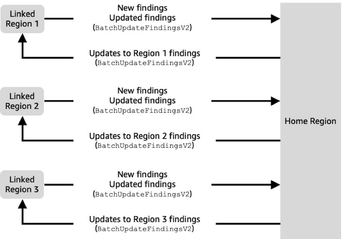

# Understanding cross-Region aggregation in Security Hub

Cross-Region aggregation allows you to aggregate findings, resources, and trends from multiple AWS Regions into a single home Region.
You can then manage all this data from the home Region.

Suppose you set US East (N. Virginia) as the home Region, and US West (Oregon) and US West (N. California) as the linked Regions.
When you view the Findings page in US East (N. Virginia), you see the findings from all three Regions.
Updates to those findings are also reflected in all three Regions.

## Types of data that are aggregated

When cross-Region aggregation is enabled with one or more linked Regions, Security Hub replicates the following data from the linked Regions to the home Region.
This occurs in every account that has cross-Region aggregation enabled.

- Findings
- Resources
- Trends

In addition to new data in the previous list, Security Hub also replicates updates to this data between the linked Regions and the home Region.
Updates that occur in a linked Region are replicated to the home Region.
Updates that occur in the home Region are replicated back to the linked Region.
If there are conflicting updates in the home Region and the linked Region, then the most recent update is used.

Any findings that existed in a region at the time that it becomes a linked region will not be replicated to the home Region unless there is an update to the finding.
Once a Region is linked to a home Region there will be a difference in findings between the home Region and the linked Region until findings in the linked Region are updated or they age out.

Any resources that existed in a region at the time that it becomes a linked region will be replicated to the home Region, typically within 24-48 hours after the Region becomes linked to a home Region.

When removing a linked region, any findings or resources for that region will remain in the home region until the finding or resource ages out.

Trends data is based on findings and resources that are present within the region that the trend is for.
Trends data in a home Region will reflect the current state of findings and resources that have been synched to the home Region.

Cross-Region aggregation does not add to the cost of Security Hub. You are not charged when Security Hub replicates new data or updates.

In the home Region, the Summary page provides a view of your active findings and resources across linked Regions.

Security Hub only aggregates data from Regions where an account has Security Hub enabled.
Security Hub is not automatically enabled for an account based on the cross-Region aggregation configuration.

It's possible to have cross-Region aggregation enabled without any linked Regions selected. In this case, no data replication occurs.

## Aggregation for administrator and member accounts

Standalone accounts and administrator accounts can configure cross-Region aggregation.
If configured by an administrator, the presence of the administrator account is essential for cross-Region aggregation to work in administered accounts.
If the administrator account is removed or disassociated from a member account, cross-Region aggregation for the member account will either stop, or if the member account had a cross-Region aggregation configuration before being associated with an administrator, that aggregation configuration will again be in effect for the account.

When an administrator account enables cross-Region aggregation, Security Hub replicates the data that the administrator account generates in all linked Regions to the home Region.
In addition, Security Hub identifies the member accounts that are associated with that administrator, and each member account inherits the cross-Region aggregation settings of the administrator. Security Hub replicates the data that a member account generates in all linked Regions to the home Region.

The administrator can access and manage security findings from all member accounts within the administered regions.
Additionally, the administrator can view resource inventory from all member accounts within the administered regions.

As a Security Hub member account, you must be signed in to the home Region to view aggregated data from your account from all linked Regions.
Member accounts don't have permissions to view data from other member accounts and are not permitted to call the `CreateAggregatorV2`, `DeleteAggregatorV2`, and `GetAggregatorV2` APIs.

## Automation rules and cross-Region aggregation

When cross-Region aggregation is enabled automation rules can only be created in the defined home region.
Any rule that you define applies to all linked regions unless your rule criteria applies to specific regions.
You must create separate automation rules for any region that is not a linked region.

Any rules that were created in the home Region, prior to enabling cross-Region aggregation, automatically become applicable in linked Regions.
Rules previously created in linked Regions will no longer apply once an aggregator is created.
Rules defined in linked Regions will resume applying once the aggregator is deleted or the region is no longer linked.
