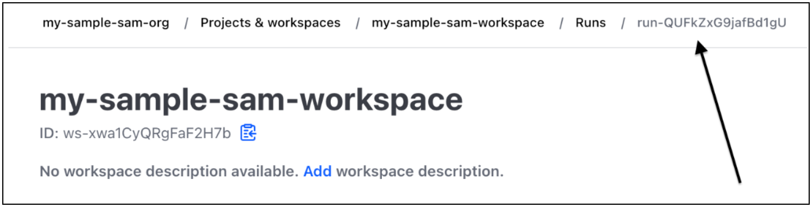

# Getting started with Terraform support for

AWS SAM CLI

This topic covers how to get started with using the AWS Serverless Application Model Command Line Interface (AWS SAM CLI)
with Terraform.

To provide feedback and submit feature requests, create a [GitHub Issue](https://github.com/aws/aws-sam-cli/issues/new?labels=area%2Fterraform "https://github.com/aws/aws-sam-cli/issues/new?labels=area%2Fterraform").

###### Topics

- [AWS SAM CLI Terraform
  prerequisites](#gs-terraform-support-prerequisites "#gs-terraform-support-prerequisites")
- [Using AWS SAM CLI commands with
  Terraform](#gs-terraform-support-using "#gs-terraform-support-using")
- [Set up for Terraform
  projects](#gs-terraform-support-projects "#gs-terraform-support-projects")
- [Set up for Terraform Cloud](#gs-terraform-support-cloud "#gs-terraform-support-cloud")

## AWS SAM CLI Terraform

prerequisites

Complete all prerequisites to begin using the AWS SAM CLI with your Terraform
projects.

1. ###### Install or upgrade the AWS SAM CLI

To check if you have the AWS SAM CLI installed, run the following:

```
`$` `sam --version`
```

If the AWS SAM CLI is already installed, the output will display a version. To upgrade
to the newest version, see [Upgrading the AWS SAM CLI](manage-sam-cli-versions.md#manage-sam-cli-versions-upgrade "manage-sam-cli-versions.md#manage-sam-cli-versions-upgrade").

For instructions on installing the AWS SAM CLI along with all of its prerequisites, see
[Install the AWS SAM CLI](install-sam-cli.md "install-sam-cli.md"). 2. ###### Install Terraform

To check if you have Terraform installed, run the following:

```
`$` `terraform -version`
```

To install Terraform, see [Install
Terraform](https://developer.hashicorp.com/terraform/downloads "https://developer.hashicorp.com/terraform/downloads") in the _Terraform
registry_. 3. ###### Install Docker for local testing

The AWS SAM CLI requires Docker for local testing. To install Docker, see [Installing Docker to use with the AWS SAM CLI](install-docker.md "install-docker.md").

## Using AWS SAM CLI commands with

Terraform

When you run a supported AWS SAM CLI command, use the `--hook-name` option and
provide the `terraform` value. The following is an example:

```
`$` `sam local invoke --hook-name terraform`
```

You can configure this option in your AWS SAM CLI configuration file with the
following:

```
hook_name = "terraform"
```

## Set up for Terraform

projects

Complete steps in this topic to use the AWS SAM CLI with Terraform
projects.

No additional setup is required if you build your AWS Lambda artifacts outside of your
Terraform project. See [Using the AWS SAM CLI with Terraform for local debugging
and testing](using-samcli-terraform.md "using-samcli-terraform.md") to start using the AWS SAM CLI.

If you build your Lambda artifacts within your Terraform projects, you must
do the following:

1. Install Python 3.8 or newer
2. Install the Make tool.
3. Define your Lambda artifacts build logic within your Terraform
   project.
4. Define a `sam metadata` resource to inform the AWS SAM CLI of your build
   logic.
5. Use the AWS SAM CLI `sam build` command to build your Lambda artifacts.

### Install Python 3.8 or newer

Python 3.8 or newer is required for use with the AWS SAM CLI. When you run `sam build`, the AWS SAM CLI creates `makefiles` that
contain Python commands to build your Lambda artifacts.

For installation instructions, see [Downloading Python](https://wiki.python.org/moin/BeginnersGuide/Download "https://wiki.python.org/moin/BeginnersGuide/Download") in Python's
_Beginners Guide_.

Verify that Python 3.8 or newer is added to your machine path by running:

```
`$` `python --version`
```

The output should display a version of Python that is 3.8 or newer.

### Install the Make tool

GNU Make is a tool that controls the generation of executables and other
non-source files for your project. The AWS SAM CLI creates `makefiles` which rely on this tool to build your Lambda artifacts.

If you do not have Make installed on your local machine, install it before moving forward.

For Windows, you can install using [Chocolatey](https://chocolatey.org/ "https://chocolatey.org/"). For instructions, see [Using Chocolatey](https://www.technewstoday.com/install-and-use-make-in-windows/#using-chocolatey "https://www.technewstoday.com/install-and-use-make-in-windows/#using-chocolatey") in _How to Install and Use "Make" in
Windows_

### Define the Lambda artifacts build

logic

Use the `null_resource`
Terraform resource type to define your Lambda build logic. The following is an
example that uses a custom build script to build a Lambda function.

```
resource "null_resource" "build_lambda_function" {
    triggers = {
        build_number = "${timestamp()}"
    }

    provisioner "local-exec" {
        command =  substr(pathexpand("~"), 0, 1) == "/"? "./py_build.sh \"${local.lambda_src_path}\" \"${local.building_path}\" \"${local.lambda_code_filename}\" Function" : "powershell.exe -File .\\PyBuild.ps1 ${local.lambda_src_path} ${local.building_path} ${local.lambda_code_filename} Function"
    }
}
```

### Define a sam

metadata resource

The `sam metadata` resource is a `null_resource`
Terraform resource type that provides the AWS SAM CLI with the information it
needs to locate your Lambda artifacts. A unique `sam metadata` resource is
required for each Lambda function or layer in your project. To learn more about this resource
type, see [null_resource](https://registry.terraform.io/providers/hashicorp/null/latest/docs/resources/resource "https://registry.terraform.io/providers/hashicorp/null/latest/docs/resources/resource") in the _Terraform
registry_.

###### To define a sam metadata resource

1. Name your resource starting with `sam_metadata_` to identify the resource
   as a sam metadata resource.
2. Define your Lambda artifact properties within the `triggers` block of your
   resource.
3. Specify your `null_resource` that contains your Lambda build logic with
   the `depends_on` argument.

The following is an example template:

```
resource "null_resource" "sam_metadata_`...`" {
  triggers = {
    resource_name = `resource_name`
    resource_type = `resource_type`
    original_source_code = `original_source_code`
    built_output_path = `built_output_path`
  }
  depends_on = [
    null_resource.`build_lambda_function` # ref to your build logic
  ]
}
```

The following is an example `sam metadata` resource:

```
resource "null_resource" "sam_metadata_aws_lambda_function_publish_book_review" {
    triggers = {
        resource_name = "aws_lambda_function.publish_book_review"
        resource_type = "ZIP_LAMBDA_FUNCTION"
        original_source_code = "${local.lambda_src_path}"
        built_output_path = "${local.building_path}/${local.lambda_code_filename}"
    }
    depends_on = [
        null_resource.build_lambda_function
    ]
}
```

The contents of your `sam metadata` resource will vary based on the Lambda
resource type (function or layer), and the packaging type (ZIP or image). For more
information, along with examples, see [sam metadata resource](terraform-sam-metadata.md "terraform-sam-metadata.md").

When you configure a `sam metadata` resource and use a supported AWS SAM CLI
command, the AWS SAM CLI will generate the metadata file before running the AWS SAM CLI command.
Once you have generated this file, you can use the `--skip-prepare-infra` option
with future AWS SAM CLI commands to skip the metadata generation process and save time. This
option should only be used if you haven’t made any infrastructure changes, such as creating
new Lambda functions or new API endpoints.

### Use the AWS SAM CLI to build your Lambda artifacts

Use the AWS SAM CLI `sam build` command to build your Lambda artifacts. When you run `sam build`, the AWS SAM CLI does the following:

1. Looks for `sam metadata` resources in your Terraform project to learn about and
   locate your Lambda resources.
2. Initiates your Lambda build logic to build your Lambda artifacts.
3. Creates an `.aws-sam` directory that organizes your Terraform project for
   use with the AWS SAM CLI `sam local` commands.

###### To build with sam build

1. From the directory containing your Terraform root module, run the following:

```
`$` `sam build --hook-name terraform`
```

2. To build a specific Lambda function or layer, run the following

```
`$` `sam build --hook-name terraform `lambda-resource-id``
```

The Lambda resource ID can be the Lambda function name or full Terraform resource address, such
as `aws_lambda_function.list_books` or
`module.list_book_function.aws_lambda_function.this[0]`.

If your function source code or other Terraform configuration files are located outside of the directory containing your Terraform root
module, you need to specify the location. Use the `--terraform-project-root-path` option to specify the absolute or relative path to the top-level directory containing
these files. The following is an example:

```
`$` `sam build --hook-name terraform --terraform-project-root-path `~/projects/terraform/demo``
```

#### Build using a container

When running the AWS SAM CLI `sam build` command, you can configure the AWS SAM CLI to build your application
using a local Docker container.

###### Note

You must have Docker installed and configured. For instructions, see
[Installing Docker to use with the AWS SAM CLI](install-docker.md "install-docker.md").

###### To build using a container

1. Create a `Dockerfile` that contains the Terraform, Python,
   and Make tools. You should also include your Lambda function runtime.

The following is an example `Dockerfile`:

```
FROM public.ecr.aws/amazonlinux/amazonlinux:2

RUN yum -y update \
    && yum install -y unzip tar gzip bzip2-devel ed gcc gcc-c++ gcc-gfortran \
    less libcurl-devel openssl openssl-devel readline-devel xz-devel \
    zlib-devel glibc-static libcxx libcxx-devel llvm-toolset-7 zlib-static \
    && rm -rf /var/cache/yum

RUN yum -y install make \
    && yum -y install zip

RUN yum install -y yum-utils \
    && yum-config-manager --add-repo https://rpm.releases.hashicorp.com/AmazonLinux/hashicorp.repo \
    && yum -y install terraform \
    && terraform --version

# AWS Lambda Builders
RUN amazon-linux-extras enable python3.8
RUN yum clean metadata && yum -y install python3.8
RUN curl -L get-pip.io | python3.8
RUN pip3 install aws-lambda-builders
RUN ln -s /usr/bin/python3.8 /usr/bin/python3
RUN python3 --version

VOLUME /project
WORKDIR /project

ENTRYPOINT ["sh"]
```

2. Use [docker build](https://docs.docker.com/engine/reference/commandline/build/ "https://docs.docker.com/engine/reference/commandline/build/")
   to build your Docker image.

The following is an example:

```
`$` `docker build --tag `terraform-build:v1` `<path-to-directory-containing-Dockerfile>``
```

3. Run the AWS SAM CLI `sam build` command with the `--use-container` and
   `--build-image` options.

The following is an example:

```
`$` `sam build --use-container --build-image `terraform-build:v1``
```

### Next steps

To start using the AWS SAM CLI with your Terraform projects, see
[Using the AWS SAM CLI with Terraform for local debugging
and testing](using-samcli-terraform.md "using-samcli-terraform.md").

## Set up for Terraform Cloud

We recommend that you use Terraform v1.6.0 or newer. If you are using an older version, you must
generate a Terraform plan file locally. The local plan file provides the AWS SAM CLI with
the information it needs to perform local testing and debugging.

###### To generate a local plan file

###### Note

These steps are not required for Terraform v1.6.0 or newer. To start using the AWS SAM
CLI with Terraform Cloud, see [Using AWS SAM CLI with
Terraform](using-samcli-terraform.md "using-samcli-terraform.md").

1. **Configure an API token** – The type of token will depend on your
   access level. To learn more, see [API Tokens](https://developer.hashicorp.com/terraform/cloud-docs/users-teams-organizations/api-tokens "https://developer.hashicorp.com/terraform/cloud-docs/users-teams-organizations/api-tokens")
   in the _Terraform Cloud documentation_.
2. **Set your API token environment variable** – The following is an example
   from the command line:

```
`$` export TOKEN="`<api-token-value>`"
```

3. **Obtain your run ID** – From the Terraform Cloud console,
   locate the run ID for the Terraform run that you’d like to use with the AWS SAM CLI.

The run ID is located in the breadcrumb path of your run.

 4. **Fetch the plan file** – Using your API token, obtain your local plan file.
The following is an example from the command line:

```
curl \
   --header "Authorization: Bearer $TOKEN" \
   --header "Content-Type: application/vnd.api+json" \
   --location \
   https://app.terraform.io/api/v2/runs/`<run ID>`/plan/json-output \
   > custom_plan.json
```

You are now ready to use the AWS SAM CLI with Terraform Cloud. When using a supported AWS SAM CLI command,
use the `--terraform-plan-file` option to specify the name and path of your local plan file. The following is
an example:

```
`$` `sam local invoke --hook-name terraform --terraform-plan-file custom-plan.json`
```

The following is an example, using the `sam local start-api` command:

```
`$` `sam local start-api --hook-name terraform --terraform-plan-file custom-plan.json`
```

For a sample application that you can use with these examples, see [api_gateway_v2_tf_cloud](https://github.com/aws-samples/aws-sam-terraform-examples/tree/main/ga/api_gateway_v2_tf_cloud "https://github.com/aws-samples/aws-sam-terraform-examples/tree/main/ga/api_gateway_v2_tf_cloud") in the _aws-samples
GitHub repository_.

### Next steps

To start using the AWS SAM CLI with Terraform Cloud, see
[Using the AWS SAM CLI with Terraform for local debugging
and testing](using-samcli-terraform.md "using-samcli-terraform.md").
