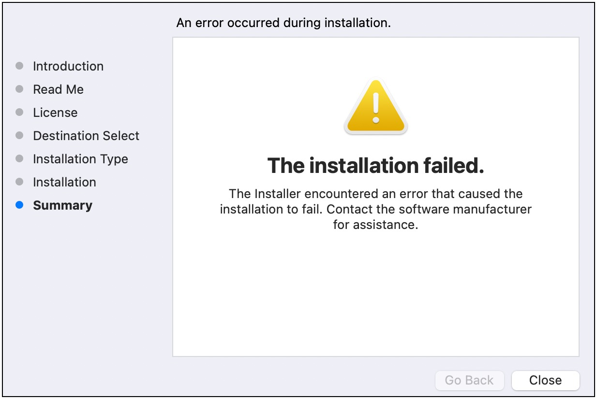

# Install the AWS SAM CLI

Install the latest release of the AWS Serverless Application Model Command Line Interface
(AWS SAM CLI) on supported operating systems by following instructions in
[Step 4: Install the AWS CLI](prerequisites.md#prerequisites-install-cli "prerequisites.md#prerequisites-install-cli").

For information on managing a currently installed version of the AWS SAM CLI, including how to
upgrade, uninstall, or manage nightly builds, see [Managing AWS SAM CLI versions](manage-sam-cli-versions.md "manage-sam-cli-versions.md").

###### Is this your first time installing the AWS SAM CLI?

Complete all [prerequisites](prerequisites.md "prerequisites.md") in the previous section before moving forward. This
includes:

1. Signing up for an AWS account.
2. Setting up secure access to AWS.
3. Creating an access key ID and secret access key.
4. Installing the AWS CLI.
5. Configuring AWS credentials.

###### Topics

- [Installing the AWS SAM CLI](#install-sam-cli-instructions "#install-sam-cli-instructions")
- [Troubleshooting installation errors](#sam-cli-troubleshoot-install "#sam-cli-troubleshoot-install")
- [Next steps](#install-sam-cli-next-steps "#install-sam-cli-next-steps")
- [Optional: Verify the integrity of the AWS SAM CLI
  installer](reference-sam-cli-install-verify.md "reference-sam-cli-install-verify.md")

## Installing the AWS SAM CLI

###### Note

Starting September 2023, AWS will no longer maintain the AWS managed Homebrew installer for the
AWS SAM CLI (`aws/tap/aws-sam-cli`). If you use Homebrew to install and manage the AWS SAM CLI,
see the following options:

- To continue using Homebrew, you can use the community managed installer. For more information,
  see [Managing the AWS SAM CLI with Homebrew](manage-sam-cli-versions.md#manage-sam-cli-versions-homebrew "manage-sam-cli-versions.md#manage-sam-cli-versions-homebrew").
- We recommend using one of the first party installation methods that are documented on this page. Before using one of these methods, see
  [Switch from Homebrew](manage-sam-cli-versions.md#manage-sam-cli-versions-switch "manage-sam-cli-versions.md#manage-sam-cli-versions-switch").
- For additional details, refer to [Release version: 1.121.0](https://github.com/aws/aws-sam-cli/releases "https://github.com/aws/aws-sam-cli/releases").

To install the AWS SAM CLI, follow the instructions for your operating system.

x86_64 - command line installer

1. Download the [AWS SAM CLI .zip file](https://github.com/aws/aws-sam-cli/releases/latest/download/aws-sam-cli-linux-x86_64.zip "https://github.com/aws/aws-sam-cli/releases/latest/download/aws-sam-cli-linux-x86_64.zip") to a directory of your choice.
2. **(Optional)** You can verify the integrity of the installer before
   installation. For instructions, see [Optional: Verify the integrity of the AWS SAM CLI
   installer](reference-sam-cli-install-verify.md "reference-sam-cli-install-verify.md").
3. Unzip the installation files into a directory of your choice. The following is an example, using the
   `sam-installation` subdirectory.

###### Note

If your operating system doesn't have the built-in
**unzip** command, use an equivalent.

```
`$` `unzip aws-sam-cli-linux-x86_64.zip -d `sam-installation``
```

4. Install the AWS SAM CLI by running the `install` executable. This executable is located in the
   directory used in the previous step. The following is an example, using the
   `sam-installation` subdirectory:

```
`$` `sudo ./`sam-installation`/install`
```

5. Verify the installation.

```
`$` `sam --version`
```

To confirm a successful installation, you should see an output that replaces the following bracketed text with the latest available version:

```
 SAM CLI, <latest version>
```

arm64 - command line installer

1. Download the [AWS SAM CLI .zip file](https://github.com/aws/aws-sam-cli/releases/latest/download/aws-sam-cli-linux-arm64.zip "https://github.com/aws/aws-sam-cli/releases/latest/download/aws-sam-cli-linux-arm64.zip") to a directory of your choice.
2. **(Optional)** You can verify the integrity of the installer before
   installation. For instructions, see [Optional: Verify the integrity of the AWS SAM CLI
   installer](reference-sam-cli-install-verify.md "reference-sam-cli-install-verify.md").
3. Unzip the installation files into a directory of your choice. The following is an example, using the
   `sam-installation` subdirectory.

###### Note

If your operating system doesn't have the built-in
**unzip** command, use an equivalent.

```
`$` `unzip aws-sam-cli-linux-arm64.zip -d `sam-installation``
```

4. Install the AWS SAM CLI by running the `install` executable. This executable is located in the
   directory used in the previous step. The following is an example, using the
   `sam-installation` subdirectory:

```
`$` `sudo ./`sam-installation`/install`
```

5. Verify the installation.

```
`$` `sam --version`
```

To confirm a successful installation, you should see an output like the following but that replaces the bracketed text with the latest SAM CLI version:

```
 SAM CLI, <latest version>
```

#### Installation steps

Use the package installer to install the AWS SAM CLI. Additionally, the package installer has two installation methods that you can choose from:
**GUI** and **Command line**. You can install for **all users** or just your **current user**. To install for all users, superuser
authorization is required.

###### Note

AWS SAM CLI doesn't support MacOS versions older than MacOS 13.x. Upgrade to a
supported version of MacOS or install AWS SAM CLI with Homebrew.

GUI - All users

###### To download the package installer and install the AWS SAM CLI

###### Note

If you previously installed the AWS SAM CLI through Homebrew or pip, you
need to uninstall it first. For instructions, see [Uninstalling the AWS SAM CLI](manage-sam-cli-versions.md#manage-sam-cli-versions-uninstall "manage-sam-cli-versions.md#manage-sam-cli-versions-uninstall").

1. Download the macOS `pkg` to a directory of your choice:
   - **For Macs running Intel processors, choose x86_64** – [aws-sam-cli-macos-x86_64.pkg](https://github.com/aws/aws-sam-cli/releases/latest/download/aws-sam-cli-macos-x86_64.pkg "https://github.com/aws/aws-sam-cli/releases/latest/download/aws-sam-cli-macos-x86_64.pkg")
   - **For Macs running Apple silicon, choose arm64** – [aws-sam-cli-macos-arm64.pkg](https://github.com/aws/aws-sam-cli/releases/latest/download/aws-sam-cli-macos-arm64.pkg "https://github.com/aws/aws-sam-cli/releases/latest/download/aws-sam-cli-macos-arm64.pkg")

###### Note

You have the option of verifying the integrity of the installer before installation. For instructions, see
[Optional: Verify the integrity of the AWS SAM CLI
installer](reference-sam-cli-install-verify.md "reference-sam-cli-install-verify.md"). 2. Run your downloaded file and follow the on-screen instructions to continue through the
**Introduction**, **Read Me**, and
**License** steps. 3. For **Destination Select**, select **Install for all users of this
computer**. 4. For **Installation Type**, choose where the AWS SAM CLI will be installed and
press **Install**. The recommended default location is
`/usr/local/aws-sam-cli`.

###### Note

To invoke the AWS SAM CLI with the **sam** command, the installer automatically
creates a symlink between `/usr/local/bin/sam` and either
`/usr/local/aws-sam-cli/sam` or the installation folder you chose. 5. The AWS SAM CLI will install and **The installation was successful** message will
display. Press **Close**.

###### To verify a successful installation

- Verify that the AWS SAM CLI has properly installed and that your symlink is configured by running:

```
`$` `which sam`
`/usr/local/bin/sam`
`$` `sam --version`
`SAM CLI, `<latest version>``
```

GUI - Current user

###### To download and install the AWS SAM CLI

###### Note

If you previously installed the AWS SAM CLI through Homebrew or pip, you
need to uninstall it first. For instructions, see [Uninstalling the AWS SAM CLI](manage-sam-cli-versions.md#manage-sam-cli-versions-uninstall "manage-sam-cli-versions.md#manage-sam-cli-versions-uninstall").

1. Download the macOS `pkg` to a directory of your choice:
   - **For Macs running Intel processors, choose x86_64** – [aws-sam-cli-macos-x86_64.pkg](https://github.com/aws/aws-sam-cli/releases/latest/download/aws-sam-cli-macos-x86_64.pkg "https://github.com/aws/aws-sam-cli/releases/latest/download/aws-sam-cli-macos-x86_64.pkg")
   - **For Macs running Apple silicon, choose arm64** – [aws-sam-cli-macos-arm64.pkg](https://github.com/aws/aws-sam-cli/releases/latest/download/aws-sam-cli-macos-arm64.pkg "https://github.com/aws/aws-sam-cli/releases/latest/download/aws-sam-cli-macos-arm64.pkg")

###### Note

You have the option of verifying the integrity of the installer before installation. For instructions, see
[Optional: Verify the integrity of the AWS SAM CLI
installer](reference-sam-cli-install-verify.md "reference-sam-cli-install-verify.md"). 2. Run your downloaded file and follow the on-screen instructions to continue through the
**Introduction**, **Read Me**, and
**License** steps. 3. For **Destination Select**, select **Install for me only**.
If you don't see this option, go to the next step. 4. For **Installation Type**, do the following:

    1. Choose where the AWS SAM CLI will be installed. The default location is
     `/usr/local/aws-sam-cli`. Select a location that you have write permissions
     for. To change the installation location, select **local** and choose your
     location. Press **Continue** when done.
    2. If you didn't get the option to choose **Install for me only** in the previous
     step, select **Change Install Location** > **Install for me only**
     and press **Continue**.
    3. Press **Install**.

5. The AWS SAM CLI will install and **The installation was successful** message will
   display. Press **Close**.

###### To create a symlink

- To invoke the AWS SAM CLI with the **sam** command, you must manually create a
  symlink between the AWS SAM CLI program and your `$PATH`. Create your symlink
  by modifying and running the following command:

```
`$` ``sudo` ln -s `/path-to`/aws-sam-cli/sam `/path-to-symlink-directory`/sam`
```

    + `sudo` – If your user has write permissions to `$PATH`,
     **sudo** is not required. Otherwise, **sudo** is required.
    + `path-to` – Path to where you installed the AWS SAM CLI program.
     For example, `/Users/myUser/Desktop`.
    + `path-to-symlink-directory` – Your `$PATH` environment
     variable. The default location is `/usr/local/bin`.

###### To verify a successful installation

- Verify that the AWS SAM CLI has properly installed and that your symlink is configured by running:

```
`$` `which sam`
`/usr/local/bin/sam`
`$` `sam --version`
`SAM CLI, `<latest version>``
```

Command line - All users

###### To download and install the AWS SAM CLI

###### Note

If you previously installed the AWS SAM CLI through Homebrew or pip, you
need to uninstall it first. For instructions, see [Uninstalling the AWS SAM CLI](manage-sam-cli-versions.md#manage-sam-cli-versions-uninstall "manage-sam-cli-versions.md#manage-sam-cli-versions-uninstall").

1. Download the macOS `pkg` to a directory of your choice:
   - **For Macs running Intel processors, choose x86_64** – [aws-sam-cli-macos-x86_64.pkg](https://github.com/aws/aws-sam-cli/releases/latest/download/aws-sam-cli-macos-x86_64.pkg "https://github.com/aws/aws-sam-cli/releases/latest/download/aws-sam-cli-macos-x86_64.pkg")
   - **For Macs running Apple silicon, choose arm64** – [aws-sam-cli-macos-arm64.pkg](https://github.com/aws/aws-sam-cli/releases/latest/download/aws-sam-cli-macos-arm64.pkg "https://github.com/aws/aws-sam-cli/releases/latest/download/aws-sam-cli-macos-arm64.pkg")

###### Note

You have the option of verifying the integrity of the installer before installation. For instructions, see
[Optional: Verify the integrity of the AWS SAM CLI
installer](reference-sam-cli-install-verify.md "reference-sam-cli-install-verify.md"). 2. Modify and run the installation script:

```
`$` `sudo installer -pkg `path-to-pkg-installer`/`name-of-pkg-installer` -target /`
`installer: Package name is AWS SAM CLI
installer: Upgrading at base path /
installer: The upgrade was successful.`
```

###### Note

To invoke the AWS SAM CLI with the **sam** command, the installer automatically
creates a symlink between `/usr/local/bin/sam` and
`/usr/local/aws-sam-cli/sam`.

###### To verify a successful installation

- Verify that the AWS SAM CLI has properly installed and that your symlink is configured by running:

```
`$` `which sam`
`/usr/local/bin/sam`
`$` `sam --version`
`SAM CLI, `<latest version>``
```

Command line - Current user

###### To download and install the AWS SAM CLI

###### Note

If you previously installed the AWS SAM CLI through Homebrew or pip, you
need to uninstall it first. For instructions, see [Uninstalling the AWS SAM CLI](manage-sam-cli-versions.md#manage-sam-cli-versions-uninstall "manage-sam-cli-versions.md#manage-sam-cli-versions-uninstall").

1. Download the macOS `pkg` to a directory of your choice:
   - **For Macs running Intel processors, choose x86_64** – [aws-sam-cli-macos-x86_64.pkg](https://github.com/aws/aws-sam-cli/releases/latest/download/aws-sam-cli-macos-x86_64.pkg "https://github.com/aws/aws-sam-cli/releases/latest/download/aws-sam-cli-macos-x86_64.pkg")
   - **For Macs running Apple silicon, choose arm64** – [aws-sam-cli-macos-arm64.pkg](https://github.com/aws/aws-sam-cli/releases/latest/download/aws-sam-cli-macos-arm64.pkg "https://github.com/aws/aws-sam-cli/releases/latest/download/aws-sam-cli-macos-arm64.pkg")

###### Note

You have the option of verifying the integrity of the installer before installation. For instructions, see
[Optional: Verify the integrity of the AWS SAM CLI
installer](reference-sam-cli-install-verify.md "reference-sam-cli-install-verify.md"). 2. Determine an installation directory that you have write permissions to. Then, create
an `xml` file using the template and modify it to reflect your installation
directory. The directory must already exist.

For example, if you replace `path-to-my-directory` with
`/Users/myUser/Desktop`, the `aws-sam-cli` program folder
will be installed there.

```
<?xml version="1.0" encoding="UTF-8"?>
<!DOCTYPE plist PUBLIC "-//Apple//DTD PLIST 1.0//EN" "http://www.apple.com/DTDs/PropertyList-1.0.dtd">
<plist version="1.0">
  <array>
    <dict>
      <key>choiceAttribute</key>
      <string>customLocation</string>
      <key>attributeSetting</key>
      <string>`path-to-my-directory`</string>
      <key>choiceIdentifier</key>
      <string>default</string>
    </dict>
  </array>
</plist>
```

3. Save the `xml` file and verify that its valid by running the following:

```
`$` `installer -pkg `path-to-pkg-installer` \
-target CurrentUserHomeDirectory \
-showChoicesAfterApplyingChangesXML `path-to-your-xml-file``
```

The output should display the preferences that will be applied to the AWS SAM CLI program. 4. Run the following to install the AWS SAM CLI:

```
`$` `installer -pkg `path-to-pkg-installer` \
-target CurrentUserHomeDirectory \
-applyChoiceChangesXML `path-to-your-xml-file``

# Example output
`installer: Package name is AWS SAM CLI
installer: choices changes file '`path-to-your-xml-file`' applied
installer: Upgrading at base path `base-path-of-xml-file`
installer: The upgrade was successful.`
```

###### To create a symlink

- To invoke the AWS SAM CLI with the **sam** command, you must manually create a
  symlink between the AWS SAM CLI program and your `$PATH`. Create your symlink
  by modifying and running the following command:

```
`$` ``sudo` ln -s `/path-to`/aws-sam-cli/sam `/path-to-symlink-directory`/sam`
```

    + `sudo` – If your user has write permissions to `$PATH`,
     **sudo** is not required. Otherwise, **sudo** is required.
    + `path-to` – Path to where you installed the AWS SAM CLI program.
     For example, `/Users/myUser/Desktop`.
    + `path-to-symlink-directory` – Your `$PATH` environment
     variable. The default location is `/usr/local/bin`.

###### To verify a successful installation

- Verify that the AWS SAM CLI has properly installed and that your symlink is configured by running:

```
`$` `which sam`
`/usr/local/bin/sam`
`$` `sam --version`
`SAM CLI, `<latest version>``
```

Windows Installer (MSI) files are the package installer files for the Windows
operating system.

Follow these steps to install the AWS SAM CLI using the MSI file.

1. Download the AWS SAM CLI [64-bit](https://github.com/aws/aws-sam-cli/releases/latest/download/AWS_SAM_CLI_64_PY3.msi "https://github.com/aws/aws-sam-cli/releases/latest/download/AWS_SAM_CLI_64_PY3.msi").
2. **(Optional)** You can verify the integrity of the installer before
   installation. For instructions, see [Optional: Verify the integrity of the AWS SAM CLI
   installer](reference-sam-cli-install-verify.md "reference-sam-cli-install-verify.md").
3. Verify the installation.

After completing the installation, verify it by opening a new command prompt or
PowerShell prompt. You should be able to invoke `sam` from the command
line.

```
`sam --version`
```

After successful installation of the AWS SAM CLI, you should see output like the
following:

```
SAM CLI, <latest version>
```

4. Enable long paths (Windows 10 and newer only).

###### Important

The AWS SAM CLI might interact with filepaths that exceed the Windows max path limitation. This may
cause errors when running `sam init` due to Windows 10 **MAX_PATH**
limitations. To resolve this issue, the new long paths behavior must be
configured.

To enable long paths, see [Enable Long Paths in Windows 10, Version 1607, and Later](https://learn.microsoft.com/en-us/windows/win32/fileio/maximum-file-path-limitation?tabs=powershell#enable-long-paths-in-windows-10-version-1607-and-later "https://learn.microsoft.com/en-us/windows/win32/fileio/maximum-file-path-limitation?tabs=powershell#enable-long-paths-in-windows-10-version-1607-and-later") in the
_Microsoft Windows App Development Documentation_. 5. Install Git.

To download sample applications using the `sam init` command, you must
also install Git. For instructions, see [Installing
Git](https://git-scm.com/book/en/v2/Getting-Started-Installing-Git "https://git-scm.com/book/en/v2/Getting-Started-Installing-Git").

## Troubleshooting installation errors

### Linux

#### Docker

error: "Cannot connect to the Docker daemon. Is the docker daemon running on this
host?"

In some cases, to provide permissions for the `ec2-user` to access the
Docker daemon, you might have to reboot your instance. If you receive this error, try
rebooting your instance.

#### Shell

error: "command not found"

If you receive this error, your shell can't locate the AWS SAM CLI executable in the
path. Verify the location of the directory where you installed the AWS SAM CLI executable,
and then verify that the directory is on your path.

#### AWS SAM CLI error: "/lib64/libc.so.6: version `GLIBC_2.14' not found (required by

/usr/local/aws-sam-cli/dist/libz.so.1)"

If you receive this error, you're using an unsupported version of Linux, and the
built-in glibc version is out of date. Try either of the following:

- Upgrade your Linux host to the 64-bit version of a recent distribution of CentOS,
  Fedora, Ubuntu, or Amazon Linux 2.
- Follow the instructions for [Install the AWS SAM CLI](install-sam-cli.md "install-sam-cli.md").

### macOS

#### The installation

failed



If you are installing the AWS SAM CLI for your user and selected an installation
directory that you don’t have write permissions for, this error could occur. Try either of
the following:

1. Select a different installation directory that you have write permissions for.
2. Delete the installer. Then, download and run it again.

## Next steps

To learn more about the AWS SAM CLI and to begin building your own serverless applications,
see the following:

- [Tutorial: Deploy a Hello World application with AWS SAM](serverless-getting-started-hello-world.md "serverless-getting-started-hello-world.md") – Step-by-step
  instructions to download, build, and deploy a basic serverless application.
- [The Complete AWS SAM
  Workshop](https://catalog.workshops.aws/complete-aws-sam/en-US "https://catalog.workshops.aws/complete-aws-sam/en-US") – A workshop designed to teach you many of the major features
  that AWS SAM provides.
- [AWS SAM example
  applications and patterns](https://serverlessland.com/patterns?framework=AWS+SAM "https://serverlessland.com/patterns?framework=AWS+SAM") – Sample applications and patterns from
  community authors that you can further experiment with.
