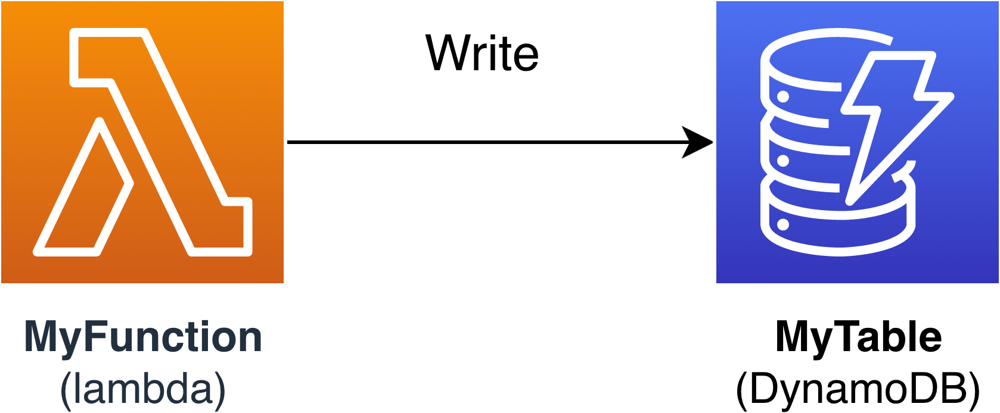

# Managing resource permissions with AWS SAM

connectors

Connectors are an AWS Serverless Application Model (AWS SAM) abstract resource type, identified as
`AWS::Serverless::Connector`, that provides simple and well-scoped permissions between your serverless
application resources.

## Benefits of AWS SAM connectors

By automatically composing the appropriate access policies between resources, connectors
give you the ability to author your serverless applications and focus on your application
architecture without needing expertise in AWS authorization capabilities, policy language,
and service-specific security settings. Therefore, connectors are a great benefit to
developers who may be new to serverless development, or seasoned developers looking to
increase their development velocity.

## Using AWS SAM connectors

Use the `Connectors` resource attribute by embedding it within a
**source** resource. Then, define your **destination**
resource and describe how data or events should flow between those resources. AWS SAM then composes the access policies
necessary to facilitate the required interactions.

The following outlines how this resource attribute is written:

```
AWSTemplateFormatVersion: '2010-09-09'
Transform: AWS::Serverless-2016-10-31
...
Resources:
  `<source-resource-logical-id>`:
    Type: `<resource-type>`
    ...
    Connectors:
      `<connector-name>`:
        Properties:
          Destination:
            `<properties-that-identify-destination-resource>`
          Permissions:
            `<permission-types-to-provision>`
  ...
```

## How connectors work

###### Note

This section explains how connectors provision the necessary resources behind the scenes. This happens for
you automatically when using connectors.

First, the embedded `Connectors` resource attribute is transformed into an
`AWS::Serverless::Connector` resource type. Its logical ID is automatically created as
`<source-resource-logical-id><embedded-connector-logical-id>`.

For example, here is an embedded connector:

```
AWSTemplateFormatVersion: '2010-09-09'
Transform: AWS::Serverless-2016-10-31
...
Resources:
  MyFunction:
    Type: AWS::Lambda::Function
    Connectors:
      MyConn:
        Properties:
          Destination:
            Id: MyTable
          Permissions:
            - Read
            - Write
  MyTable:
    Type: AWS::DynamoDB::Table
```

This will generate the following `AWS::Serverless::Connector` resource:

```
Transform: AWS::Serverless-2016-10-31
Resources:
  ...
  MyFunctionMyConn:
    Type: AWS::Serverless::Connector
    Properties:
      Source:
        Id: MyFunction
      Destination:
        Id: MyTable
      Permissions:
        - Read
        - Write
```

###### Note

You can also define connectors in your AWS SAM template by using this syntax. This is recommended when your
source resource is defined on a separate template from your connector.

Next, the necessary access policies for this connection are automatically composed. For more information about
the resources generated by connectors, see [CloudFormation resources generated when
you specify AWS::Serverless::Connector](sam-specification-generated-resources-connector.md "sam-specification-generated-resources-connector.md").

## Example of connectors

The following example shows how you can use connectors to write data from an AWS Lambda function to an
Amazon DynamoDB table.



```
Transform: AWS::Serverless-2016-10-31
Resources:
  MyTable:
    Type: AWS::Serverless::SimpleTable
  MyFunction:
    Type: AWS::Serverless::Function
    Connectors:
      MyConn:
        Properties:
          Destination:
            Id: MyTable
          Permissions:
            - Write
    Properties:
      Runtime: nodejs16.x
      Handler: index.handler
      InlineCode: |
        const AWS = require("aws-sdk");
        const docClient = new AWS.DynamoDB.DocumentClient();
        exports.handler = async (event, context) => {
          await docClient.put({
            TableName: process.env.TABLE_NAME,
            Item: {
              id: context.awsRequestId,
              event: JSON.stringify(event)
            }
          }).promise();
        }
      Environment:
        Variables:
          TABLE_NAME: !Ref MyTable
```

The `Connectors` resource attribute is embedded within the Lambda function source resource. The
DynamoDB table is defined as the destination resource using the `Id` property. Connectors will provision
`Write` permissions between these two resources.

When you deploy your AWS SAM template to CloudFormation, AWS SAM will automatically compose the necessary access policies
required for this connection to work.

## Supported connections between source and

destination resources

Connectors support `Read` and `Write` data and event permission types between a select
combination of source and destination resource connections. For example, connectors support a `Write`
connection between an `AWS::ApiGateway::RestApi` source resource and an `AWS::Lambda::Function`
destination resource.

Source and destination resources can be defined by using a combination of supported properties. Property
requirements will depend on the connection you are making and where the resources are defined.

###### Note

Connectors can provision permissions between supported serverless and non-serverless resource types.

For a list of supported resource connections and their property requirements, see
[Supported source and destination resource
types for connectors](reference-sam-connector.md#supported-connector-resource-types "reference-sam-connector.md#supported-connector-resource-types").

## Learn more

For more information about using AWS SAM connectors, see the following topics:

- [AWS::Serverless::Connector](sam-resource-connector.md "sam-resource-connector.md")
- [Define Read and Write permissions in AWS SAM](connector-usage-define.md "connector-usage-define.md")
- [Define resources by using other supported properties in AWS SAM](connector-usage-other-properties.md "connector-usage-other-properties.md")
- [Create multiple connectors from a single source in AWS SAM](connector-usage-single-source.md "connector-usage-single-source.md")
- [Create multi-destination connectors in AWS SAM](connector-usage-multi-destination.md "connector-usage-multi-destination.md")
- [Define Read and Write permissions in AWS SAM](connector-usage-define.md "connector-usage-define.md")
- [Define resource attributes with connectors in AWS SAM](connector-usage-resource-attributes.md "connector-usage-resource-attributes.md")

## Provide feedback

To provide feedback on connectors, [submit a new issue](https://github.com/aws/serverless-application-model/issues/new?assignees=&labels=area%2Fconnectors,stage%2Fneeds-triage&template=other.md&title=%28Feature%20Request%29 "https://github.com/aws/serverless-application-model/issues/new?assignees=&labels=area%2Fconnectors,stage%2Fneeds-triage&template=other.md&title=%28Feature%20Request%29") at the _serverless-application-model AWS GitHub
repository_.
