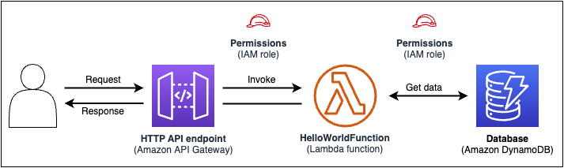

# How AWS SAM works

When working with AWS SAM to create your serverless application, you will interact with the following components:

1. **[AWS SAM template](sam-specification.md "sam-specification.md")** – An important file that defines your AWS resources. This template includes the **AWS SAM template specification** – the open-source framework that comes with a simplified short-hand syntax you use to define the functions, events, APIs, configurations, and permissions of your serverless application. This file is located in the AWS SAM project, which is the application folder that gets created when you run the **sam init** command.
2. **[AWS SAM CLI](using-sam-cli.md "using-sam-cli.md")** – A command line tool that
   you can use with your AWS SAM project and supported third-party integrations to build and run your serverless applications.
   The AWS SAM CLI is the tool you use to run commands on your AWS SAM project and eventually turn it
   into your serverless application.
   To express resources, event source mappings, and other properties that define your serverless application, you define resources and develop your application in the
   AWS SAM template and other files in your AWS SAM project. You use the AWS SAM CLI to run commands
   on your AWS SAM project, which is how you initialize, build, test, and deploy your serverless application.

###### New to serverless?

We recommend you review [Serverless concepts for AWS Serverless Application Model](what-is-concepts.md "what-is-concepts.md").

## What is the AWS SAM template specification?

The AWS SAM template specification is an open-source framework that you can use to define and manage your serverless application infrastructure code. The AWS SAM template specification is:

- **Built on AWS CloudFormation** – You use the AWS CloudFormation syntax directly in your AWS SAM template,
  taking advantage of its extensive support of resource and property configurations. If you are already familiar with AWS CloudFormation,
  you don't have to learn a new service to manage your application infrastructure code.
- **An extension of AWS CloudFormation** – AWS SAM offers its own
  unique syntax that focuses specifically on speeding up serverless development. You can use
  both the AWS CloudFormation and AWS SAM syntax within the same template.
- **An abstract, short-hand syntax** – Using the
  AWS SAM syntax, you can define your infrastructure quickly, in fewer lines of code, and with
  a lower chance of errors. Its syntax is especially curated to abstract away the complexity
  in defining your serverless application infrastructure.
- **Transformational** – AWS SAM does the complex work
  of transforming your template into the code necessary to provision your infrastructure
  through AWS CloudFormation.

## What is the AWS SAM project and AWS SAM template?

The AWS SAM project includes the AWS SAM template which contains the AWS SAM template specification. This specification is the open-source framework that you
use to define your serverless application infrastructure on AWS,
with some additional components that make them easier to work with. In this sense, AWS SAM templates are an extension of AWS CloudFormation templates.

Here’s an example of a basic serverless application. This application processes requests
to get all items from a database through an HTTP request. It consists of the following
parts:

1. A function that contains the logic to process the request.
2. An HTTP API to serve as communication between the client (requestor) and the
   application.
3. A database to store items.
4. Permissions for the application to run securely.



This application's infrastructure code can be defined in the following AWS SAM
template:

```
AWSTemplateFormatVersion: 2010-09-09
Transform: AWS::Serverless-2016-10-31
Resources:
  getAllItemsFunction:
    Type: AWS::Serverless::Function
    Properties:
      Handler: src/get-all-items.getAllItemsHandler
      Runtime: nodejs20.x
      Events:
        Api:
          Type: HttpApi
          Properties:
            Path: /
            Method: GET
    Connectors:
      MyConn:
        Properties:
          Destination:
            Id: SampleTable
          Permissions:
            - Read
  SampleTable:
    Type: AWS::Serverless::SimpleTable
```

In 23 lines of code, the following infrastructure is defined:

- A function using the AWS Lambda service.
- An HTTP API using the Amazon API Gateway service.
- A database using the Amazon DynamoDB service.
- The AWS Identity and Access Management (IAM) permissions necessary for these services to interact with one
  another.

To provision this infrastructure, the template is deployed to AWS CloudFormation. During deployment,
AWS SAM transforms the 23 lines of code into the AWS CloudFormation syntax required to generate these
resources in AWS. The transformed AWS CloudFormation template contains over 200 lines of code!

```
{
  "AWSTemplateFormatVersion": "2010-09-09",
  "Resources": {
    "getAllItemsFunction": {
      "Type": "AWS::Lambda::Function",
      "Metadata": {
        "SamResourceId": "getAllItemsFunction"
      },
      "Properties": {
        "Code": {
          "S3Bucket": "amzn-s3-demo-source-bucket-1a4x26zbcdkqr",
          "S3Key": "what-is-app/a6f856abf1b2c4f7488c09b367540b5b"
        },
        "Handler": "src/get-all-items.getAllItemsHandler",
        "Role": {
          "Fn::GetAtt": [
            "getAllItemsFunctionRole",
            "Arn"
          ]
        },
        "Runtime": "nodejs12.x",
        "Tags": [
          {
            "Key": "lambda:createdBy",
            "Value": "SAM"
          }
        ]
      }
    },
    "getAllItemsFunctionRole": {
      "Type": "AWS::IAM::Role",
      "Properties": {
        "AssumeRolePolicyDocument": {
          "Version": "2012-10-17",
          "Statement": [
            {
              "Action": [
                "sts:AssumeRole"
              ],
              "Effect": "Allow",
              "Principal": {
                "Service": [
                  "lambda.amazonaws.com"
                ]
              }
            }
          ]
        },
        "ManagedPolicyArns": [
          "arn:aws:iam::aws:policy/service-role/AWSLambdaBasicExecutionRole"
        ],
        "Tags": [
          {
            "Key": "lambda:createdBy",
            "Value": "SAM"
          }
        ]
      }
    },
    "getAllItemsFunctionApiPermission": {
      "Type": "AWS::Lambda::Permission",
      "Properties": {
        "Action": "lambda:InvokeFunction",
        "FunctionName": {
          "Ref": "getAllItemsFunction"
        },
        "Principal": "apigateway.amazonaws.com",
        "SourceArn": {
          "Fn::Sub": [
            "arn:${AWS::Partition}:execute-api:${AWS::Region}:${AWS::AccountId}:${__ApiId__}/${__Stage__}/GET/",
            {
              "__ApiId__": {
                "Ref": "ServerlessHttpApi"
              },
              "__Stage__": "*"
            }
          ]
        }
      }
    },
    "ServerlessHttpApi": {
      "Type": "AWS::ApiGatewayV2::Api",
      "Properties": {
        "Body": {
          "info": {
            "version": "1.0",
            "title": {
              "Ref": "AWS::StackName"
            }
          },
          "paths": {
            "/": {
              "get": {
                "x-amazon-apigateway-integration": {
                  "httpMethod": "POST",
                  "type": "aws_proxy",
                  "uri": {
                    "Fn::Sub": "arn:${AWS::Partition}:apigateway:${AWS::Region}:lambda:path/2015-03-31/functions/${getAllItemsFunction.Arn}/invocations"
                  },
                  "payloadFormatVersion": "2.0"
                },
                "responses": {}
              }
            }
          },
          "openapi": "3.0.1",
          "tags": [
            {
              "name": "httpapi:createdBy",
              "x-amazon-apigateway-tag-value": "SAM"
            }
          ]
        }
      }
    },
    "ServerlessHttpApiApiGatewayDefaultStage": {
      "Type": "AWS::ApiGatewayV2::Stage",
      "Properties": {
        "ApiId": {
          "Ref": "ServerlessHttpApi"
        },
        "StageName": "$default",
        "Tags": {
          "httpapi:createdBy": "SAM"
        },
        "AutoDeploy": true
      }
    },
    "SampleTable": {
      "Type": "AWS::DynamoDB::Table",
      "Metadata": {
        "SamResourceId": "SampleTable"
      },
      "Properties": {
        "AttributeDefinitions": [
          {
            "AttributeName": "id",
            "AttributeType": "S"
          }
        ],
        "KeySchema": [
          {
            "AttributeName": "id",
            "KeyType": "HASH"
          }
        ],
        "BillingMode": "PAY_PER_REQUEST"
      }
    },
    "getAllItemsFunctionMyConnPolicy": {
      "Type": "AWS::IAM::ManagedPolicy",
      "Metadata": {
        "aws:sam:connectors": {
          "getAllItemsFunctionMyConn": {
            "Source": {
              "Type": "AWS::Serverless::Function"
            },
            "Destination": {
              "Type": "AWS::Serverless::SimpleTable"
            }
          }
        }
      },
      "Properties": {
        "PolicyDocument": {
          "Version": "2012-10-17",
          "Statement": [
            {
              "Effect": "Allow",
              "Action": [
                "dynamodb:GetItem",
                "dynamodb:Query",
                "dynamodb:Scan",
                "dynamodb:BatchGetItem",
                "dynamodb:ConditionCheckItem",
                "dynamodb:PartiQLSelect"
              ],
              "Resource": [
                {
                  "Fn::GetAtt": [
                    "SampleTable",
                    "Arn"
                  ]
                },
                {
                  "Fn::Sub": [
                    "${DestinationArn}/index/*",
                    {
                      "DestinationArn": {
                        "Fn::GetAtt": [
                          "SampleTable",
                          "Arn"
                        ]
                      }
                    }
                  ]
                }
              ]
            }
          ]
        },
        "Roles": [
          {
            "Ref": "getAllItemsFunctionRole"
          }
        ]
      }
    }
  }
}
```

By using AWS SAM, you define 23 lines of infrastructure code. AWS SAM transforms your code
into the 200+ lines of AWS CloudFormation code necessary to provision your application.

## What is the AWS SAM CLI?

The AWS SAM CLI is a command line tool that you can use with AWS SAM templates and supported
third-party integrations to build and run your serverless applications. Use the AWS SAM CLI
to:

- Quickly initialize a new application project.
- Build your application for deployment.
- Perform local debugging and testing.
- Deploy your application.
- Configure CI/CD deployment pipelines.
- Monitor and troubleshoot your application in the cloud.
- Sync local changes to the cloud as you develop.
- And more!

The AWS SAM CLI is best utilized when used with AWS SAM and AWS CloudFormation templates. It also works
with third-party products such as Terraform.

### Initialize a new project

Select from starter templates or choose a custom template location to begin a new
project.

Here, we use the **sam init** command to initialize a new application
project. We select the **Hello World Example** project to start
with. The AWS SAM CLI downloads a starter template and creates our project folder directory
structure.


For more details, see [Create your application in AWS SAM](using-sam-cli-init.md "using-sam-cli-init.md").

### Build your application for deployment

Package your function dependencies and organize your project code and folder structure
to prepare for deployment.

Here, we use the **sam build** command to prepare our application for
deployment. The AWS SAM CLI creates a `.aws-sam`directory and organizes our
application dependencies and files there for deployment.


For more details, see [Build your application](serverless-building.md "serverless-building.md").

### Perform local debugging and testing

On your local machine, simulate events, test APIs, invoke functions, and more to debug
and test your application.

Here, we use the **sam local invoke** command to invoke our
`HelloWorldFunction` locally. To accomplish this, the AWS SAM CLI creates a local
container, builds our function, invokes it, and outputs the results. You can use an application like Docker to run containers on your machine.


For more details, see [Test your application](serverless-test-and-debug.md "serverless-test-and-debug.md")
and [Debug your application](debug-application.md "debug-application.md").

### Deploy your application

Configure your application's deployment settings and deploy to the AWS Cloud to
provision your resources.

Here, we use the **sam deploy --guided** command to deploy our
application through an interactive flow. The AWS SAM CLI guides us through configuring our
application's deployment settings, transforms our template into AWS CloudFormation, and deploys to AWS CloudFormation
to create our resources.


For more details, see [Deploy your application and resources](serverless-deploying.md "serverless-deploying.md").

### Configure CI/CD deployment pipelines

Create secure _continuous integration and delivery (CI/CD)_
pipelines, using a supported CI/CD system.

Here, we use the **sam pipeline init --bootstrap** command to configure a
CI/CD deployment pipeline for our application. The AWS SAM CLI guides us through our options
and generates the AWS resources and configuration file to use with our CI/CD
system.


For more details, see [Deploy with CI/CD systems and pipelines](deploying-options.md#serverless-deploying-ci-cd "deploying-options.md#serverless-deploying-ci-cd").

### Monitor and troubleshoot your application in the

cloud

View important information about your deployed resources, gather logs, and utilize
built-in monitoring tools such as AWS X-Ray.

Here, we use the **sam list** command to view our deployed resources. We
get our API endpoint and invoke it, which triggers our function. Then, we use **sam
logs** to view our function's logs.


For more details, see [Monitor your application](serverless-monitoring.md "serverless-monitoring.md").

### Sync local changes to the cloud as you

develop

As you develop on your local machine, automatically sync changes to the cloud. Quickly
see your changes and perform testing and validation in the cloud.

Here, we use the **sam sync --watch** command to have the AWS SAM CLI watch
for local changes. We modify our `HelloWorldFunction` code and the AWS SAM CLI
automatically detects the change and deploys our updates to the cloud.


### Test supported resources in the cloud

Invoke and pass events to supported resources in the cloud.

Here, we use the **sam remote invoke** command to test a deployed Lambda
function in the cloud. We invoke our Lambda function and receive its logs and response. With
our Lambda function configured to stream responses, the AWS SAM CLI streams its response back
in real time.


## Learn more

To continue learning about AWS SAM, see the following resources:

- **[The Complete AWS SAM
  Workshop](https://s12d.com/sam-ws-en-intro "https://s12d.com/sam-ws-en-intro")** – A workshop designed to teach you many of the
  major features that AWS SAM provides.
- **[Sessions with SAM](https://www.youtube.com/playlist?list=PLJo-rJlep0ED198FJnTzhIB5Aut_1vDAd "https://www.youtube.com/playlist?list=PLJo-rJlep0ED198FJnTzhIB5Aut_1vDAd")** – Video series created by our AWS
  Serverless Developer Advocate team on using AWS SAM.
- **[Serverless
  Land](https://serverlessland.com/ "https://serverlessland.com/")** – Site that brings together the latest information,
  blogs, videos, code, and learning resources for AWS serverless.

## Next steps

If this is your first time using AWS SAM, see [Getting started with AWS SAM](serverless-getting-started.md "serverless-getting-started.md").
