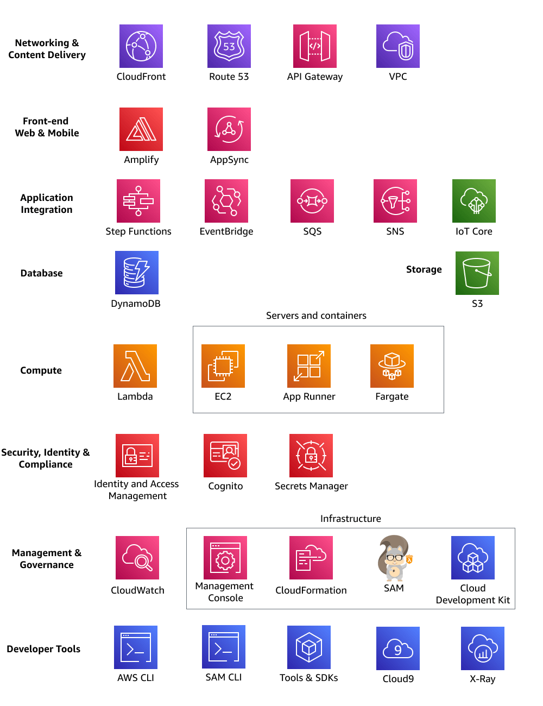
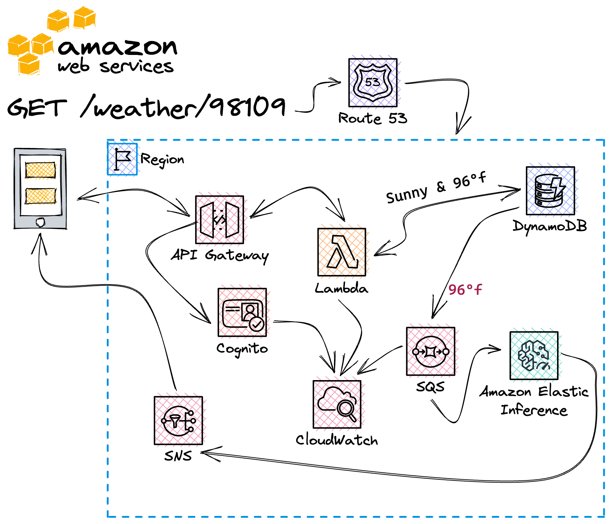

# Focusing on core serverless services

AWS has over 220 services.

Each service is a tool in your serverless development toolbox. Commonly, you start out using some services more frequently than others.
This topic provides an overview of the core services you need to build serverless solutions.

You can read high level explanations of the core services here, and an example of how they interact within the context of an example
microservice, or you can choose to skip ahead to the hands on workshop that uses three common services to build a working microservice.

## Common serverless services

The following diagram shows AWS services commonly used together to build serverless applications:

### Networking & content delivery

- **Amazon CloudFront** - content delivery network, serving
  and caching assets in storage
- **Amazon Route 53** - DNS registry/service
- **Amazon API Gateway** - HTTP & WebSocket connections and integrations
- **Amazon Virtual Private Cloud** - private networking between services in the cloud

### Front-end web & mobile

- **AWS Amplify** - open-source client libraries to build
  cloud powered mobile and web apps on AWS with authentication, data store, pub/sub,
  push notifications, storage, API built on AppSync
- **AWS AppSync** - managed GraphQL API

### Application integration

- **AWS Step Functions** - orchestration service;
  useful when you have workflows with more than one state,
  need to branch, or run tasks in parallel.
  The Step Functions service acts as the state model for your application.
- **Amazon EventBridge** - integration with AWS & 3rd
  party services through events
- **Amazon Simple Queue Service** - simple queue service; buffering
  requests
- **Amazon Simple Notification Service** - simple notification system,
  publish/subscribe topics, and sending a limited number of SMS/email messages
- **AWS IoT Core** - bi-directional communication for Internet-connected devices
  (such as sensors, actuators, embedded devices,
  wireless devices, and smart appliances) to connect to the AWS
  Cloud over MQTT, HTTPS, and LoRaWAN
- **Amazon Simple Email Service** - simple email system, bulk email sending
  service

### Database & storage

- **Amazon DynamoDB** - scalable no SQL key/value store
- **Amazon Simple Storage Service** - file storage

### Compute

- **AWS Lambda** - serverless compute functions; responsible for nearly
  all processing in serverless projects
- **Amazon Elastic Compute Cloud** - non-serverless compute alternative;
  useful when you need always-on and fully customizable capabilities. EC2 is often used for
  initial “lift and shift” migration to the cloud. You can continue to use EC2 while migrating
  portions of your workflow to serverless patterns.
- **AWS App Runner** - fully managed service to deploy your containerized
  web applications and APIs. App Runner will scale compute instances and network resources automatically
  based on incoming traffic.
- **AWS Fargate** - serverless computer for clusters of containers;
  useful when you need custom containers but do not want to maintain and
  manage the infrastructure or cluster.

### Security, identity & compliance

- **IAM** - identity and access management;
  provides policies to authorize service resources to interact with each other and your data.
- **Amazon Cognito** - authentication and authorization of users and systems
- **AWS Secrets Manager** - manage access to secrets using fine-grained policies

### Management & governance

- **Amazon CloudWatch** - suite of monitoring and logging services
- **AWS Management Console** - web-based user interface for creating,
  configuring, and monitoring AWS resources and your code.
- **AWS CloudFormation (CFN)** - text templates to automate deploying infrastructure and code
- **AWS Serverless Application Model (AWS SAM)** - an open-source framework for deploying
  serverless application infrastructure and code. AWS SAM templates provide a shorthand syntax to declare
  functions, APIs, databases, and event source mappings. With just a few lines of configuration per resource,
  you can define the application infrastructure components. During deployment, AWS SAM transforms and expands
  the template into verbose AWS CloudFormation templates.
- **AWS Cloud Development Kit (AWS CDK)** - an open-source software development framework to define
  your cloud application resources using familiar programming languages. Instead of configuration files,
  you write code that creates infrastructure. Your IDE can validate the definition and even provide
  hints through code completion.

### Developer tools and code instrumentation

- **AWS CLI** - command line utility for managing AWS resources
- **AWS SAM CLI** - command line utility for rapidly creating,
  deploying, and testing AWS resources with AWS SAM templates
- **Tools & SDKs** - libraries for connecting to
  services and resources programmatically
- **Cloud9** - cloud-based integrated development environment
- **X-Ray** — monitoring and debug

### Streaming & batch processing

- **Kinesis** - event stream processing at scale

## Typical microservice example

Consider the following scenario: you want to build a microservices application
that looks up weather data by zip code and returns JSON data.

What serverless services would you use, and how?

The solution starts with the client resolving the hostname through Route 53 DNS. The browser's HTTPS `GET`
request routes to API Gateway. If the URL is valid,
API Gateway verifies access an access token, commonly implemented as a [JWT token](https://jwt.io/introduction "https://jwt.io/introduction")JWT
token with Amazon Cognito, then creates an event for the request and sends it to a serverless Lambda function for processing.

The Lambda function receives the event and a _context_ object with additional information related to
the environment as inputs to a designated _handler_ method. The handler method in this case, uses an SDK
to send a query to DynamoDB for weather data for the given zip code. The function may filter and customize the data based on the
location and preferences of the user, perhaps converting degrees in Celsius to Fahrenheit.

Before returning the data, bundled into a new event, back to API Gateway, the function handler might create additional events.
It might send one to an SQS queue, where a data analytics service could be listening. The handler function might create
and send another event to an SNS queue so that alerts for high temperature are sent to users through SMS messages.

The function finally wraps up the JSON weather data into a new event and sends it back to
API gateway. Afterward, the function continues to handle hundreds of additional requests.
Request from users slow down after 2AM, so after some time the Lambda service will tear down
the function execution environment to conserve resources. As a Customer, you will only be
charged for function usage.

