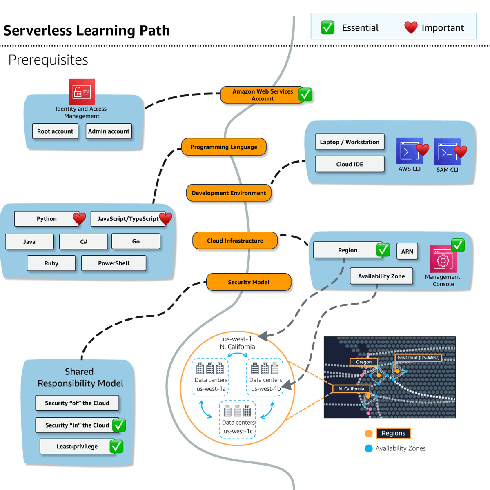
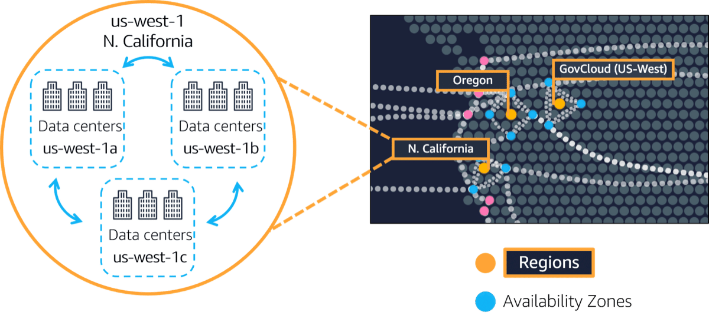
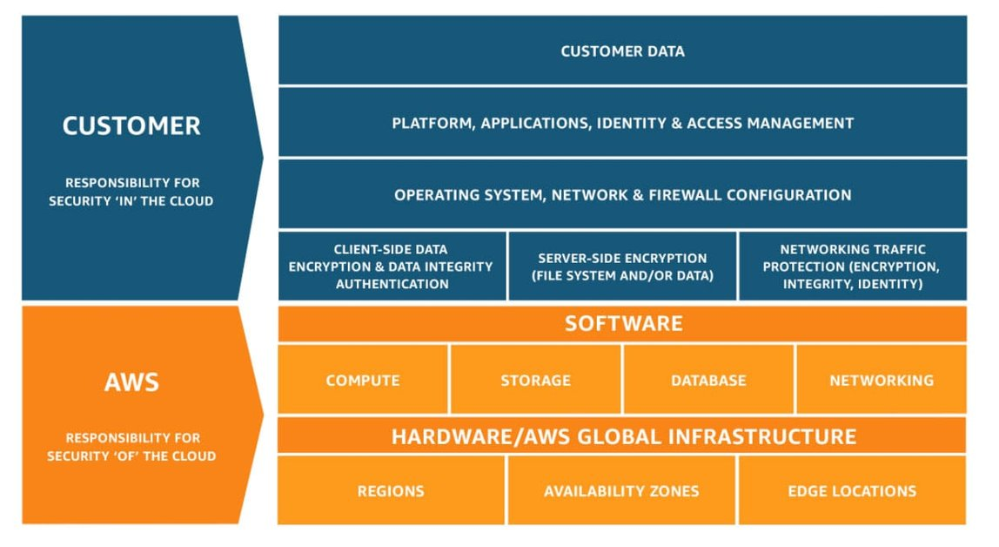

# Understanding prerequisites for serverless development

Before you begin to develop a serverless application, there are some key concepts you need to understand.
Review the serverless learning path in the following diagram.

Topics are shown in orange boxes. Large topics may be broken down into several sub-topics in blue.
Icons represent related services or tools. Essential topics are noted with a green check box.
Important, but not essential, items are noted with a red mark. When a high level orange topic is marked as essential,
that means all of the sub-topics are essential too.

###### Topics

- [Amazon Web Services account](#prereq_aws-account "#prereq_aws-account")
- [Programming languages](#prereq_programming-language "#prereq_programming-language")
- [Development environment](#prereq_development-environment "#prereq_development-environment")
- [AWS cloud infrastructure](#prereq_aws-infrastructure "#prereq_aws-infrastructure")
- [Security model](#prereq_security-model "#prereq_security-model")



## Amazon Web Services account

Before getting started, you must have or create an Amazon Web Services (AWS) account.

If you are creating a new account, you will create a root account using an email address.
The **root** account has _unrestricted_ _access_,
similar to root accounts for an operating system. As a best practice, you should create an administrative user too.

###### Granting administrative access to a user

As you might guess, granting administrative access to a user is still rather far reaching. An account with administrative
level privileges will make getting started easier. For systems in production, follow the principle of least-privilege —
granting only the minimum access necessary to accomplish tasks.

- For a step-by-step guide to account types and login management, see [Signing in to the AWS Management Console](../../../signin/latest/userguide/console-sign-in-tutorials.md "../../../signin/latest/userguide/console-sign-in-tutorials.md").
- AWS Identity and Access Management (IAM) is the service to manage entities and resources authorized to use services and service resources.

If you do not have an AWS account, complete the following steps to create one.

###### To sign up for an AWS account

1. Open [https://portal.aws.amazon.com/billing/signup](https://portal.aws.amazon.com/billing/signup "https://portal.aws.amazon.com/billing/signup").
2. Follow the online instructions.

Part of the sign-up procedure involves receiving a phone call or text message and entering
a verification code on the phone keypad.

When you sign up for an AWS account, an _AWS account root user_ is created. The root user has access to all AWS services
and resources in the account. As a security best practice, assign administrative access to a user, and use only the root user to perform [tasks that require root user access](../../../IAM/latest/UserGuide/id_root-user.md#root-user-tasks "../../../IAM/latest/UserGuide/id_root-user.md#root-user-tasks").
AWS sends you a confirmation email after the sign-up process is
complete. At any time, you can view your current account activity and manage your account by
going to [https://aws.amazon.com/](https://aws.amazon.com/ "https://aws.amazon.com/") and choosing **My
Account**.

After you sign up for an AWS account, secure your AWS account root user, enable AWS IAM Identity Center, and create an administrative user so that you
don't use the root user for everyday tasks.

###### Secure your AWS account root user

1. Sign in to the [AWS Management Console](https://console.aws.amazon.com/ "https://console.aws.amazon.com/") as the account owner by choosing **Root user** and entering your AWS account email address. On the next page, enter your password.

For help signing in by using root user, see [Signing in as the root user](../../../signin/latest/userguide/console-sign-in-tutorials.md#introduction-to-root-user-sign-in-tutorial "../../../signin/latest/userguide/console-sign-in-tutorials.md#introduction-to-root-user-sign-in-tutorial") in the _AWS Sign-In User Guide_. 2. Turn on multi-factor authentication (MFA) for your root user.

For instructions, see [Enable a virtual MFA device for your AWS account root user (console)](../../../IAM/latest/UserGuide/enable-virt-mfa-for-root.md "../../../IAM/latest/UserGuide/enable-virt-mfa-for-root.md") in the _IAM User Guide_.

###### Create a user with administrative access

1. Enable IAM Identity Center.

For instructions, see [Enabling
AWS IAM Identity Center](../../../singlesignon/latest/userguide/get-set-up-for-idc.md "../../../singlesignon/latest/userguide/get-set-up-for-idc.md") in the
_AWS IAM Identity Center User Guide_. 2. In IAM Identity Center, grant administrative access to a user.

For a tutorial about using the IAM Identity Center directory as your identity source, see [Configure user access with the default IAM Identity Center directory](../../../singlesignon/latest/userguide/quick-start-default-idc.md "../../../singlesignon/latest/userguide/quick-start-default-idc.md") in the
_AWS IAM Identity Center User Guide_.

###### Sign in as the user with administrative access

- To sign in with your IAM Identity Center user, use the sign-in URL that was sent to your email address when you created the IAM Identity Center user.

For help signing in using an IAM Identity Center user, see [Signing in to the AWS access portal](../../../signin/latest/userguide/iam-id-center-sign-in-tutorial.md "../../../signin/latest/userguide/iam-id-center-sign-in-tutorial.md") in the _AWS Sign-In User Guide_.

###### Assign access to additional users

1. In IAM Identity Center, create a permission set that follows the best practice of applying least-privilege permissions.

For instructions, see [Create a permission set](../../../singlesignon/latest/userguide/get-started-create-a-permission-set.md "../../../singlesignon/latest/userguide/get-started-create-a-permission-set.md") in the _AWS IAM Identity Center User Guide_. 2. Assign users to a group, and then assign single sign-on access to the group.

For instructions, see [Add groups](../../../singlesignon/latest/userguide/addgroups.md "../../../singlesignon/latest/userguide/addgroups.md") in the _AWS IAM Identity Center User Guide_.

## Programming languages

We assume that you have some experience with coding and deploying programs using one of the supported languages. This guide will
_not_ teach you how to program, but it will at times provide code samples.

Writing functions in an interpreted language like Python or JavaScript might be more straight-forward in some scenarios
because your code can be added directly through the AWS Management Console web interface.

You can use one of the listed languages, or create your own Lambda runtime container.

- Python, JavaScript/TypeScript — Commonly used interpreted languages
- Java, C#, Go — Compiled languages
- Ruby, PowerShell — Less frequently used options

## Development environment

For serverless development, you will likely want to set up and use a familiar editor or IDE, such as Visual Studio Code or PyCharm.
Alternatively, you may prefer AWS Cloud9, a browser-based IDE and terminal "in the cloud" with direct access to your AWS account.

You should definitely install the AWS CLI for command line control and automation of services. For example, you can list your Amazon S3
buckets, update Lambda functions, or send test events to invoke service resources. Many tutorials will show how to complete tasks with the AWS CLI.

Another useful, but optional, tool is the AWS Serverless Application Model CLI, aka the "SAM CLI". AWS SAM templates define infrastructure services and code.
You can use AWS SAM CLI to build and deploy from these templates to the cloud. AWS SAM CLI also provides features to test and debug locally
and deploy changes to infrastructure and code.

###### Tip

There are other tools that our customers use, such as the [AWS Cloud Development Kit (AWS CDK)](https://aws.amazon.com/cdk/ "https://aws.amazon.com/cdk/") for programmatic creation of infrastructure and code, or several 3rd party IaC options.

You will find that some services provide emulators that can run on your local laptop. These tools can be useful for local development, but they are also limited in terms of service and API coverage. Serverless services are better suited to their native cloud environment.

Related resources:

- [Install AWS CLI](../../../cli/latest/userguide/getting-started-install.md "../../../cli/latest/userguide/getting-started-install.md") - to control and manage your AWS services from the command line
- [Install AWS SAM CLI](../../../serverless-application-model/latest/developerguide/serverless-sam-cli-install.md "../../../serverless-application-model/latest/developerguide/serverless-sam-cli-install.md") - to create, deploy, test, and update your serverless code and resources from the command line
- Note: These tools are provided by AWS Cloud9, but you should update to the latest available versions.

## AWS cloud infrastructure

AWS provides services across the globe. You only need to understand how regions, availability zones, and data centers are related so that you can select a region. You will see the region code in URLs and Amazon Resource Names (ARNs), unique identifiers for AWS resources.

### Regions

Every solution you build that runs in the AWS cloud will be deployed to at least one region.

- **Region** – a physical location around the world where we cluster data centers
- **Availability Zone** or "AZ" - one or more discrete data centers with redundant power, networking, and connectivity _within_ a Region
- **Data center** – a physical location that contains servers, data storage drives, and network equipment



Amazon has many regions all across the globe. Inside each region, there are one or more Availability Zones located tens of miles apart. The distance is near enough for low latency — the gap between requesting and receiving a response, and far enough to reduce the chance that multiple zones are affected if a disaster happens.

Each region is identified by a code, such as "us-west-1", "us-east-1" or "eu-west-2". Within each region, the multiple isolated locations known as _Availability Zones_ or AZs are identified with the region code followed by a letter identifier. For example, `us-east-1a`. AWS handles deploying to multiple availability zones within a region for resilience.

### Amazon Resource Name (ARN)

Services are identified with regional endpoints. The general syntax of a regional endpoint is as follows:

```
protocol://<service-code>.<region-code>.amazonaws.com
```

For example, `https://dynamodb.us-west-1.amazonaws.com` is the endpoint for the Amazon DynamoDB service in the US West (N. California) Region.

The region code is also used to identify AWS resources with [Amazon Resource Names](../../../general/latest/gr/aws-arns-and-namespaces.md "../../../general/latest/gr/aws-arns-and-namespaces.md"), also called "ARNs". Because AWS is deployed all over the world, ARNs function like an addressing system to precisely locate which specific part of AWS we are referring to. ARNs have a hierarchical structure:

```
arn:partition:service:region:account-id:resource-id
arn:partition:service:region:account-id:resource-type/resource-id
arn:partition:service:region:account-id:resource-type:resource-id
```

- arn: literally, the string "arn"
- `partition` is one of the three partitions: AWS Regions, AWS China Regions, or AWS GovCloud (US) Regions
- `service` is the specific service such as Amazon EC2 or DynamoDB
- `region` is the AWS region like `us-east-1` (North Virginia)
- `account-id` is the AWS account ID
- `resource-id` is the unique resource ID. Other forms for resource IDs like `resource-type/resource-id`,
  are used by services like IAM where IAM users have `resource-type` of `user` and `resource-id`
  a username like `MyUsername,`

Try to identify the service, region, and resource for the following example ARNs:

```
arn:aws::dynamodb:us-west-2:123456789012:table/myDynamoDBTable
arn:aws::lambda:us-east-2:123456789012:function:my-function:1
```

If you are interested in learning more, check out a [map of Regions and Availability Zones](https://aws.amazon.com/about-aws/global-infrastructure/regions_az/ "https://aws.amazon.com/about-aws/global-infrastructure/regions_az/"), a view of our [data centers](https://aws.amazon.com/compliance/data-center/data-centers/ "https://aws.amazon.com/compliance/data-center/data-centers/"), and the complete list of [regional service endpoints](../../../general/latest/gr/rande.md#ddb_region "../../../general/latest/gr/rande.md#ddb_region").

## Security model

Security is a top priority for AWS. Before you start building serverless solutions, you need to know how security factors into AWS solutions.

Amazon Web Services has a _shared responsibility model:_



A shared security model means that Amazon manages certain aspects of security, and you are responsible for others.

- AWS is responsible for the security _of_ the cloud.
  This includes such thing as the physical security of the data centers.
- You are responsible for the security _in_ the cloud.
  For example, you are responsible for your data, and for granting functions only the access the need to complete their work.

For developers getting started with serverless and experts alike, the responsibility of securing the resources and functions will take effort to understand and implement.

We'll explain more along the way, but you should at least know that AWS commitment to security is not taken lightly. AWS services have carefully established security mechanisms for you to create secure solutions from the start. However, you have the responsibility to learn how and properly implement these mechanisms in your solutions.

For more details, see the [Shared Responsibility Model](https://aws.amazon.com/compliance/shared-responsibility-model/ "https://aws.amazon.com/compliance/shared-responsibility-model/"), [AWS Cloud Security](https://aws.amazon.com/security/ "https://aws.amazon.com/security/"), and [Security Documentation Index](../../../security.md "../../../security.md") with links to security documents for every service.
