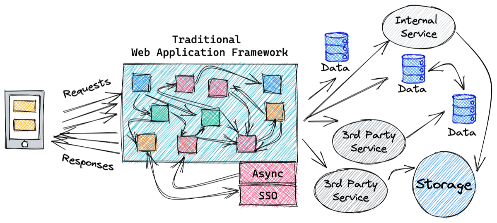

# Understanding the difference between traditional and serverless development

As a developer, you might already be familiar with traditional web applications, but new to serverless development.
You might even know how to use some AWS services directly, such as Amazon S3 or DynamoDB, but are not sure what it takes to
develop a fully-functional serverless application in production.

This topic provides an overview a traditional application development, then explain the shift in thinking needed
shift to serverless development. This is intended to provide you with a clearer conceptual understanding of serverless development
using AWS services

###### Topics

- [Traditional development](#shift_traditional-development "#shift_traditional-development")
- [Use services instead of custom code](#use-services-instead-of-custom-code "#use-services-instead-of-custom-code")
- [Serverless development on AWS](#shift_serverless-solutions- "#shift_serverless-solutions-")

## Traditional development

Traditional web apps generally handle synchronous requests and responses.
This cycle has been the basis of web since the beginning of the Internet.
Over time, developers created and shared code to speed up development. You
have probably used or at least recognize one or more of these web frameworks:
Express, Django, Flask, Ruby on Rails, Asp.net, Play, Backbone, Angular, Spring Boot, Vapor, to name a few.

Web frameworks help you build solutions faster by including common tools and features.

The following diagram represents some of the complex mix of components that are included with frameworks.
Routers send URLs to classes or functions to handle requests and return responses. Utility classes retrieve form data,
query strings, headers, and cookies. A bundled abstraction layer stores and retrieves data in SQL or NoSQL databases.
Additional components manage connections to external services through synchronous API calls or asynchronous message queues.
Extension points exist to bolt-on even more components, such as asynchronous hooks, or single sign-on authentication.

We call these solutions _traditional_ because request/response has been the model for
web applications for decades. We call them _monolithic_ because everything is provided in one package.

Traditional frameworks do an awful lot, but can be awfully complex doing it.

To be fair, traditional development does have advantages. Developer workstation setup is generally quick.
You typically setup a package manager or installer such as NPM, Gradle, Maven, homebrew, or a custom CLI to initialize a new application,
then you run the bare bones app with a command.

Frameworks that bring everything can boost initial productivity,
especially when starting with a simple solution.

But, this everything in one box approach makes scaling and troubleshooting problems difficult.
As an application grows, it tends to rely on more external systems. Asynchronous integrations with these systems are preferred
because they do not block the flow. But, asynchronous requests are difficult to invoke and troubleshoot in a traditional architecture.

For asynchronous actions, the application logic must include timeouts, retry logic, and the status.
Single errors can cascade and impact many components. Work flows become more involved just to keep the solution running.

Increases (or decreases) in demand for a particular feature require scaling up (or down) the entire system.
This is inefficient and difficult because all of the components and state are tightly coupled together.

The architecture of traditional monolithic web applications tends to become more complex over time.
Complexity increases ramp-up time for new developers, makes tracking down the source of bugs
more challenging, and delays the delivery of new features.

## Use services instead of custom code

Serverless applications usually comprise several AWS services, integrated with custom code run in Lambda functions.
While Lambda can be integrated with most AWS services, the services most commonly used in serverless applications are:

| Commonly used AWS services in serverless applications | Category                            | AWS service                                                                                                                                                                                                                                                                                                                                                                                                                                                                                                                                                                                                                                                                                                                                                                                                                                                                                                                                                                                                                                                                                                                                                                                                                                                                                                                                                                                                                                                                                                                                                                                                                                                                                                                                                                                                                                                                                                                                                                                                                                                                                                                                                                                                                                                                                                                                                                                                                                                                                                                                                                                                                                                                                                                                                                                                                                                                                                                                                                                                                                                                                                                                                                                                                                                                                                                                                                                                                                                                                                                                                    |
| ----------------------------------------------------- | ----------------------------------- | -------------------------------------------------------------------------------------------------------------------------------------------------------------------------------------------------------------------------------------------------------------------------------------------------------------------------------------------------------------------------------------------------------------------------------------------------------------------------------------------------------------------------------------------------------------------------------------------------------------------------------------------------------------------------------------------------------------------------------------------------------------------------------------------------------------------------------------------------------------------------------------------------------------------------------------------------------------------------------------------------------------------------------------------------------------------------------------------------------------------------------------------------------------------------------------------------------------------------------------------------------------------------------------------------------------------------------------------------------------------------------------------------------------------------------------------------------------------------------------------------------------------------------------------------------------------------------------------------------------------------------------------------------------------------------------------------------------------------------------------------------------------------------------------------------------------------------------------------------------------------------------------------------------------------------------------------------------------------------------------------------------------------------------------------------------------------------------------------------------------------------------------------------------------------------------------------------------------------------------------------------------------------------------------------------------------------------------------------------------------------------------------------------------------------------------------------------------------------------------------------------------------------------------------------------------------------------------------------------------------------------------------------------------------------------------------------------------------------------------------------------------------------------------------------------------------------------------------------------------------------------------------------------------------------------------------------------------------------------------------------------------------------------------------------------------------------------------------------------------------------------------------------------------------------------------------------------------------------------------------------------------------------------------------------------------------------------------------------------------------------------------------------------------------------------------------------------------------------------------------------------------------------------------------------------------- | ------- | ----------- |
| Compute                                               | Lambda                              |
| Data storage                                          | Amazon S3, DynamoDB, Amazon RDS     |
| API                                                   | API Gateway                         |
| Application integration                               | EventBridge, Amazon SNS, Amazon SQS |
| Orchestration                                         | Step Functions                      |
| Streaming data and analytics                          | Amazon Data Firehose                | There are many well-established, common patterns in distributed architectures that you can build yourself or implement using AWS services. For most customers, there is little commercial value in investing time to develop these patterns from scratch. When your application needs one of these patterns, use the corresponding AWS service: Common patterns and corresponding AWS services                                                                                                                                                                                                                                                                                                                                                                                                                                                                                                                                                                                                                                                                                                                                                                                                                                                                                                                                                                                                                                                                                                                                                                                                                                                                                                                                                                                                                                                                                                                                                                                                                                                                                                                                                                                                                                                                                                                                                                                                                                                                                                                                                                                                                                                                                                                                                                                                                                                                                                                                                                                                                                                                                                                                                                                                                                                                                                                                                                                                                                                                                                                                                                 | Pattern | AWS service |
| ---                                                   | ---                                 |
| Queue                                                 | Amazon SQS                          |
| Event bus                                             | EventBridge                         |
| Publish/subscribe (fan-out)                           | Amazon SNS                          |
| Orchestration                                         | Step Functions                      |
| API                                                   | API Gateway                         |
| Event streams                                         | Kinesis                             | These services are designed to integrate with Lambda and you can use infrastructure as code (IaC) to create and discard resources in the services. You can use any of these services via the [AWS SDK](https://aws.amazon.com/tools/ "https://aws.amazon.com/tools/") without needing to install applications or configure servers. Becoming proficient with using these services via code in your Lambda functions is an important step to producing well-designed serverless applications. ## Serverless development on AWS To build serverless solutions, you need to shift your mindset to break up monoliths into loosely connected services. Consider how each service will do one thing well, with as few dependencies as possible. You may have created microservices before, but it was probably inside a traditional framework. Imagine if your microservice existed, but without the framework. For that to happen, services need a way to get input, communicate with other services, and send outputs or errors. The key to serverless apps is _event-driven architecture._ Event-driven architecture (EDA) is a modern architecture pattern built from small, decoupled services that publish, consume, or route _events._ Events are messages sent between services. This architecture makes it easier to scale, update, and independently deploy separate components of a system. The following diagram shows an event-driven serverless microservice. A client request is converted by an API Gateway into an event that is sent to a Lambda compute service. A Lambda function retrieves info from a DynamoDB data store. That data is returned in an event to API Gateway, which sends a response to the client with all the appropriate headers, cookies, and security tokens.  Many traditional systems are designed to run periodically and process batches of transactions that have built up over time. For example, a banking application may run every hour to process ATM transactions into central ledgers. In Lambda-based applications, the custom processing should be triggered by every event, allowing the service to scale up concurrency as needed, to provide near-real time processing of transactions. While you can run cron tasks in serverless applications by using Amazon EventBridge Scheduler, consider the size of each batch of data that your event sends to Lambda. In this scenario, there is potential for the volume of transactions to grow beyond what can be processed within the 15-minute Lambda timeout. If the limitations of external systems force you to use a scheduler, you should generally schedule for the shortest reasonable recurring time period. For example, it’s not best practice to use a batch process that triggers a Lambda function to fetch a list of new Amazon S3 objects. This is because the service might receive more new objects in between batches than can be processed within a 15-minute Lambda function. |
