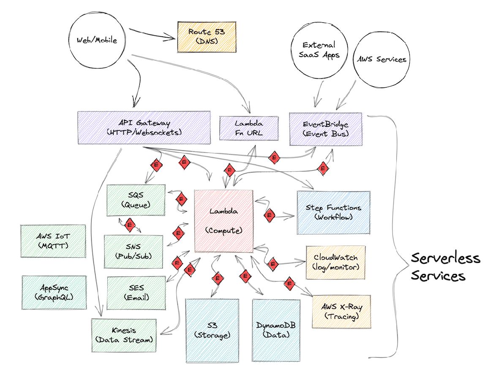
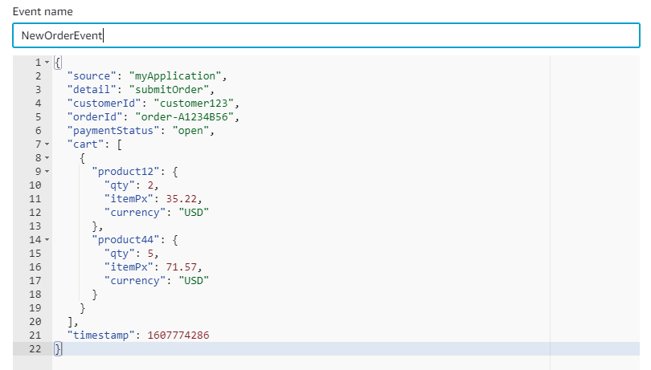

# Transitioning to event-driven architecture

Event-driven architecture (EDA) is the first step on the serverless learning path. Understanding how services interact through _events_
is essential to successful serverless development.

In this chapter, you will dive into the transition from traditional to event-driven architecture.

![Serverless learning path showing Event Driven Architecture as the first concept on the path, connected by a dotted line to an Event Driven Architecture block with "event 1" connected with arrows to blocks for Service A and Service B. Service A has an arrow connecting to Service B with "event 2" in a box on that arrow. The next concept is a Workshop:Intro to Serverless icons for API Gateway, Lambda, and DynamoDB. The legend has a green check mark for essential and a red heart for Important items. Event Driven Architecture has a green check box.](images/path-serverless-eda.png)

Let's start by thinking about event-driven components of a food delivery service.

You'll need a data store for menus, locations, orders, status. Customers will send network requests to a web API. Your application then needs a compute resource
to process customer orders.

You can handle long-running tasks asynchronously. For example you can implement a queue using Amazon SQS to manage order submission on.
You can then use Step Functions to manage a workflow that updates user information, and inventory counts after every order is processed.
Along the way, you will need to log actions, monitor app activity, and trace data flows to debug.



If you're new to serverless development, you might be more familiar with traditional frameworks.
Let us look at the steps in a traditional request/response cycle for comparison:

1. Accept an inbound network request and create local data objects.
2. Map the URL, often called a route, with configuration or annotations to an action.
3. Create global data and utility services, such as a database connection pool and an object relational mapper.
4. Implement web hooks for logging, observability, and health monitoring components.
5. Process the request: query a database, store or retrieve data, call external systems.
6. Convert outbound data into a suitable response or error and serialize the data into JSON.
7. Add metadata, such as headers, cookies, tokens to the response object.
8. Send the response back to the client.
   Now, let us compare a similar work flow implemented with event-driven architecture.

This diagram represents a microservice that retrieves data from a database, for example, retrieving shopping cart items for a customer order.

![Diagram of flow for a microservice with authentication. A client box with Web & Mobile labels, connects by an arrow to an API Gateway (HTTP) block. API Gateway block connects by an arrow with red diamond with text "Event" inside to a Lambda (compute) box. Lambda box is connected by a double ended arrow with an API label to a DynamoDB (Data) icon. Lambda box is also connected by an arrow with a different colored "event" diamond back to API Gateway. API Gateway connects through a lighter arrow back to the Client.](/images/serverless/latest/devguide/images/arch-serverless-essentials.png)

First, a web or mobile client makes an HTTP request to `GET /cart/`A1234B56`` for a list items in a cart.

A component needs to accept the request and extract metadata, such as HTTP method, path, extra path info, query string parameters,
headers, and cookies. That component will also verify the request is from an authenticated and authorized entity. In AWS, API Gateway accepts the inbound URL,
extracts the parameters, query string, and headers and creates an event to send to other services for processing.

Example based on [event.json](https://github.com/awsdocs/aws-lambda-developer-guide/tree/main/sample-apps/nodejs-apig/event.json "https://github.com/awsdocs/aws-lambda-developer-guide/tree/main/sample-apps/nodejs-apig/event.json") API Gateway
proxy event for a REST API:

```
{
  "resource": "/cart",
  "path": "/cart/A1234B56",
  "httpMethod": "GET",
  "headers": {
      "accept": "text/html,application/xhtml+xml,application/xml;q=0.9",
      "accept-encoding": "gzip, deflate, br",
      "User-Agent": "Chrome/80.0.3987.132 Safari/537.36",
      "X-Amzn-Trace-Id": "Root=1-5e66d96f-7491f09x5pl79d18acf3d050", ...
  },
  "multiValueHeaders": {
      "accept": [
          "text/html,application/xhtml+xml,application/xml;q=0.9,"
      ],
      "accept-encoding": [
          "gzip, deflate, br"
      ],

      ...

      "queryStringParameters": null,
      "multiValueQueryStringParameters": null,
      "pathParameters": null,
      "stageVariables": null,
      "body": null,
      "isBase64Encoded": false
  }
}

```

###### Tip

A dedicated API service might at first seem unnecessary, but implementing this action as a
separate service allows flexibility and scalability to your solution. For more information about working with API Gateway,
see the [Get started with API Gateway](starter-apigw.md "starter-apigw.md").

An _event_ represents a change in state, or an update.

For example: an item placed in a shopping cart, a file uploaded to a storage system, or an order becoming ready to ship. Events can either carry the state, such as:
quantity (qty), item price (itemPx), and currency; or simply contain _identifiers_ needed to look up related information, such as:
customerId and orderId, as shown in the following example of a `NewOrderEvent`:



Next, API Gateway integrates with Lambda, a compute service, to handle the new event. Lambda function code parses the parameters in the inbound event, connects to the data store,
and retrieves the cart. The function queries the database API through an SDK library. Because the DynamoDB database is also serverless and built to respond with low latency, there is no need for a connection pool.

After converting currency to USD and removing unavailable items, the function sends the result as a new event to API Gateway.

Finally, API Gateway converts the event into a response to send to the waiting client.

The method with which a function is invoked should be informed by your application architecture and needs. For example,
batch-processing patterns have different applications to on-demand data processing. Understanding these paradigm differences
can also help customers decide between AWS services.

Deploying a microservice as a containerized application on Fargate could be more appropriate if the microservice
is primarily used for batch data processing. Whereas a Lambda function would be much more straight-forward to deploy and
maintain in applications that require on-demand data processing.

## Decoupled event-driven architecture

For simpler applications, the advantage of event-driven versus request-driven applications may not be apparent.
But, as your applications add more functionality and handle more traffic, the value becomes clear.

Event-driven applications rely on communication through events that are also observable by other services and systems.
Event producers are unaware of which (if any) consumers are listening. This strategy makes it easier to extend and scale,
without disrupting existing work flows.

For example, API Gateway can enforce rate and volume limits for requests to your API on a per-customer basis. Or,
a service could watch the inbound query parameters to create a list of popular product searches. The database could
send events when products are added to the cart, to feed to a predictive ML algorithm for ordering supplies.

Due to the loose coupling between components of an event-driven system, your compute functions are not even aware
of these other activities. You can scale components independently. One service can fail, without impacting other services.
Events can be flexibly routed, buffered, and provide a log for audit.

Let’s revisit the diagram with various services connected through events. We can start to see now that
it is actually not as complex as it might have appeared.

Think of it like looking down on a big city with messengers moving packages and letters
between people and businesses. The sources and destinations range from the suburbs to the city
core. Inbound requests could be managed by a dispatcher, like API Gateway, Lambda Function URLs, or
Amazon EventBridge. Or, some messages might be dropped in a box for asynchronous delivery. This would be
like events routed to queues or orchestrated in complex work flows with Step Functions. The
monitoring, tracing, and metrics services, CloudWatch and AWS X-Ray, are like managers, watching
the stream of events to make sure packages are delivered, and if not, to troubleshoot the
problem. After drop-off at a business, some packages are transferred by in-house delivery
agents to their final destination. This situation is similar to how services that store data
and files, may stream events to compute services, which triggers ever more actions.


Connecting services with **events** and **event-driven architecture** gives you a consistent and scalable way
to build solutions with hundreds of services.

## Summary

- Serverless is built on independent services that communicate through _events_ in an _event-driven architecture._
- _event-driven architecture_ (EDA) - a modern architecture pattern built from small decoupled services that publish,
  consume, or route _events._
- _events_ - represent a change in state, or an update
- Decoupled microservice architecture helps you build modern, agile, and extendable applications faster than traditional monolithic applications,
  and free developers from needing to learn everything at once about existing systems.

## Next steps

- See [What is EDA?](https://aws.amazon.com/what-is/eda/ "https://aws.amazon.com/what-is/eda/") for advantages of a decoupled architecture.
- Learn more about the advantages of modernizing monolithic applications in the
  [AWS Prescriptive Guidance enabling data persistence in microservices](../../../prescriptive-guidance/latest/modernization-data-persistence/welcome.md "../../../prescriptive-guidance/latest/modernization-data-persistence/welcome.md") reference document.
