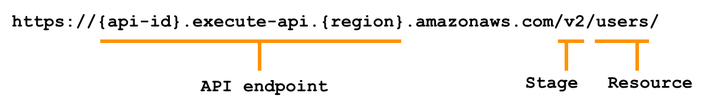
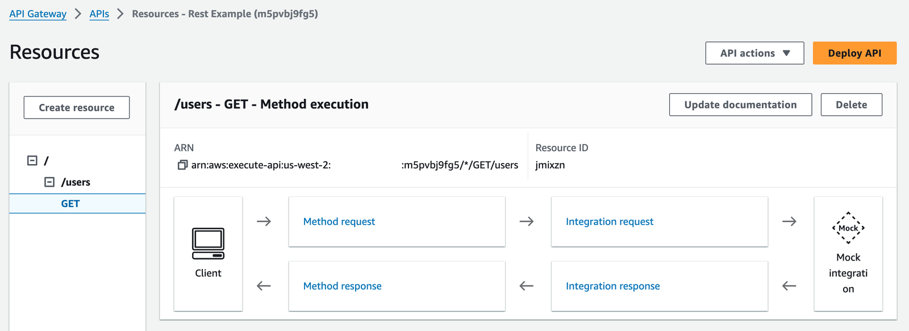

# Get started with API Gateway

Desktop and mobile browsers, command line clients, and applications all make requests to your web-based APIs.
Your application API must handle these requests, scale based on incoming traffic, ensure secure access,
and be available in multiple environments.

For serverless applications, API Gateway acts as the entry point, also called the
“front door”, for your web-based applications.

You are likely familiar with how to use and setup back-end APIs in traditional application
frameworks. In this starter, you will learn the essential role Amazon API Gateway plays in the
request/response workflow. Additionally, API Gateway can optimize response time with cache,
prevent function throttling, and defend against common network and transport layer DDoS attacks.

## What is API Gateway?

Amazon API Gateway is an AWS service for creating, publishing, maintaining, monitoring, and securing REST, HTTP, and WebSocket APIs. API Gateway can transform inbound web requests into *events*that are processed by Lambda functions, AWS services, and HTTP endpoints.

API Gateway can process many concurrent API calls and provides additional management capabilities, including:

- Authorization, authentication, and API Keys for access control
- Documentation and version control
- OpenAPI 3.0 import and export

Although similar in purpose, the REST API and HTTP API configuration and management console experiences are quite different.
WebSocket APIs are included in the advanced section, as they are less frequently used when starting out.

- REST API configuration models **resources** with Client, Method request,
  Integration Request, Integration endpoint, Integration Response, Method Response, return to Client.
- HTTP API configuration models **routes**
  with a tree of HTTP methods and associated integration configuration.

###### Important

Unless otherwise stated, REST APIs are discussed in the fundamentals.

## Fundamentals

An API (Application Program Interface) is a collection of endpoints that connect to your
application logic. You may already be familiar with creating APIs in traditional frameworks.
This section will introduce how the concepts map to API Gateway.

### Core Concepts

You can choose to get started with the core concepts in a workshop or tutorial, or read through the high level concepts here.

Let’s start with a high level work flow for an API request, pictured in the following
diagram. Imagine a UI component that requests User data from the server to show a table of users:

![Arrow with text of API Gateway URL inside pointing to a root label. Placed above the arrow is a user icon with an arrow pointing to an Access Control icon. Between the user icon and Access Control icon is the number one. The root label points to a users GET label. Next to the users GET label is the number two and a Lambda function icon, a resource based permission icon with the number three. Next to the Lambda function icon is an arrow pointing to a DynamoDB icon. Next to the icon is the number four. Placed above the icon is an arrow pointing to a box with a status code and users table. Next to the box is the number five and an arrow pointing to the users icon.](images/s_apigw/high-level-request-flow.png)

1. API HTTP request for a user is received and authentication is verified.
2. The call matches the API `GET` method and `users` resource, which is integrated with get-users Lambda function.
3. Permissions are verified before invoking the AWS resource.
4. Lambda function sends queries to retrieve items from a Users Table data store.
5. Data is wrapped in an HTTP response to be returned to the client.

### Create an API

When you create an API Gateway REST API, there are two essential components:

- **method** – HTTP methods (`GET`, `POST`, `PUT`, `PATCH`, `OPTIONS` and `DELETE`) An HTTP method is an action to be taken on a resource. API Gateway also has an `ANY` method, that matches any method type.
- **resource** – A resource is related to your business logic, for example users, orders, or messages.

Resources can also have the following:

- **child resources** - such as `/users/PremiumUser` to retrieve special types of Users
- **path parameters** – such as `/users/{UserId}` to retrieve a specific user by an identifier like 12345 or UserA

Resources must have an _integration_ to connect the resource to a back-end endpoint:

- **integration** – connection to a Lambda function, HTTP endpoint, or AWS service action

The following diagram shows the components of a URL request: API Endpoint, Stage, and
Resource.



- **API Endpoint**: The hostname for the API. Unless you designate a custom domain name, all APIs created using API Gateway will have this structure.
- **Stage Name:** An API deployment. You can deploy different snapshots of your API to various stages, for example: “v2", "latest", "dev", "qa".
- **Resource**: The piece of your business logic provided by the request.

To create an REST API resource, you specify the resource path, then add a method with an API integration endpoint. You can then further configure the integration and test it in the console. The following screenshot shows an example REST API integration for a GET method for the /users resource.

After you are satisfied with your configuration, you must **deploy** the API to a **stage** so it will become available to process requests.



### Integrate your API resources

During the creation of an API method, you must integrate it with an backend endpoint. A backend endpoint is also referred to as an _integration endpoint_ and can be one of the following:

- Lambda function to invoke
- HTTP server to forward the request to
- AWS service action to invoke

Integration of your API is how your frontend and backend communicate.

Like an API request, an API integration has an _integration request_ and an _integration response_. The integration request encapsulates the HTTP request received by the backend. The integration response is an HTTP response that wraps the output returned by the backend.

Setting up an integration request involves the following:

- Configuring how to pass client-submitted method requests to the backend
- Configuring how to transform the request data (REST API only), if necessary, to the integration request data
- Specifying an integration endpoint: Lambda function, HTTP server, or AWS service action

For advanced non-proxy integrations (REST API only), setting up an integration response involves the following:

- Configuring how to pass the backend-returned result to a method response with a given HTTP status code
- Configuring how to transform specified integration response parameters to preconfigured method response parameters
- Configuring how to map the integration response body to the method response body according to the specified body-mapping templates.

In the simpler case of proxy integrations, the preceding steps are handled automatically.

### Invoke your API

After you have deployed your REST API, you can invoke it. The following shows the
standard format of an API URL

```
https://{restapi_id}.execute-api.{region}.amazonaws.com/{stage_name}/
```

- `{restapi_id}` is your unique API identifier
- `{region}` is the AWS region, or location of the API
- `{stage_name}` is the stage name of the API deployment.

You can call an API using a web browser, through the CLI using cURL or the Postman application. After you deploy your API, you can turn on invocation logs using CloudWatch to monitor your API calls.

You can call a REST API **before** deployment for testing in two ways:

- In the API Gateway console by using the API Gateway's `TestInvoke` feature.
- Through the CLI using the `test-invoke-method` command.

Both of these methods bypass the `Invoke` URL and any authorization steps to allow API testing.

Alternatively, after the API is successfully deployed, you can use any command line or graphical tool, like cURL or Postman to call your API.

**Related resource(s):**

- [cURL home page](https://curl.se/ "https://curl.se/") - Learn how to invoke APIs with cURL
- [Postman home page](https://www.postman.com/ "https://www.postman.com/") - Learn how to invoke APIs with the Postman application

### Protect your API

To authenticate and authorize access to your Rest APIs, you can choose from the following:

- Amazon Cognito user pools as an identity source for who access the API.
- Lambda functions to control access to APIs by using a variety of identity sources.
- Resource-based policies to allow or deny specified access from source IP addresses or VPC endpoints.
- AWS Identity and Access Management roles, policies, and IAM tags to control access for who can invoke certain APIs.

**Related resource(s):**

- [Controlling and managing access to a REST API in API Gateway](../../../apigateway/latest/developerguide/apigateway-control-access-to-api.md "../../../apigateway/latest/developerguide/apigateway-control-access-to-api.md")
- [API Security Whitepaper](../../../whitepapers/latest/security-overview-amazon-api-gateway/security-design-principles.md "../../../whitepapers/latest/security-overview-amazon-api-gateway/security-design-principles.md") - Learn about AWS best practices for API Gateway security

More resources related to access control:

- [How to set up cross-origin resource sharing (CORS)](../../../apigateway/latest/developerguide/how-to-cors.md "../../../apigateway/latest/developerguide/how-to-cors.md")
- [Mutual TLS in REST API](../../../apigateway/latest/developerguide/rest-api-mutual-tls.md "../../../apigateway/latest/developerguide/rest-api-mutual-tls.md")
- [Control access with AWS WAF](../../../apigateway/latest/developerguide/apigateway-control-access-aws-waf.md "../../../apigateway/latest/developerguide/apigateway-control-access-aws-waf.md")

## Advanced Topics

You can connect a microservice with a REST API and a single integration to a Lambda function. As you progress on your journey, you should explore the following advanced topics.

### Choose between REST and HTTP APIs

API Gateway offers two types of RESTful API products: REST APIs and HTTP APIs .

- REST APIs support more features than HTTP APIs, but pricing is higher than HTTP APIs.

- HTTP APIs consist of a collection of _routes_ that direct incoming API request to backend resources. Routes are a combination of an HTTP method and a resource path, such as “GET /users/details/1234”. HTTP APIs also provide a `$default` route that is a catch-all for requests that don’t match other more specific routes.

Choosing between the type of API depends on your specific use case:

- Choose a REST API if you need advanced features, such as mock integration, request
  validation, a web application firewall, certificates for backend authentication, or a
  _private_ API endpoint with per-client rate limiting and usage
  throttling,
- Choose an HTTP API if you need minimal features, lower price, and
  auto-deployment.

**Related resource(s):**

- [Choosing between REST APIs and HTTP APIs](../../../apigateway/latest/developerguide/http-api-vs-rest.md "../../../apigateway/latest/developerguide/http-api-vs-rest.md") - detailed comparison between REST and HTTP APIs

### Non-proxy integrations and data transformations (REST API only)

Your API integration contains an integration request and integration response. You can have API Gateway directly pass the request and response between the frontend and backend, or you can manually set up an integration request and integration response.

- _proxy integration –_ you let API Gateway automatically pass all data in the HTTP request/response between the client and backend, automatically, without modification
- _non-proxy integration –_ you set up a custom integration request and integration response, where you can alter the data that flows between client and backend

Choosing between integration types depends on your use case:

- **Proxy integrations** directly send all information to a function for processing.
- **Non-proxy custom integrations** can transform data before it gets to your integration service and before the output is sent to clients. For Lambda, your function code can focus on the business task rather than parsing data in the input event. Non-proxy can be a good fit for legacy code migrations too, because you can transform the data to match expectations of existing code.

**Related resource(s):**

- [Tutorial: Build a Hello World REST API with Lambda proxy integration](../../../apigateway/latest/developerguide/api-gateway-create-api-as-simple-proxy-for-lambda.md "../../../apigateway/latest/developerguide/api-gateway-create-api-as-simple-proxy-for-lambda.md") (proxy example)
- [Using API Gateway as a proxy for DynamoDB](https://aws.amazon.com/blogs/compute/using-amazon-api-gateway-as-a-proxy-for-dynamodb/ "https://aws.amazon.com/blogs/compute/using-amazon-api-gateway-as-a-proxy-for-dynamodb/") (custom non-proxy integration example)
- [Best practices for working with Apache Velocity Template Language (VTL)](https://aws.amazon.com/blogs/compute/best-practices-for-working-with-the-apache-velocity-template-language-in-amazon-api-gateway/ "https://aws.amazon.com/blogs/compute/best-practices-for-working-with-the-apache-velocity-template-language-in-amazon-api-gateway/") (custom non-proxy integration example)

### Optimize your API with caching (REST API only)

To reduce the number of calls made to your endpoint and improve the latency of requests to your API, you can cache responds from your endpoint for a specified time-to-live period. API Gateway will respond to the request by using the cache instead of your end point. This can speed up your latency.

**Related resource(s):**

- [Enabling API caching to enhance responsiveness](../../../apigateway/latest/developerguide/api-gateway-caching.md "../../../apigateway/latest/developerguide/api-gateway-caching.md") - Learn how to enable caching for your REST APIs.

### Send binary media types

You can use either REST APIs or HTTP APIs to send binary payloads such as a JPEG or gzip file. For REST APIs, you need to take additional steps to handle binary payloads for non-proxy integrations.

**Related resource(s):**

- [Return binary media from a Lambda proxy integration](../../../apigateway/latest/developerguide/lambda-proxy-binary-media.md "../../../apigateway/latest/developerguide/lambda-proxy-binary-media.md") - Learn how to use a Lambda function to return binary media. This works for both REST and HTTP APIs.
- [Working with binary media types for REST APIs](../../../apigateway/latest/developerguide/api-gateway-payload-encodings.md "../../../apigateway/latest/developerguide/api-gateway-payload-encodings.md") - Additional considerations for REST non-proxy integrations

### Greedy path variables

If you want to handle the routing implementation outside of API Gateway, for example inside a Lambda function, you can use a greedy path variable in the form of a proxy resource `{proxy+}` to match all the child resources of a route for both HTTP and REST APIs.

Here are two examples of using greedy path variables:

- Use `/{proxy+}` to match both `/users` and `/users/{UserID}` routes
- Use the `ANY` method for a /`{proxy+}` resource at the root of your API to match all HTTP method types

**Related resource(s):**

- [Use a proxy resource to streamline API setup](../../../apigateway/latest/developerguide/api-gateway-method-settings-method-request.md#api-gateway-proxy-resource "../../../apigateway/latest/developerguide/api-gateway-method-settings-method-request.md#api-gateway-proxy-resource") – Set up a proxy resource and greedy path variable for REST APIs.
- [Working with routes for HTTP APIs](../../../apigateway/latest/developerguide/http-api-develop-routes.md "../../../apigateway/latest/developerguide/http-api-develop-routes.md") – Set up a greedy path variable for HTTP APIs

### WebSocket APIs

WebSocket APIs are a connection of WebSocket routes that are integrated with backend HTTP endpoints, Lambda functions, or other AWS services. A client can send messages to a service, and services can independently send messages to clients, making these APIs bidirectional. Because of this, WebSocket APIs are often used as chat applications or for multiplayer games or financial trading platforms.

**Related resource(s):**

- [About WebSocket APIs in API Gateway](../../../apigateway/latest/developerguide/apigateway-websocket-api-overview.md "../../../apigateway/latest/developerguide/apigateway-websocket-api-overview.md") - Get started with WebSocket APIs
- [Tutorial: Building a serverless chat app with a WebSocket API, Lambda, and DynamoDB](../../../apigateway/latest/developerguide/websocket-api-chat-app.md "../../../apigateway/latest/developerguide/websocket-api-chat-app.md") - Intermediate level WebSocket API tutorial using AWS CloudFormation

### OpenAPI

The OpenAPI 3 definition allows you to import and export APIs using API Gateway. OpenAPI is a standard format that is language agnostic and vendor-neutral and is used to define and structure REST APIs. There are many Open API extensions to support the AWS-specific authorization and API Gateway-specific API interactions for REST APIs and HTTP APIs.

You can use OpenAPI API definitions in AWS SAM templates for more complicated applications. Or, you can build APIs with API Gateway and export the OpenAPI 3.0 definition to use with other services.

**Related resource(s):**

- [OpenAPI FAQ](https://www.openapis.org/faq "https://www.openapis.org/faq") - Introduction and FAQ for the OpenAPI Specification
- [Working with API Gateway extensions to OpenAPI](../../../apigateway/latest/developerguide/api-gateway-swagger-extensions.md "../../../apigateway/latest/developerguide/api-gateway-swagger-extensions.md") - Learn how to use API Gateway extensions to the OpenAPI specification

## Additional resources

Official AWS documentation:

- [API Gateway Developer Guide](../../../apigateway/latest/developerguide/welcome.md "../../../apigateway/latest/developerguide/welcome.md") - extensive and complete documentation for Amazon API Gateway
- [REST API tutorial](../../../apigateway/latest/developerguide/api-gateway-create-api-as-simple-proxy-for-http.md "../../../apigateway/latest/developerguide/api-gateway-create-api-as-simple-proxy-for-http.md") - REST API tutorial
- [HTTP API tutorial](../../../apigateway/latest/developerguide/http-api-dynamo-db.md "../../../apigateway/latest/developerguide/http-api-dynamo-db.md") - HTTP API tutorial

Resources from the serverless community:

- [Building Happy Little APIs | I Didn’t Know Amazon API Gateway Did That](https://www.youtube.com/watch?v=10t2H9aT5Kc "https://www.youtube.com/watch?v=10t2H9aT5Kc") - AWS video series introducing to API Gateway

## Next Steps

###### Learn how to use API Gateway in an online workshop

Learn by doing in the **[Serverless Patterns Workshop](https://catalog.workshops.aws/serverless-patterns "https://catalog.workshops.aws/serverless-patterns")**. The first module introduces a serverless microservice to retrieve data from DynamoDB with Lambda and API Gateway.

Additional modules provide practical examples using infrastructure as code to deploy resources, test, and build with common architectural patterns used in serverless solutions.

![Architecture diagram for a REST microservice. Client icon connects through an arrow to REST API resource icon with API Gateway service icon placed above it. REST API is connected by a double arrow to Lambda function resource icon with Permissions Policy resource icon placed above it, and Lambda service icon placed above both. Lambda function resource is connected through an arrow pointing to Users Table resource with DynamoDB service icon placed above it. Dotted boxes enclose each of the services.](/images/serverless/latest/devguide/images/workshop-m1-infra-complete.png)
